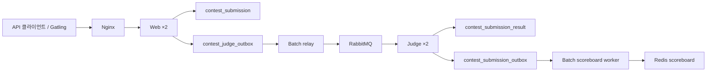

# OJ 프로젝트 구조와 실행 흐름

이 문서는 코드를 처음 보거나 작업 흐름을 다시 잡을 때의 시작점이다. 성능 실험의 상세 과정은 [`CONTEST_SUBMISSION_PIPELINE_HISTORY.md`](CONTEST_SUBMISSION_PIPELINE_HISTORY.md), 실행 전제는 [`ENVIRONMENT.md`](ENVIRONMENT.md)를 참조한다.

## 1. 런타임 구성

| 역할 | 인스턴스 | Spring profile | 주 책임 |
|---|---|---|---|
| Web | `web-1`, `web-2` | `multi-web` | JSON API 요청, 제출 검증, 제출/outbox 저장 |
| Batch | `batch-1` | `multi-batch` | judge outbox 발행, scoreboard 반영·복구, rank batch |
| Judge | `judge-1`, `judge-2` | `multi-judge` | RabbitMQ 소비, 채점, 결과/outbox 저장 |
| Data | MySQL, Redis, RabbitMQ | 해당 없음 | 원본 데이터, 파생 상태, 메시지 전달 |
| Edge | Nginx | 해당 없음 | 두 Web 인스턴스 로드밸런싱 |

아웃박스(outbox)는 원본 DB 변경과 후속 작업 기록을 같은 트랜잭션에 저장한 뒤 별도 worker가 전달하는 패턴이다.

## 2. 소스 디렉터리 지도

기본 패키지는 `my.oj.web`이며 기능 단위로 나눈다.

| 경로 | 책임 | 먼저 볼 파일 |
|---|---|---|
| `auth` | 현재 사용자 주입과 미인증 처리 | `CurrentUserArgumentResolver` |
| `problem` | 문제 조회와 대회 문제 연결 | `problem/api/ProblemApiController`, `ProblemRepository` |
| `submission` | 제출 조회와 제출 유스케이스 | `submission/api/SubmissionApiController`, `SubmissionService` |
| `contest` | 대회 목록·상세와 대회 상태 | `contest/api/ContestApiController`, `ContestService` |
| `contest/submission/core` | 대회 제출 모델·유스케이스와 저장 포트 | `ContestSubmissionService`, `ContestSubmissionWriter` |
| `contest/submission/queue` | core 저장 포트의 immediate/batch 구현과 영속화 | `ContestSubmissionBulkWriter`, `ContestSubmissionBulkProcessor` |
| `contest/submission/messaging` | judge DB outbox와 RabbitMQ 발행/소비 | `ContestJudgeOutboxRelay`, `ContestJudgeRabbitListener` |
| `contest/submission/judge` | 채점 실행과 결과 batch 저장 | `ContestSubmissionJudgeProcessor`, `ContestSubmissionJudgeResultBatchWriter` |
| `contest/submission/support` | ID, 중복 방지, rate limit 지원 | `ContestSubmissionIdGenerator` 구현체 |
| `contest/scoreboard` | live scoreboard 조회와 Redis 저장 | `ContestScoreboardService`, `ContestScoreboardReader`, `ContestScoreboardApplier` |
| `contest/scoreboard/api` | scoreboard 읽기 경로. hot(Redis 전용)과 cold(최종·aroundMe) 분리 | `ContestScoreboardApiController`, `ContestScoreboardViewApiController` |
| `api` | API 전역 오류 응답과 페이지 응답 봉투 | `JsonApiExceptionHandler`, `PageResponse` |
| `contest/scoreboard/outbox` | scoreboard 반영·재시도·복구 | `ContestScoreboardOutboxProcessor`, `ContestScoreboardOutboxRecoveryService` |
| `contest/finalization` | 대회 종료, 최종 점수, rejudge | `ContestFinalizationService` |
| `user/rank` | solved/streak/longest rank | 각 하위 `*RankService` |
| `perf` | `perf` profile 전용 seed·계측 endpoint(측정용 제출/조회는 제거됨) | `ContestPerfController`, `RankPerfController` |

`src/test/java`는 main package 경로를 그대로 따른다. MySQL/Redis 의존 테스트와 부하 테스트는 일반 단위 테스트보다 실행 조건이 많으므로 테스트 클래스의 profile·tag를 먼저 확인한다.

## 3. 요청별 코드 탐색 순서

### 대회 제출

1. `ContestSubmissionApiController.submit`
2. `SubmissionService.submitAsync`
3. `ContestSubmissionService`
4. `ContestSubmissionBulkWriter` → `ContestSubmissionBulkProcessor`
5. `ContestJudgeOutboxRelay`
6. `ContestJudgeRabbitListener` → `ContestSubmissionJudgeProcessor`
7. `ContestSubmissionJudgeResultBatchWriter`
8. `ContestScoreboardOutboxProcessor`

### 대회 상세과 scoreboard

대회 상세·문제 목록·scoreboard는 각각 별개의 리소스다. 하나의 탭 페이지가 세 가지를 모두
불러오던 시절에는 scoreboard 한 번 읽는 데 MySQL 3회가 앞섰다.

1. `ContestApiController.contest` → `ContestService.getDetail` (MySQL 1회, `finalized` 포함)
2. `ContestApiController.problems` → `ContestService.getProblems`
3. `ContestScoreboardApiController` → `ContestScoreboardService` (Redis만)
4. 최종 순위·aroundMe는 `ContestScoreboardViewApiController` → `ContestScoreboardViewAssembler`
   → 종료 후 확정됐으면 `ContestFinalScoreService`

### 대회 종료와 rejudge

1. `ContestFinalizationService`
2. `ContestFinalScoreService`
3. `ContestRejudgeService`

## 4. 코드 배치 원칙

- Controller는 요청 매핑과 응답 DTO 변환만 담당한다. 뷰 렌더링은 없다.
- Service는 하나의 유스케이스와 트랜잭션 경계를 소유한다.
- Repository/JDBC persistence는 데이터 접근만 담당한다.
- RabbitMQ·Redis 같은 외부 시스템 코드는 해당 기능의 infrastructure 역할로 한정한다.
- 뜨거운 읽기 경로에 조회를 되돌리지 않는다. `GET /api/contests/{id}/scoreboard`가 Redis만 읽는 것은 설계이고, 이름·최종 순위처럼 MySQL이 필요한 것은 별도 cold endpoint에 둔다.
- profile 조건과 운영 설정 key는 역할 계약이므로 리팩터링 중 임의로 바꾸지 않는다.
- 동시성 실행기와 queue의 종료 정책 변경은 단순 구조 이동과 분리해 검증한다.
- scoreboard 반영은 적용 순서와 중복 횟수에 무관해야 한다. Redis live/rebuild는 같은 Lua applier를 공유하고, 메모리 구현도 같은 규칙을 지켜야 한다. 배경은 `CONTEST_SUBMISSION_PIPELINE_HISTORY.md` §4.10.1이다.

## 5. 설정과 실행 파일

| 파일 | 용도 |
|---|---|
| `application.properties` | 공통 기본값과 profile group 정의 |
| `application-multi-server.properties` | 다중 인스턴스 공통 설정 |
| `application-web-role.properties` | Web 역할 활성/비활성 계약 |
| `application-batch-role.properties` | Batch 역할 활성/비활성 계약 |
| `application-judge-role.properties` | Judge 역할 활성/비활성 계약 |
| `compose.yaml` | 전체 로컬 배포와 자원 상한 |
| `gatling/` | 부하 시나리오와 Windows 실행 도구 |

## 6. 문서 구분

- `ARCHITECTURE.md`: 현재 구조와 코드 탐색 순서
- `ENVIRONMENT.md`: 하드웨어·컨테이너·미들웨어 실행 전제
- `CONTEST_SUBMISSION_PIPELINE_HISTORY.md`: 구현 선택, 측정, 미해결 과제의 전체 이력
- `OJ_DESIGN_NOTES.md`: 초기 아이디어와 과거 설계 판단 보존본
- `PORTFOLIO_*.md`, `_posts/`, `velog/`, `pdf/`: 공개 글과 배포용 콘텐츠

원시 측정물은 문서가 아니다. `var/`, `results*/`, heap dump, 임시 SQL과 로그는 로컬에서만 생성하고 필요가 끝나면 삭제한다.
