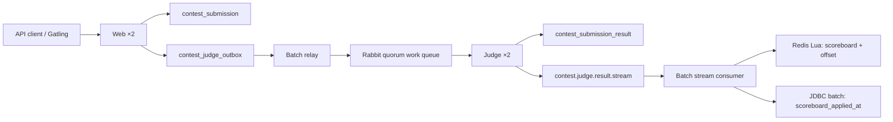

# OJ 프로젝트 구조와 실행 흐름

이 문서는 현재 코드를 찾기 위한 지도다. 설계 선택의 이력은
[`CONTEST_SUBMISSION_PIPELINE_HISTORY.md`](CONTEST_SUBMISSION_PIPELINE_HISTORY.md), 실행 전제는
[`ENVIRONMENT.md`](ENVIRONMENT.md)를 본다.

## 1. 역할별 구성

| 역할 | 인스턴스 | Spring profile | 주 책임 |
|---|---|---|---|
| Web | `web-1`, `web-2` | `multi-web` | JSON API, 제출 검증, submission/judge outbox 저장 |
| Batch | `batch-1` | `multi-batch` | judge outbox relay, scoreboard stream 소비, rank batch |
| Judge | `judge-1`, `judge-2` | `multi-judge` | judge queue 소비, 채점, 결과 저장, result stream confirm 발행 |
| Data | MySQL, Redis, RabbitMQ | 없음 | 원본, 파생 상태, durable 전달 |
| Edge | Nginx | 없음 | 두 Web 인스턴스 로드밸런싱 |



judge listener의 완료 순서는 반드시 다음과 같다.

```text
contest_submission_result commit
  -> result stream publisher confirm
  -> judge work queue ACK
```

scoreboard consumer의 완료 순서도 고정되어 있다.

```text
stream delivery
  -> Redis Lua(scoreboard + applied offset + DB-completion repair marker)
  -> contest_submission_result.scoreboard_applied_at JDBC batch
  -> stream delivery ACK
```

`contest_submission_outbox` 테이블은 롤백 호환을 위해 schema에 남아 있지만 현재 코드가 쓰거나
읽지 않는다. `contest_judge_outbox`는 제출 원본 commit과 Rabbit publish 사이의 복구 경로로 계속
사용한다.

## 2. 주요 패키지

| 경로 | 책임 | 주요 타입 |
|---|---|---|
| `contest/submission/core` | 대회 제출 모델과 저장 | `ContestSubmissionService`, `ContestSubmissionWriter` |
| `contest/submission/queue` | 제출 bulk/completion 실행 | `ContestSubmissionBulkWriter`, `ContestSubmissionBulkProcessor` |
| `contest/submission/messaging` | judge outbox, Rabbit work queue, result stream | `ContestJudgeOutboxRelay`, `ContestJudgeRabbitListener`, `RabbitContestSubmissionJudgeResultStreamPublisher` |
| `contest/submission/judge` | 채점과 결과 JDBC batch 저장 | `ContestSubmissionJudgeProcessor`, `ContestSubmissionJudgeResultBatchWriter` |
| `contest/scoreboard` | 공통 scoreboard 읽기·적용 계약 | `ContestScoreboardService`, `ContestScoreboardApplier` |
| `contest/scoreboard/redis` | commutative Lua와 Redis key 계약 | `ContestScoreboardRedisScript`, `RedisContestScoreboardApplier` |
| `contest/scoreboard/stream` | AMQP 0.9.1 stream 소비, offset 복구·tail 관측, 적용 완료 batch | `ContestScoreboardStreamListener`, `ContestScoreboardStreamProcessor`, `ContestScoreboardStreamLifecycle`, `ContestScoreboardStreamTailOffsetMonitor` |
| `contest/scoreboard/rebuild` | MySQL 결과에서 contest scoreboard 재구성 | `ContestScoreboardRebuildService` |
| `contest/finalization` | 대회 종료, 최종 점수, rejudge | `ContestFinalizationService` |
| `observability` | 중립 지표와 남은 judge outbox 진단 | `ContestOutboxBacklogMetrics`, `ContestOutboxDrainMetrics` |

## 3. 복구 경계

- RabbitMQ가 stream offset을 발급하고 Redis Lua가 scoreboard 상태와 그 offset을 함께 저장한다.
- Redis가 과거 RDB로 롤백되면 상태와 offset이 함께 롤백된다. lifecycle이 이를 감지해
  `x-stream-offset=storedOffset+1`로 consumer를 다시 시작한다.
- per-contest processed set은 정확성 checkpoint가 아니다. commutative 규칙이 정확성을 보장하고,
  set은 중복 replay의 계산만 줄인다. contest rebuild 때는 해당 set도 지운다.
- Redis 적용 후 MySQL batch 전에 죽는 구간은 Redis `contest:scoreboard:stream:db-pending` set으로
  복구한다. 이 set도 Lua에서 offset과 함께 기록하고 DB 완료 후 제거한다.
- 요청 offset이 retention 밖이면 RabbitMQ가 첫 보존 offset으로 맞춘다. consumer는 offset gap을
  감지해 전체 contest를 MySQL에서 rebuild한 뒤에만 그 gap을 연결한다.
- 운영자가 한 contest를 명시적으로 rebuild할 때는 내부 관리 endpoint
  `POST /actuator/contestscoreboard?contestId={id}`를 사용한다. live 적용과 같은 lock을 사용한다.

## 4. 중요한 불변식

- scoreboard 결과는 event 순서와 중복 횟수에 무관해야 한다. Redis Lua와
  `InMemoryContestScoreboard`는 같은 commutative 규칙을 유지한다.
- live stream batch는 offset 순서로 fail-fast 적용한다. Redis pipeline은 앞 script 실패 뒤의
  명령도 실행할 수 있으므로 이 경로에서는 사용하지 않는다.
- poison event를 건너뛰지 않는다. batch 전체를 requeue하고 Redis 복구 또는 payload 수정 후 같은
  offset부터 다시 처리한다.
- AMQP 0.9.1 stream consumer에는 명시적 prefetch가 필요하다. 현재 구성은 consumer 1개,
  `prefetch=500`, consumer batch 500이다.
- AMQP 0.9.1에는 stream single-active-consumer 조정이 없으므로 scoreboard consumer 역할은 현재
  `batch-1` 한 인스턴스만 실행한다.
- Compose RabbitMQ는 단일 노드다. stream replication과 failover는 이 환경에서 검증되지 않는다.
- AMQP 0.9.1에는 broker-managed consumer offset lag가 없다. batch-1이
  `x-stream-offset=last`로 마지막 chunk를 주기적으로 관측하고 Lua 적용 offset을 빼서
  `contest_scoreboard_pending_events`를 게시한다. 관측은 기본 5초 주기이며 실패 counter를 별도로
  내보낸다.

## 5. 설정과 검증

| 파일 | 용도 |
|---|---|
| `application.properties` | 공통 기본값, stream consumer와 management endpoint |
| `application-batch-role.properties` | scoreboard stream consumer 활성화 |
| `application-web-role.properties` | consumer 비활성화 |
| `application-judge-role.properties` | judge listener와 result stream publisher |
| `compose.yaml` | 로컬 역할 배치와 Rabbit/Redis/MySQL |
| `observability/` | Prometheus recording rule와 Grafana dashboard |
| `gatling/` | Windows 부하·복구 검증 도구 |

핵심 회귀 테스트는 `RedisContestScoreboardApplierRedisIntegrationTests`,
`ContestScoreboardLiveVersusRebuildRedisIntegrationTests`, `ContestScoreboardStreamProcessorTests`다.
