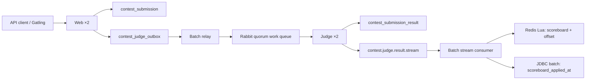

# OJ 프로젝트 구조와 실행 흐름

이 문서는 현재 코드를 찾기 위한 지도다. 설계 선택의 이력은
[`CONTEST_SUBMISSION_PIPELINE_HISTORY.md`](CONTEST_SUBMISSION_PIPELINE_HISTORY.md), 실행 전제는
[`ENVIRONMENT.md`](ENVIRONMENT.md)를 본다.

## 1. 역할별 구성

| 역할 | 인스턴스 | Spring profile | 주 책임 |
|---|---|---|---|
| Web | `web-1`, `web-2` | `multi-web` | JSON API, 제출 검증, submission/judge outbox 저장 |
| Batch | `batch-1` | `multi-batch` | judge outbox relay, scoreboard stream 소비, rank batch |
| Judge | `judge-1`, `judge-2` | `multi-judge` | judge queue 소비, 채점, 결과 저장, result stream confirm 발행 |
| Data | MySQL, Redis, RabbitMQ | 없음 | 원본, 파생 상태, durable 전달 |
| Edge | Nginx | 없음 | 두 Web 인스턴스 로드밸런싱 |


```mermaid
flowchart LR
    Client["API client / Gatling"] --> Web["Web ×2"]
    Web --> Submission["contest_submission"]
    Web --> JudgeOutbox["contest_judge_outbox"]
    JudgeOutbox --> Relay["Batch relay"]
    Relay --> JudgeQueue["Rabbit quorum work queue"]
    JudgeQueue --> Judge["Judge ×2"]
    Judge --> Result["contest_submission_result"]
    Judge --> Stream["contest.judge.result.stream"]
    Stream --> Consumer["Batch stream consumer"]
    Consumer --> Lua["Redis Lua: scoreboard + offset"]
    Consumer --> AppliedAt["JDBC batch: scoreboard_applied_at"]
```

judge listener의 완료 순서는 반드시 다음과 같다.

```text
contest_submission_result commit
  -> result stream publisher confirm
  -> judge work queue ACK
```

scoreboard consumer의 완료 순서도 고정되어 있다.

```text
stream delivery
  -> Redis Lua(scoreboard + applied offset + DB-completion repair marker)
  -> contest_submission_result.scoreboard_applied_at JDBC batch
  -> stream delivery ACK
```

`contest_submission_outbox` 테이블은 롤백 호환을 위해 schema에 남아 있지만 현재 코드가 쓰거나
읽지 않는다. `contest_judge_outbox`는 제출 원본 commit과 Rabbit publish 사이의 복구 경로로 계속
사용한다.

위 흐름은 `contest.scoreboard.recovery.mode=stream-offset`일 때의 경로다. 다른 모드는 소비·적용
경로를 바꾸지 않고 **체크포인트와 복구 기전만** 바꾼다(§3.1).

## 2. 주요 패키지

| 경로 | 책임 | 주요 타입 |
|---|---|---|
| `contest/submission/core` | 대회 제출 모델과 저장 | `ContestSubmissionService`, `ContestSubmissionWriter` |
| `contest/submission/queue` | 제출 bulk/completion 실행 | `ContestSubmissionBulkWriter`, `ContestSubmissionBulkProcessor` |
| `contest/submission/messaging` | judge outbox, Rabbit work queue, result stream | `ContestJudgeOutboxRelay`, `ContestJudgeRabbitListener`, `RabbitContestSubmissionJudgeResultStreamPublisher` |
| `contest/submission/judge` | 채점과 결과 JDBC batch 저장 | `ContestSubmissionJudgeProcessor`, `ContestSubmissionJudgeResultBatchWriter` |
| `contest/scoreboard` | 공통 scoreboard 읽기·적용 계약 | `ContestScoreboardService`, `ContestScoreboardApplier` |
| `contest/scoreboard/redis` | commutative Lua와 Redis key 계약 | `ContestScoreboardRedisScript`, `RedisContestScoreboardApplier` |
| `contest/scoreboard/stream` | AMQP 0.9.1 stream 소비, offset 복구·tail 관측, 적용 완료 batch | `ContestScoreboardStreamListener`, `ContestScoreboardStreamProcessor`, `ContestScoreboardStreamLifecycle`, `ContestScoreboardStreamTailOffsetMonitor` |
| `contest/scoreboard/rebuild` | MySQL 결과에서 contest scoreboard 재구성 | `ContestScoreboardRebuildService` |
| `contest/scoreboard/recovery` | 복구 모드 선택·검증·기동 보고, full-replay와 redis-seq 기전 | `ContestScoreboardRecoveryProperties`, `ContestScoreboardFullReplayService`, `ContestScoreboardRedisSequenceRecoveryService` |
| `contest/finalization` | 대회 종료, 최종 점수, rejudge | `ContestFinalizationService` |
| `observability` | 중립 지표와 남은 judge outbox 진단 | `ContestOutboxBacklogMetrics`, `ContestOutboxDrainMetrics` |

## 3. 복구 경계

### 3.1 모드 선택

`contest.scoreboard.recovery.mode`가 JVM당 하나의 복구 방식을 고른다. 기본값 `stream-offset`은 기준
브랜치의 동작(offset 하나로 복구)을 그대로 보존한다.

| 모드 | 무엇을 복구 기준으로 삼는가 | 체크포인트(`contest:scoreboard:stream:offset`)를 움직이는가 |
|---|---|---|
| `stream-offset` | scoreboard와 **같은 Lua EVAL**에서 저장된 stream offset | 움직인다 |
| `full-replay` | MySQL `contest_submission_result`의 저장된 채점 결과 | 움직이지 않는다 |
| `redis-seq` | Redis가 발급해 DB `scoreboard_applied_seq`에 남긴 seq | 움직이지 않는다 |

복구 방식은 **전송이나 채점을 바꾸지 않는다.** 세 모드 모두 같은 RabbitMQ stream 경로와 같은 Lua
script(`ContestScoreboardRedisScript.APPLY`), 같은 `ContestScoreboardApplier.applyAll`을 지난다.
모드가 바꾸는 것은 **체크포인트와 복구 기전**뿐이다. 그래야 세 방식을 같은 조건에서 비교할 수 있다.

모드별 빈은 `@ConditionalOnProperty(prefix="contest.scoreboard.recovery", name="mode", havingValue=...)`로
배타 게이팅한다. 이 애노테이션은 **원시 프로퍼티 문자열**을 비교하는 반면 enum 바인딩은 관대하므로
(`FULL_REPLAY`·`full_replay`도 통과), `ContestScoreboardRecoveryValidator`가 기동 시 비정규 표기를
거부한다. enum에 없는 값은 바인딩 단계에서 기동을 실패시킨다. `mode=redis-seq` + `store != redis`도
기동 실패다 — seq를 발급할 주체가 없기 때문이다. 반대로 기본 조합(`stream-offset` + `store=memory`)은
정상 기동해야 한다. `contest.scoreboard.store`는 `application.properties`에 **없고** `memory`가
`matchIfMissing`이므로, 이것이 기준 브랜치의 실제 기본값이다.

선택된 모드와 그 모드가 실제로 읽는 effective 값은 `ContestScoreboardRecoveryReporter`가 기동 시
INFO 1회로 남긴다. 값 조합은 순수 정적 `ContestScoreboardRecoverySummary.describe(...)`에 있어
로그를 읽지 않고도 단위 테스트로 고정된다.

### 3.2 stream-offset

기준 브랜치의 기전이며 아래를 유지한다.

- RabbitMQ가 stream offset을 발급하고 Redis Lua가 scoreboard 상태와 그 offset을 함께 저장한다.
- Redis가 과거 RDB로 롤백되면 상태와 offset이 함께 롤백된다. lifecycle이 이를 감지해
  `x-stream-offset=storedOffset+1`로 consumer를 다시 시작한다.
- per-contest processed set은 정확성 checkpoint가 아니다. commutative 규칙이 정확성을 보장하고,
  set은 중복 replay의 계산만 줄인다. contest rebuild 때는 해당 set도 지운다.
- Redis 적용 후 MySQL batch 전에 죽는 구간은 Redis `contest:scoreboard:stream:db-pending` set으로
  복구한다. 이 set도 Lua에서 offset과 함께 기록하고 DB 완료 후 제거한다.
- 운영자가 한 contest를 명시적으로 rebuild할 때는 내부 관리 endpoint
  `POST /actuator/contestscoreboard?contestId={id}`를 사용한다. live 적용과 같은 lock을 사용한다.

추가로 노출한 두 설정은 **선언만 하지 않고 실제 호출 경로가 읽는다.**

- `stream-offset.startup-offset`(`stored` 기본 | `first`) —
  `ContestScoreboardStreamLifecycle.startAtStoredOffset()`이 consumer 인자를 정할 때 읽는다.
  `first`는 체크포인트 자체가 의심스러울 때 retention 처음부터 다시 읽는 운영자의 출구다.
  재전달된 메시지는 Lua가 저장된 offset을 그대로 반환하고 standings를 건드리지 않으므로,
  비용은 트래픽이고 결과는 같다. 이때도 `listener.initializeOffset`은 **저장된** offset을 받는다
  (재읽기가 체크포인트를 다시 쓰면 첫 재전달이 전진 점프로 보인다).
- `stream-offset.retention-gap-fallback`(`full-replay` 기본 | `none`) —
  `ContestScoreboardStreamRecoveryService`가 읽는다.

#### retention gap fallback은 비파괴다

요청 offset이 retention 밖이면 RabbitMQ가 첫 보존 offset으로 맞춘다. consumer는 `firstNew.offset() >
startingOffset + 1`로 gap을 감지한다. 그 구간의 결과는 브로커에 없고 MySQL에만 있으므로 replay가
필요한데, 이 fallback은 **`ContestScoreboardFullReplayService`를 호출한다** — 이전에 호출하던
`ContestScoreboardRebuildService.rebuildAllFromContestResults()`는 reset을 포함해 **모든 대회의 Redis
상태를 지웠다.** 요구는 "retention 범위에서 offset이 사라진 경우에만 full-replay fallback"이고
full-replay는 Redis를 초기화하지 않아야 한다는 것이었다.

`none`은 잃어버린 결과를 조용히 건너뛰지 않는다. gap을 연결하지 않은 채로 두므로 Lua의 연속성
검사가 batch를 거부하고 consumer가 요란하게 계속 실패한다. 원인은 `contest.scoreboard.stream.offset.gaps`
지표와 `expected offset / first available offset` ERROR 로그로 확인한다.

#### 실패한 batch는 requeue로 돌아오지 않는다

`ContestScoreboardStreamListener`는 batch 실패 시 `ImmediateRequeueAmqpException`을 던지고
`defaultRequeueRejected=true`가 켜져 있다. 이것이 `basic.reject(requeue=true)`이며, 설계는 "batch가
head에 남아 재시도된다"고 적혀 있었다. **실물 브로커로 측정한 결과는 다르다**
(`StreamQueueRequeueRabbitIntegrationTests`). stream 큐는 requeueing rejection을 **아무 오류 없이
받아들이고**, channel과 connection은 열린 채로 남지만, **그 메시지를 실행 중인 consumer에게 다시
주지 않는다.** connection이 끊기는 방식이었더라면 컨테이너 재구독으로 귀결됐을 것이고, 실제로는
아무 일도 일어나지 않아 **consumer가 영원히 멈춘다.**

따라서 재시도는 requeue가 아니라 **저장된 checkpoint에서의 재구독**이 담당한다. supervisor pass
(`offset-check-interval`, `ContestScoreboardStreamLifecycle.recoverConsumption()`)가 두 원인을
구분해 답한다.

| 원인 | checkpoint | 조치 | 지표 |
|---|---|---|---|
| Redis 롤백 | 이 프로세스가 적용한 offset보다 **뒤** | 저장된 offset에서 재구독 (재읽기) | `contest.scoreboard.stream.rollback.restarts` |
| 실패한 batch | 그대로 (전진하지 않음) | `storedOffset + 1`에서 재구독 (재읽기) | `contest.scoreboard.stream.failure.restarts` |

실패한 batch는 checkpoint를 움직이지 않으므로 롤백 guard만으로는 "정상"으로 보인다. 그래서
`ContestScoreboardStreamListener.failedBatches()`를 함께 보고, 이미 답한 실패는 재시작하지 않는다.

### 3.3 full-replay

MySQL에 저장된 채점 결과만으로 scoreboard를 다시 채운다. **RDB에서 복원된 Redis 상태를 그대로 두고
`applier.reset(...)`을 호출하지 않는다.** swap도 도입하지 않는다(비목표).

- `findDistinctContestIds()` → 대회별 keyset pagination. `submissionId` 내림차순이 아니라
  `order by csr.submission.id` keyset이며, 상위 N건이 아니라 끝까지 읽는다.
- projection(`ContestScoreboardReplayRow`)과 keyset을 **한 쿼리**로 가져온다. 엔티티 hydration도
  N+1도 없다. `result`는 `COALESCE(finalResult, provisionalResult)`로 SQL에서 계산한다.
- **미채점 행은 후보가 아니다.** 쿼리가 `coalesce(finalResult, provisionalResult) <> 'PENDING'`으로
  거른다(양쪽이 NULL이면 SQL 3값 논리로 함께 떨어진다 — 이 값을 판단하는 필터는 닫힌 쪽으로
  실패하는 것이 맞다). PENDING을 한 번 적용하면 Lua가 `processed` set에 그 제출을 찍어 이후 실제
  채점 결과를 영구히 삼키기 때문이다(§4 불변식 참조). 같은 이유로 기존
  `ContestScoreboardRebuildService`도 같은 필터를 쓴다.
- `ApplyRequest.rebuild(...)`는 `streamOffset = null`이므로 **체크포인트를 움직이지 않는다.**
  전량 replay는 이미 반영된 행을 `processed` set이 흡수하는 **멱등** 연산이다.
- 전체 실행 동안 잠금을 잡지 않는다. batch 단위로만 `ContestScoreboardApplyLock`을 잡아 live
  stream 경로를 막지 않는다. 대회별 keyset batch 크기는 `full-replay.db-batch-size`,
  replay batch 크기는 `full-replay.replay-batch-size`다.

### 3.4 redis-seq

seq는 **Redis가 발급**하고, 할당자와 매핑이 같은 Redis에 있으므로 RDB 롤백 시 스코어보드와 함께
되감긴다. gapless DB sequence는 도입하지 않는다(비목표). Lua의 seq 발급 플래그(`ARGV[10]`)가
`0`이면 스크립트는 seq 작업을 **전혀 하지 않고** 도입 전과 완전히 동일하게 동작한다.

- 발급은 **하나의 EVAL 안에서** 일어난다. `KEYS[7] = contest:scoreboard:seq`(전역 할당자),
  `KEYS[8] = contest:scoreboard:submission-seq`(전역 `submissionId → seq` hash).
- **아직 처리되지 않은** 제출: `sequenceToIssue = allocator + 1`. 그 제출에 이미 매핑이 있고 그것이
  `allocator + 1` 이상이면 `mapped + 1`로 올려 잡는다. 즉 매핑을 재사용하지 않고 **항상 더 큰 값**을
  발급하며, 그 값으로 할당자도 함께 올린다(`set KEYS[7]`) — 이 규칙이 없으면 RDB 롤백 후
  `allocator < mapped`가 영구화되어 lost-tail 검사가 무한 재생에 빠진다.
- **이미 처리된** 제출: 스크립트가 `sismember KEYS[6]`에서 **먼저 반환**하므로 seq 작업에 도달하지
  않는다. 매핑이 다시 발급되지 않는다는 뜻이며, **응답값은 stream offset 그대로**다. 그래서 호출자는
  발급된 seq를 두 번째 왕복 없이 `KEYS[8]`에서 되읽는다. 재전달된 이벤트가 새 seq를 받지 않는다는
  옛 규칙의 의도는 이렇게 남는다 — 다만 **반환값이 아니다.**
- DB 영속화는 `scoreboard_applied_at = COALESCE(...)`(최초 적용 시각 보존)와 `scoreboard_applied_seq`
  (발급된 seq가 있으면 덮어쓰고, 없으면 `COALESCE`가 옛 값을 남긴다)를 한 배치 UPDATE로 함께 쓴다.
  seq를 덮어쓰는 것이 재생된 행을 할당자 아래로 수렴시키는 방법이다 — 옛 seq를 계속 들고 있으면
  `seq > allocator` 후보로 영원히 남는다. 중복 seq는 재생 **이전에** 검사가 잡으므로 증거를 잃지 않는다.
- stream-offset 모드는 seq 플래그가 꺼져 있으므로 위 분기 자체를 타지 않는다.
- **미채점 행은 후보가 아니다.** 두 읽기(중복 그룹의 행, 내림차순 walk)가 행을 넘겨줄 때
  `ContestScoreboardRedisSequenceRecoveryService.collect`가 걸러낸다. 쿼리에서 거르지 않는 이유는
  walk가 **sequence로 페이징**하고 window보다 짧은 page를 "집합의 끝"으로 읽기 때문이다 — 쿼리에서
  행을 떨어뜨리면 아직 필요한 행 위에서 walk가 끝난 것처럼 보인다.

한 회차는 **중복 검사 → lost-tail 검사 → 재생** 순서다.

| 검사 | 주기 프로퍼티 | 내용 |
|---|---|---|
| 중복 seq | `redis-seq.duplicate-check-interval`(기본 30s) | `GROUP BY scoreboard_applied_seq HAVING COUNT(*) > 1`. seq가 전역 유일하므로 **전역 스코프**가 정확하다 |
| lost-tail | `redis-seq.lost-tail-check-interval`(기본 30s) | **DB 먼저** 영속 seq를 내림차순 keyset으로 훑고, **Redis 나중** 할당자를 읽고, `seq > allocator`인 행을 누락 후보로 재생 |

**읽는 순서가 정확성의 전부다.** seq는 할당자가 발급한 **뒤에야** DB에 기록되므로, DB 먼저 → Redis
나중 순서에서만 `seq > allocator`가 진짜 퇴행을 뜻한다. 순서를 뒤집으면 읽는 사이 워커가 완료한
정상 행이 전부 유실로 오탐된다(`PORTFOLIO_SCOREBOARD_RECOVERY.md` §읽는 순서가 정확성의 전부다). 같은 이유로 **한 회차의
모든 DB 읽기가 할당자 읽기보다 먼저** 끝난다 — window마다 할당자를 새로 읽으면 window 사이 진행이
더 깊은 window를 오판한다.

window는 `check-window-size`(1000) × `max-windows-per-pass`(10)까지 내림차순 keyset으로 이어 읽는다.
상위 N건만 읽는 과거 설계는 N보다 깊은 누락을 놓쳤다. 예산을 다 쓰면(=포화) 지표로 경보한다.
회차는 후보가 0건이거나 `max-iterations`(5)를 소진할 때까지 반복한다. **재생 batch는 잠금을
chunk 단위로만 잡고** `retry-max-attempts`/`retry-backoff`를 적용한다.

수렴하지 않는 경우가 하나 있다. **모든 구성원이 이미 `processed` set에 있는 중복 그룹**은 replay가
흡수되어 중복이 해소되지 않는다. 스크립트가 `sismember`에서 먼저 반환하므로 그 행에는 **새 seq가
발급되지 않고** 매핑도 그대로여서, marker가 되읽는 값이 여전히 같은 seq다. 이 상태는 이 모드가
**찾을 수는 있으나 고칠 수 없으며**, 회차를 무한히 돌리지 않도록 `max-iterations`로 자른 뒤
`redis-seq.unresolved` 지표와 로그로 보고한다. 반대로 **아직 처리되지 않은** 행의 재생은 수렴한다 —
적용이 그 행에 seq를 발급하고 할당자를 그 값으로 함께 올리므로, 되읽은 seq가 할당자보다 클 수 없다.

**구성원에 미채점 행이 있는 중복 그룹**도 같은 이유로 해소되지 않지만, 경로가 다르다. 그 행은
후보에서 제외되므로 **재생 자체가 일어나지 않고**, 남은 구성원이 이미 처리된 행이면 발급할 seq도
없다. 그래서 후보가 0건인 회차로 끝나 `unresolved`는 서지 않는다 — 그룹을 고치려면 미채점 행을
적용해야 하는데, 그것이 바로 이 모드가 하지 않기로 한 일이기 때문이다. 이 상태는 매 회차
`redis-seq.duplicates`가 0이 아닌 채로 남아 **지표로는 드러난다.** 참고로 미채점 행을 적용해
그룹을 "해소"하려는 시도는 해소가 아니라 악화다 — 위에서 본 대로 그 행에는 seq가 발급되지 않으므로
그룹은 그대로 남고, 제출만 `processed` set에 찍혀 실제 채점 결과가 영구히 삼켜진다
(`ContestScoreboardSequenceRecoveryMySqlIntegrationTests.anUnjudgedResultIsNeverOfferedToTheScoreboard`
가 이 두 가지를 함께 고정한다).

## 4. 중요한 불변식

- scoreboard 결과는 event 순서와 중복 횟수에 무관해야 한다. Redis Lua와
  `InMemoryContestScoreboard`는 같은 commutative 규칙을 유지한다.
- live stream batch는 offset 순서로 fail-fast 적용한다. Redis pipeline은 앞 script 실패 뒤의
  명령도 실행할 수 있으므로 이 경로에서는 사용하지 않는다.
- poison event를 건너뛰지 않는다. batch 전체를 적용하지 않고 실패시키고, Redis 복구 또는 payload 수정
  후 **같은 offset부터** 다시 처리한다. 재시도 자체는 requeue가 아니라 저장된 checkpoint에서의
  재구독이 만든다(§3.2). checkpoint는 실패한 batch를 넘어 전진하지 않으므로 그 사이 결과가 조용히
  사라지지 않는다.
- offset을 **gapless 연속 정수라고 가정하지 않는다.** Lua가 `streamOffset ~= currentOffset + 1`을
  검사해 `error_reply`로 거부하고, `ARGV[2]=allowOffsetGap`일 때만 통과시킨다. 그 예외를 쓰는 유일한
  통로는 retention gap fallback이며, fallback이 MySQL replay를 마친 뒤에만 열린다. 즉 "gap이 없다고
  가정"하는 대신 **gap을 검사하고, gap이면 복구한 뒤에만 연결**한다.
- **미채점(PENDING) 결과를 scoreboard에 적용하지 않는다.** Lua는 `ARGV[4] == 'PENDING'`일 때
  standings 변형만 건너뛰고 `sadd processed submissionId`는 그 블록 **바깥**에서 무조건 실행한다.
  PENDING을 한 번 적용하면 그 제출이 `processed` set에 들어가 이후 `alreadyProcessed == 1` 분기가
  **실제 채점 결과를 영구히 삼킨다.** 그래서 **세 replay 경로 전부**가 PENDING을 후보에서 제외한다 —
  `ContestScoreboardFullReplayService`와 `ContestScoreboardRebuildService`는 쿼리에서,
  `ContestScoreboardRedisSequenceRecoveryService`는 후보를 모을 때(§3.4) 제외한다.
- `scoreboard_applied_at`은 `COALESCE`로 최초 적용 시각을 보존하고, `scoreboard_applied_seq`는
  덮어쓴다(§3.4).
- AMQP 0.9.1 stream consumer에는 명시적 prefetch가 필요하다. 현재 구성은 consumer 1개,
  `prefetch=500`, consumer batch 500이다.
- AMQP 0.9.1에는 stream single-active-consumer 조정이 없으므로 scoreboard consumer 역할은 현재
  `batch-1` 한 인스턴스만 실행한다.
- Compose RabbitMQ는 단일 노드다. stream replication과 failover는 이 환경에서 검증되지 않는다.
- AMQP 0.9.1에는 broker-managed consumer offset lag가 없다. batch-1이
  `x-stream-offset=last`로 마지막 chunk를 주기적으로 관측하고 Lua 적용 offset을 빼서
  `contest_scoreboard_pending_events`를 게시한다. 관측은 기본 5초 주기이며 실패 counter를 별도로
  내보낸다.

## 5. 설정과 검증

| 파일 | 용도 |
|---|---|
| `application.properties` | 공통 기본값, stream consumer와 management endpoint |
| `application-batch-role.properties` | scoreboard stream consumer 활성화 |
| `application-web-role.properties` | consumer 비활성화 |
| `application-judge-role.properties` | judge listener와 result stream publisher |
| `compose.yaml` | 로컬 역할 배치와 Rabbit/Redis/MySQL |
| `observability/` | Prometheus recording rule와 Grafana dashboard |
| `gatling/` | Windows 부하·복구 검증 도구 |

### 5.1 복구 모드 설정과 effective 기본값

값은 **클램핑하지 않고 검증**한다(`@Validated` + `@Min`). 다른 scoreboard 프로퍼티는 `Math.max`
헬퍼로 정규화하지만, 복구 설정이 잘못된 것은 운영자의 실수이므로 **기동을 실패**시킨다. 아래는
`ContestScoreboardRecoveryProperties`의 `@DefaultValue`이며, 기동 로그의 `mode=... ` 한 줄이 실제
적용값이다.

| 프로퍼티 | 기본값 |
|---|---|
| `contest.scoreboard.recovery.mode` | `stream-offset` |
| `...recovery.stream-offset.startup-offset` | `stored` |
| `...recovery.stream-offset.retention-gap-fallback` | `full-replay` |
| `...recovery.full-replay.db-batch-size` | `1000` |
| `...recovery.full-replay.replay-batch-size` | `500` |
| `...recovery.full-replay.startup-replay-enabled` | `true` |
| `...recovery.redis-seq.duplicate-check-interval` | `30s` |
| `...recovery.redis-seq.lost-tail-check-interval` | `30s` |
| `...recovery.redis-seq.check-window-size` | `1000` |
| `...recovery.redis-seq.max-windows-per-pass` | `10` |
| `...recovery.redis-seq.max-iterations` | `5` |
| `...recovery.redis-seq.replay-batch-size` | `500` |
| `...recovery.redis-seq.retry-max-attempts` | `3` |
| `...recovery.redis-seq.retry-backoff` | `50ms` |
| `...recovery.redis-seq.startup-check-enabled` | `true` |

모드가 무엇을 실행하는지는 **배타적이다.** `full-replay`는 기동 시 1회 replay하는
`ContestScoreboardFullReplayStartupRunner`를 켜고(끄려면 `startup-replay-enabled=false`), `redis-seq`는
`duplicate-check-interval`·`lost-tail-check-interval` 주기의 scheduler와 기동 1회 검사를 켠다.
`redis-seq`의 검사 scheduler와 기동 검사는 같은 guard를 공유하므로 서로 겹쳐 돌지 않는다.

복구 상태 지표는 세 갈래다.

| 지표 | 의미 |
|---|---|
| `contest.scoreboard.stream.failures` | 적용되지 못하고 남은 stream batch |
| `contest.scoreboard.stream.rollback.restarts` / `.failure.restarts` | 롤백 / 실패 batch 때문에 재구독한 횟수 |
| `contest.scoreboard.stream.offset.gaps` | retention gap 감지 횟수 |
| `contest.scoreboard.redis.sequence.duplicates` / `.replayed` | 중복 seq 그룹 수 / 재적용 건수 |
| `contest.scoreboard.redis.sequence.rounds` / `.windows.saturated` / `.unresolved` | 회차 수 / window 예산 포화 / 수렴 실패 |
| `contest.scoreboard.redis.sequence.mapping.size` | 전역 seq 매핑 hash 크기(관측만, 정리는 비목표) |

핵심 회귀 테스트는 `RedisContestScoreboardApplierRedisIntegrationTests`,
`ContestScoreboardLiveVersusRebuildRedisIntegrationTests`, `ContestScoreboardStreamProcessorTests`다.
복구 모드는 `ContestScoreboardRecoveryModeWiringTests`(모드별 빈 선택),
`ContestScoreboardRedisSequenceRecoveryServiceTests`,
`ContestScoreboardSequenceRecoveryMySqlIntegrationTests`(실물 MySQL),
`ContestScoreboardStreamLifecycleTests`가 덮는다. 실물 인프라가 있어야 도는 것은
`-DredisIntegration=true`의 `ContestScoreboardFullReplayRedisIntegrationTests`, 그리고
`-DrabbitIntegration=true`의 `ContestScoreboardStreamRedisRabbitIntegrationTests`(저장 offset 이후
재소비), `ContestScoreboardStreamBatchFailureRabbitIntegrationTests`(중간 실패 시 checkpoint 미전진),
`StreamQueueRequeueRabbitIntegrationTests`(stream 큐의 reject 동작 측정)다.
