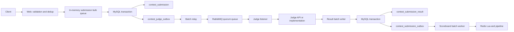

# 대회 제출 파이프라인 설계 및 개선 기록

> 최종 갱신: 2026-07-31
> 작업 브랜치: `codex/scoreboard-commutative-port`
> 문서 목적: 과거의 설계 판단부터 현재 구현, 성능 측정, 미해결 문제까지 한 문서에서 다시 파악하고 LLM에 인수인계하기 위한 기록

## 0. 먼저 읽을 요약

이 프로젝트의 대회 제출 경로는 다음 순서로 발전했다.

1. Spring event와 비동기 listener로 건별 채점
2. 제출을 JVM 큐에 모아 MySQL batch insert
3. DB에서 여러 제출을 claim하고 한 트랜잭션 안에서 병렬 채점
4. claim, 채점, 결과 저장을 분리하고 heartbeat/sweeper로 회복
5. DB outbox와 Kafka를 연결하고 수동 offset commit을 관리
6. Kafka 대신 DB outbox와 RabbitMQ quorum queue를 사용하는 work queue 구조로 전환
7. 제출, relay, 채점 결과, scoreboard 반영을 각각 batch화
8. 전체 1000 TPS 부하와 JFR 진단으로 현재 병목을 다시 확인

현재 선택한 구조는 다음과 같다.

```text
HTTP 제출
  -> Web JVM 제출 배치 큐
  -> MySQL: contest_submission + contest_judge_outbox (동일 트랜잭션)
  -> Batch relay
  -> RabbitMQ quorum queue
  -> Judge listener
  -> MySQL: contest_submission_result + contest_submission_outbox (동일 트랜잭션)
  -> Scoreboard batch worker
  -> Redis scoreboard
```

핵심 판단은 다음과 같다.

- 제출 원본과 중복 제약의 최종 권위는 MySQL이다.
- RabbitMQ는 원본 저장소가 아니라 채점 작업을 분배하는 durable work queue다.
- DB와 RabbitMQ 사이에 2PC를 사용하지 않고 outbox와 멱등성으로 at-least-once를 만든다.
- RabbitMQ consumer ACK는 채점 결과와 scoreboard outbox의 DB commit 이후에만 발생한다.
- 채점 서버의 긴 꼬리 지연은 `prefetch=1`과 다수 consumer로 서로 격리한다.
- Redis scoreboard는 파생 상태이며 DB outbox로 재구성할 수 있어야 한다.
- 채점 완료 순서는 제출 순서와 다르므로 scoreboard 반영은 순서와 중복에 무관해야 한다. 라이브 값과 rebuild 값이 같은 데이터에서 일치하는 것이 기준이다.
- 2026-07-31 리팩터링에서 제출 경로의 동기 Redis dedup 호출과 user/problem 반복 조회를 제거했다.
- 제출 admission은 `max-in-flight` semaphore로 제한하며, 현재 공통 설정은
  `4 workers × batch 100`, `max-in-flight=800`이다.
- completion executor는 실측 최대 queue depth 2를 근거로 4 threads + queue 64로 줄였다.

현재 가장 중요한 검증 과제는 다음 두 가지다.

1. 새 설정에서 평균 chunk가 기존 58보다 커지고 성공 처리량 천장 약 2,500 TPS가 유지되는지
   분리된 부하 생성기로 다시 측정한다.
2. Snowflake worker ID의 인스턴스별 유일성을 배포 검증으로 강제한다.

## 1. 문제 정의와 가정

### 1.1 기능 요구사항

- 짧은 시간에 대회 제출이 집중된다.
- HTTP 제출 성공을 반환했다면 최소한 제출 원본은 DB에 commit돼 있어야 한다.
- `(contest, problem, user, codeHash)`가 같은 제출은 중복 저장하지 않는다.
- 채점 결과는 중복 전달되더라도 최종 DB 상태가 중복 생성되지 않아야 한다.
- 채점이 늦어져도 다른 제출의 처리가 같이 막히지 않아야 한다.
- 프로세스 또는 broker 장애 후 미완료 작업을 다시 처리할 수 있어야 한다.
- scoreboard는 빠르게 조회하되 Redis 유실 후 복구 가능해야 한다.

### 1.2 부하 모델

설계 논의에서 사용한 목표 가정은 다음과 같다.

- 최대 유입: 약 1000 TPS
- 대회용 부분 채점 평균: 약 10ms라는 가정
- 긴 꼬리: 약 1000건 중 한 건이 최대 2초까지 걸릴 수 있다는 가정

주의할 점은 현재 실제 채점 구현이 외부 채점 API가 아니라 즉시 `PARTIAL_ACCEPTED`를 반환하는 stub이라는 것이다.

- 구현: [`ContestProvisionalJudgement`](../src/main/java/my/oj/web/submission/judge/ContestProvisionalJudgement.java)
- 따라서 지금까지의 전체 파이프라인 부하 테스트는 RabbitMQ와 DB 흐름을 검증했지만, 실제 2초 p999 채점 API까지 재현한 것은 아니다.

### 1.3 현재 범위 밖으로 미룬 것

- 대회 종료 후 최종 재채점
- 여러 judge run을 독립적으로 추적하는 모델
- provisional/final phase별 메시지 및 결과 이력
- 재채점 정책과 대회 최종화의 완전한 정합성 모델

현재 `contest_submission_result`의 PK는 `submission_id`이고 scoreboard outbox도 제출당 하나의 unique row를 사용한다. 따라서 향후 여러 번의 채점 이력을 저장하려면 `(submission_id, phase, judge_run_id)` 같은 별도 실행 식별자를 다시 검토해야 한다. 현재 범위에서는 한 제출당 provisional 결과 하나이므로 `submission_id`만으로 충분하다.

## 2. 설계가 발전한 과정

### 2.1 V0: Spring event + async listener

흐름:

1. HTTP 요청에서 제출을 DB에 저장한다.
2. Spring application event를 발행한다.
3. 비동기 listener가 채점 API를 호출한다.
4. 결과를 DB와 scoreboard에 반영한다.

장점:

- 구현이 단순하다.
- HTTP 요청과 채점을 분리하기 쉽다.

문제:

- event가 JVM 메모리에만 있으므로 DB commit 후 listener 실행 전에 프로세스가 죽으면 작업이 유실될 수 있다.
- 갑작스러운 제출 burst가 비동기 executor로 그대로 전달된다.
- executor queue의 영속성과 복구 지점이 없다.

### 2.2 V1: 제출 batch insert

HTTP 요청마다 바로 insert하지 않고 JVM 큐에 잠시 모은 후 chunk 단위로 DB에 썼다.

핵심 구현:

- `rewriteBatchedStatements=true`
- 애플리케이션에서 ID를 먼저 발급
- `saveAll()`의 `merge` 경로 대신 `persist()` 또는 JDBC batch 사용
- 한 transaction에서 `contest_submission`과 후속 작업 근거를 함께 저장

이 단계에서 확인한 중요한 사실:

- ID가 이미 있는 엔티티를 `saveAll()`에 넘기면 JPA가 신규 insert임에도 `merge`를 선택하고 row마다 존재 확인 `SELECT`를 발생시킬 수 있었다.
- OSIV가 켜져 있으면 요청 및 lazy loading이 DB connection을 예상보다 오래 점유할 수 있었다.
- JDBC batch를 사용한다는 사실만으로 multi-values rewrite가 보장되는 것은 아니므로 MySQL general log와 driver 호출을 확인해야 했다.

격리된 insert 실험의 첫 실패 지점은 다음과 같았다.

| 시나리오 | Immediate | Bulk |
|---|---:|---:|
| insert 1건, pool 100 | 4000 RPS | 6000 RPS |
| insert 3건, pool 100 | 4000 RPS | 5000 RPS |
| insert 1건, pool 10 | 2000 RPS | 4000 RPS |
| insert 3건, pool 10 | 2000 RPS | 4000 RPS |

이 값은 저장 경로만 격리한 결과이며 전체 HTTP-Rabbit-Judge-Scoreboard 처리량과 직접 비교하면 안 된다.

문제:

- HTTP 응답이 DB batch commit을 기다리므로 batch flush 주기만큼 latency가 생긴다.
- batch의 한 row가 제약 위반으로 실패하면 같은 transaction의 전체 chunk가 rollback될 수 있다.
- 제출 insert는 빨라졌지만 채점의 긴 꼬리 문제는 남았다.

### 2.3 V2: 한 transaction 안에서 여러 건 채점

DB에서 `SELECT ... FOR UPDATE SKIP LOCKED`로 여러 제출을 가져오고, 같은 transaction 안에서 채점 API를 병렬 호출한 뒤 결과를 batch로 저장했다.

의도:

- claim과 완료 기록을 하나의 transaction으로 묶으면 중간 장애 시 rollback으로 정리된다.
- 채점 결과 insert를 batch화할 수 있다.

문제:

- 외부 API 호출 동안 DB transaction과 connection이 열린다.
- batch 안의 느린 한 건이 전체 transaction 종료를 늦춘다.
- p999 2초 작업 하나 때문에 빠른 작업의 결과 commit도 2초 이상 밀리는 head-of-line blocking이 생긴다.

### 2.4 V3: DB claim + 메모리 queue + sweeper

transaction을 짧게 만들기 위해 단계를 분리했다.

1. DB에서 여러 제출을 짧게 claim한다.
2. 메모리 queue와 worker pool에서 채점한다.
3. 완료 결과를 다시 모아 DB batch로 저장한다.
4. 오래된 claim은 sweeper가 회수한다.

claim 상태:

- `PROCESSING`
- `claim_token`
- `claimed_at`

장점:

- 외부 API 호출을 DB transaction 밖으로 꺼냈다.
- 빠른 채점과 느린 채점이 서로 덜 영향을 준다.
- 결과 저장을 계속 batch화할 수 있다.

문제:

- claim timeout이 너무 짧으면 정상적으로 오래 걸린 작업을 중복 채점한다.
- timeout이 너무 길면 실제 장애 복구가 늦어진다.
- 메모리 queue 구간은 durable하지 않다.
- heartbeat, claim lease, sweeper, JVM in-flight를 직접 구현하고 관찰해야 한다.

heartbeat는 claim을 소유한 실제 worker가 작업 중 주기적으로 `claimed_at` 또는 별도 lease 만료 시점을 갱신해야 의미가 있다. 다른 scheduler가 대신 갱신하면 죽은 작업을 살아 있다고 오판할 수 있다.

### 2.5 V4: DB outbox + Kafka classic consumer

Kafka를 고려한 이유:

- 높은 순차 append 처리량
- producer record batch와 압축
- partition을 이용한 수평 확장
- 긴 backlog와 replay에 적합

그러나 제출 원본의 unique 제약과 HTTP 성공 의미를 유지하려면 결국 MySQL 저장이 먼저 필요했다. 그래서 구조가 다음처럼 됐다.

```text
HTTP -> MySQL submission/outbox -> relay -> Kafka -> judge worker -> DB result
```

여기서 Kafka classic consumer의 offset 문제가 생겼다.

- 한 번의 `poll()`로 여러 record를 가져온다.
- record를 worker pool에 넘기면 완료 순서가 offset 순서와 달라진다.
- offset 10이 느리고 11~20이 먼저 끝나도 20까지 commit할 수 없다.
- 안전하게 commit하려면 완료된 offset을 추적하고 가장 높은 연속 구간까지만 commit해야 한다.
- consumer가 죽으면 마지막 commit 이후 record가 다시 전달되므로 결과 저장은 여전히 멱등해야 한다.

이 수동 commit 추적은 과거 DB claim 코드와 다른 형태의 복잡성을 다시 만들었다. 로컬 단일 장비에서는 MySQL, relay, Kafka까지 함께 실행해 오히려 처리량도 낮아졌다.

Kafka가 구조적으로 불리하다는 뜻은 아니다. 다음 조건이면 여전히 유리하다.

- 동일 이벤트를 여러 consumer group이 독립적으로 읽는다.
- 매우 긴 backlog를 비교적 저렴하게 유지해야 한다.
- audit, replay, 데이터 분석이 핵심 요구사항이다.
- partition key로 순서를 명시적으로 관리할 필요가 있다.

현재 프로젝트의 핵심은 replay 가능한 이벤트 로그보다 각 제출을 한 worker가 가져가 완료하는 work queue에 더 가깝다.

### 2.6 Kafka Share와 Redis Streams도 검토

Kafka Share 계열 소비 방식은 classic consumer의 partition 독점과 연속 offset commit 부담을 줄이고 record 단위 accept/release/reject에 가까운 작업 분배를 제공한다. 다만 broker가 제한된 in-flight window와 acquired 상태를 관리하며, acquired 상태 자체를 매번 강하게 영속화하지 않아 broker 장애 시 중복 전달은 여전히 가능하다.

평가:

- Kafka 저장 구조와 backlog/replay 장점을 유지하면서 work queue에 가까워진다.
- classic consumer보다 현재 문제에 잘 맞을 수 있다.
- 그래도 운영 및 개념 복잡도가 RabbitMQ보다 크고, 현재 프로젝트에서는 Kafka의 replay 장점을 적극 사용하지 않는다.

Redis Streams도 consumer group, pending entries, claim을 제공한다.

평가:

- 이미 Redis를 운영한다면 인프라를 줄일 수 있다.
- batch read와 pipeline을 사용할 수 있다.
- 그러나 pending reclaim, trimming, AOF/RDB durability, Redis 메모리와 scoreboard 부하의 결합을 직접 관리해야 한다.
- 대량 backlog를 Redis 메모리에 같이 두는 것은 현재 구조에 불리하다.

### 2.7 최종 선택: DB outbox + RabbitMQ

RabbitMQ를 선택한 이유:

- 메시지 하나를 consumer 하나에게 전달하는 work queue 의미가 명확하다.
- `prefetch`로 consumer별 in-flight를 제한할 수 있다.
- listener가 성공 반환하면 ACK하고, connection/channel이 죽으면 unacked 메시지가 다시 queue로 돌아간다.
- 긴 작업 하나가 다른 consumer의 메시지 진행을 막지 않는다.
- Kafka classic처럼 완료 offset의 연속 구간을 수동 추적하지 않아도 된다.
- retry와 dead-letter queue의 의미가 작업 처리와 잘 맞는다.

RabbitMQ의 약점도 감수했다.

- Kafka처럼 producer record batch를 압축된 한 덩어리로 저장하는 구조가 아니다.
- 같은 크기의 매우 긴 backlog는 Kafka보다 비싸다.
- publisher confirm과 quorum replication을 강하게 설정하면 처리량과 latency 비용이 생긴다.
- replay와 여러 독립 consumer group은 Kafka만큼 자연스럽지 않다.

현재 메시지 payload는 실제 코드 전체가 아니라 event/submission ID 중심으로 작게 유지한다. 따라서 backlog의 payload 비용을 줄이고, 원본 코드는 MySQL에서 조회한다.

## 3. 왜 RabbitMQ-only가 아닌가

RabbitMQ-only 구조도 검토했지만 현재는 선택하지 않았다.

RabbitMQ quorum queue, persistent message, publisher confirm을 사용하면 높은 내구성을 만들 수 있다. 하지만 다음 문제는 남는다.

- 제출 코드와 조회 가능한 상태는 결국 DB에 저장해야 한다.
- `(contest, problem, user, codeHash)` unique 제약은 DB가 가장 명확하게 보장한다.
- HTTP 성공 후 DB 저장이 실패하면 사용자에게 보인 성공과 실제 조회 상태가 달라진다.
- RabbitMQ와 DB 사이에서 결과적으로 중복 저장과 재시도 처리가 필요하다.

따라서 HTTP 요청에서는 MySQL을 먼저 commit하고, 같은 transaction에 `contest_judge_outbox`를 저장한다.

중요한 점은 DB outbox가 있다고 해서 RabbitMQ durability를 마음대로 낮출 수 있는 것은 아니라는 것이다.

- 현재 relay는 Rabbit publisher confirm을 받으면 outbox를 `PUBLISHED`로 바꾼다.
- 그 이후 judge 완료 여부는 `contest_judge_outbox`에서 추적하지 않는다.
- 따라서 confirm 이후 RabbitMQ에서 메시지가 유실되면 DB outbox가 자동으로 다시 발행하지 않는다.

현재 구조에서 RabbitMQ는 `quorum queue + durable queue + persistent message + publisher confirm`을 유지해야 한다. Rabbit durability를 낮추려면 outbox를 judge 완료 시점까지 유지하거나 별도 reconciliation을 추가해야 한다.

## 4. 현재 구현 구조

### 4.1 역할 분리

Docker Compose 기준 역할은 다음과 같다.

| 역할 | Spring profile | 책임 |
|---|---|---|
| Web 1, 2 | `multi-web` | HTTP, 검증, 중복 확인, 제출 batch 저장 |
| Batch | `multi-batch` | judge outbox relay, scoreboard outbox 반영/복구 |
| Judge 1, 2 | `multi-judge` | Rabbit 소비, 채점, 결과/outbox batch 저장 |
| MySQL | MySQL 8.0 | 원본, unique 제약, 두 종류 outbox |
| Redis | Redis 7 | session, rate limit, scoreboard |
| RabbitMQ | RabbitMQ 4.1 | 채점 work queue와 DLQ |

관련 설정:

- [`application-multi-server.properties`](../src/main/resources/application-multi-server.properties)
- [`application-web-role.properties`](../src/main/resources/application-web-role.properties)
- [`application-batch-role.properties`](../src/main/resources/application-batch-role.properties)
- [`application-judge-role.properties`](../src/main/resources/application-judge-role.properties)
- [`compose.yaml`](../compose.yaml)

### 4.1.1 운영 편 시작 — judge 2인스턴스화와 자원 예산 고정

Judge를 두 인스턴스로 늘리고 Snowflake worker ID를 `200`, `201`로 분리했다. 컨슈머 스케일아웃과 한 인스턴스 장애 시나리오를 실제 배포 형태에 가깝게 검증하기 위한 구성이다.

WSL은 8 vCPU와 10GB로 제한하고 Compose CPU 상한 합을 7.5로 고정했다. 남은 0.5 CPU는 다음 단계의 관측 스택에 예약한다. 이웃 서비스의 무제한 자원 경합을 막아 병목 원인을 특정 서비스에 귀속할 수 있게 하고, 이후 수치가 같은 전제에서 비교되도록 했다. 세부 하드웨어·메모리·미들웨어 설정과 검증 명령은 [`ENVIRONMENT.md`](ENVIRONMENT.md)를 기준으로 삼는다.

### 4.1.2 가동성 정리 — 역할 기동과 운영 설정의 명시화

기능·처리량 설정은 유지하면서 실행 구성을 읽고 검증하기 쉽게 정리했다. 제출 실행기, bulk/completion, scoreboard outbox, judge relay/result writer 설정을 타입이 있는 설정 객체로 묶어 기동 시 한 번 바인딩하고, 실제 `multi-web`·`multi-batch`·`multi-judge` 프로필 그룹을 사용하는 역할별 기동 테스트를 추가했다.

Compose의 반복 정의는 YAML 앵커로 통합하되 렌더링된 서비스 정의가 기존과 같음을 해시로 확인했다.

종료 시 drain 정책, 재시작 정책, readiness 의미는 장애 시 메시지 처리 결과를 바꿀 수 있으므로 이 구조 정리에는 포함하지 않았다. 현재 완료 통지와 judge 결과 writer의 종료 대기 동작만 회귀 테스트로 고정했고, bulk writer의 graceful shutdown은 별도 운영 변경 후보로 남겼다.

### 4.1.3 RabbitMQ 채점 경로 단일화

RabbitMQ 전환 전에 사용하던 Spring application event 기반 대회 채점 listener와 DB 미채점 행 polling scheduler를 제거했다. 대회 제출은 이제 outbox relay와 RabbitMQ consumer를 통해서만 채점되며, 일반 제출의 application event 경로는 그대로 유지한다. 과거 설계와 선택 근거는 이 문서의 V0~V6 기록과 Git 이력에서 확인할 수 있다.

### 4.2 전체 흐름



### 4.3 HTTP 제출과 DB 저장

주요 코드:

- [`SubmissionController`](../src/main/java/my/oj/web/submission/SubmissionController.java)
- [`SubmissionService`](../src/main/java/my/oj/web/submission/SubmissionService.java)
- [`ContestSubmissionService`](../src/main/java/my/oj/web/contest/submission/core/ContestSubmissionService.java)
- [`ContestSubmissionBulkWriter`](../src/main/java/my/oj/web/contest/submission/queue/ContestSubmissionBulkWriter.java)
- [`ContestSubmissionBulkProcessor`](../src/main/java/my/oj/web/contest/submission/queue/ContestSubmissionBulkProcessor.java)
- [`JdbcContestSubmissionBatchPersistence`](../src/main/java/my/oj/web/contest/submission/queue/JdbcContestSubmissionBatchPersistence.java)

흐름:

1. user는 JPA reference만 만들고 SELECT하지 않는다.
2. problem과 contest는 bounded in-memory cache에서 읽는다. cache miss일 때만 DB를 조회한다.
3. Redis 또는 in-memory rate limit을 확인한다.
4. 코드 hash를 계산하고 Snowflake ID를 예약한다.
5. `ContestSubmissionBulkWriter`의 queue에 request와 `CompletableFuture`를 넣는다.
6. batch worker가 최대 100건을 꺼낸다.
7. 한 transaction에서 `contest_submission`을 `INSERT IGNORE`로 JDBC batch insert한다.
8. 예약 ID와 dedup key를 조회해 새 삽입, 정상 중복, 설명할 수 없는 누락을 판별한다.
9. 새로 삽입된 ID만 `contest_judge_outbox`에 넣는다.
10. transaction commit 후 completion executor가 Future를 완료한다.
11. Future가 끝나면 HTTP 응답 또는 redirect를 보낸다.

HTTP controller가 `CompletionStage`를 반환하므로 제출 queue에 들어간 이후에는 Tomcat 요청 스레드를 계속 점유하지 않는다. 하지만 응답이 끝난 것은 아니다. Servlet async context, HTTP connection, Future와 관련 객체는 DB 저장 및 후속 completion이 끝날 때까지 살아 있다.

현재 사용자에게 보이는 의미:

- HTTP 성공: 제출 DB transaction이 commit됐으며, 중복이면 기존 submission ID가 확정됐다.
- HTTP 실패 또는 timeout: DB commit 여부를 단정할 수 없다.
- DB commit 후 응답 전에 프로세스가 죽으면 사용자는 실패/timeout을 보지만 제출은 존재할 수 있다.

즉 `성공 -> DB commit`은 보장하지만 `DB commit -> 성공 응답`은 보장하지 못한다. 네트워크 시스템에서 일반적인 결과이며, 클라이언트 재시도와 멱등 처리가 필요하다.

### 4.4 제출 중복 처리

현재 중복 방지는 두 겹과 사후 정합성 판별로 구성된다.

1. 같은 JVM batch chunk 안에서는 `(contest, problem, user, codeHash)` map으로 중복을 합친다.
2. MySQL unique key `uk_cs_code_hash`가 cross-node 중복 row 생성을 막는다.
3. `INSERT IGNORE` 직후 예약 ID 및 dedup key를 조회해 요청별 결과를 확정한다.

Redis dedup registry의 `HGET`, `HSET`, `EXPIRE`는 제출 임계 경로에서 제거했다. MySQL이
중복의 유일한 권위이며, `rewriteBatchedStatements=true`는 유지한다. Connector/J의
`SUCCESS_NO_INFO(-2)` 반환값으로는 무시된 행을 구분할 수 없으므로 다음 조회 결과로 판별한다.

- 예약 ID가 요청의 key와 함께 존재하면 새 삽입이다.
- 예약 ID가 없고 같은 dedup key의 행이 있으면 정상 중복이며 기존 ID를 응답한다.
- 둘 다 아니면 FK 위반, 데이터 잘림 등 설명할 수 없는 무시이므로
  `ContestSubmissionBatchConsistencyException`을 던져 transaction 전체를 rollback한다.
- 예약 ID가 다른 key의 행을 가리키면 Snowflake PK 충돌 가능성이므로 역시 fail-fast한다.

### 4.5 Snowflake ID

여러 Web 인스턴스가 DB auto increment를 기다리지 않고 batch insert하기 위해 Snowflake ID를 사용한다.

- timestamp: 상위 비트
- worker ID: 10비트
- 같은 millisecond sequence: 12비트
- 인스턴스별 worker ID가 반드시 달라야 한다.
- 시계가 과거로 이동하면 현재 구현은 예외를 발생시키고 fail-fast한다.
- 예약 ID가 다른 제출에 이미 쓰인 경우 batch 정합성 조회도 이를 검출하고 fail-fast한다.

최신 테스트에서 clock rollback 오류는 발생하지 않았다. 운영에서는 worker ID 배포 관리와 시간 동기화가 필요하다.

### 4.6 DB outbox relay와 Rabbit publisher confirm

주요 코드:

- [`ContestJudgeOutboxWriter`](../src/main/java/my/oj/web/contest/submission/messaging/ContestJudgeOutboxWriter.java)
- [`ContestJudgeOutboxStore`](../src/main/java/my/oj/web/contest/submission/messaging/ContestJudgeOutboxStore.java)
- [`ContestJudgeOutboxRelay`](../src/main/java/my/oj/web/contest/submission/messaging/ContestJudgeOutboxRelay.java)

상태 전이:

```text
PENDING
  -> PUBLISHING(claim_token, claimed_at, attempts++)
  -> PUBLISHED              when every corresponding publisher confirm is ACK
  -> PENDING                on send exception, NACK, return, or confirm timeout
```

relay는 `FOR UPDATE SKIP LOCKED`로 최대 500건을 claim한다. 메시지를 먼저 전부 보내고 각 `CorrelationData` Future를 기다린 뒤, 성공과 실패를 한 번의 JDBC batch update로 반영한다.

초기 구현에서는 confirm 이후 `markPublished()`를 메시지마다 DB update해 relay가 약 33건/초밖에 처리하지 못했다. 이를 `completeAll()` batch update로 바꾸면서 메시지별 DB 왕복 병목을 제거했다.

claim token은 오래된 worker의 완료 결과가 새 claim을 덮어쓰지 못하게 한다. `PUBLISHING` 상태가 30초 이상 오래되면 다른 relay가 다시 claim할 수 있다.

장애 구간:

- DB commit 후 publish 전 죽음: outbox가 남아 다시 publish한다.
- Rabbit이 받기 전 send 실패: outbox를 `PENDING`으로 되돌린다.
- Rabbit이 받고 confirm했지만 DB를 `PUBLISHED`로 바꾸기 전 죽음: 다시 publish돼 중복 전달될 수 있다.

따라서 이 경로는 exactly-once가 아니라 at-least-once다.

### 4.7 RabbitMQ topology와 소비

주요 코드:

- [`ContestJudgeRabbitConfiguration`](../src/main/java/my/oj/web/contest/submission/messaging/ContestJudgeRabbitConfiguration.java)
- [`ContestJudgeRabbitListener`](../src/main/java/my/oj/web/contest/submission/messaging/ContestJudgeRabbitListener.java)

현재 설정:

- live queue: durable quorum queue
- dead-letter queue: durable quorum queue
- message delivery mode: persistent
- publisher confirm: correlated
- mandatory return: enabled
- consumer concurrency: 64
- prefetch: 1
- acknowledge mode: auto
- listener retry: 최대 3회, 1초에서 시작해 3배 증가, 최대 10초
- retry 소진 후 reject하고 DLQ로 이동

`prefetch=1`이므로 consumer 하나는 ACK하지 않은 메시지를 하나만 갖는다. 64개 consumer라면 정상적으로 최대 약 64건이 unacked이고, 나머지는 RabbitMQ ready backlog에 남는다.

RabbitMQ의 ACK는 요청 스레드 ID로 돌아오는 것이 아니다. Java client가 TCP connection 안의 channel과 channel별 delivery 상태를 관리한다. Spring AMQP listener container가 이 세부 사항을 감추고 listener 성공/실패를 기준으로 ACK 또는 reject를 수행한다.

connection이나 channel이 끊어지면 해당 channel의 unacked 메시지는 다시 queue에 들어간다. 반대로 consumer 프로세스는 살아 있고 채점 호출만 영원히 멈춘다면 connection은 살아 있으므로 즉시 재전달되지 않는다. 운영에서는 Rabbit consumer timeout과 judge API timeout을 최대 정상 처리시간보다 넉넉하지만 유한하게 설정해야 한다.

### 4.8 ACK와 DB commit 경계

2PC나 saga를 추가하지 않았다.

현재 listener 흐름:

1. Rabbit listener가 메시지를 받는다.
2. judge projection을 DB에서 조회한다.
3. 채점을 호출한다.
4. result batch writer queue에 결과를 넣는다.
5. listener thread는 해당 결과 batch의 완료 Future를 기다린다.
6. batch worker가 transaction 안에서 result와 scoreboard outbox를 저장한다.
7. transaction interceptor가 commit한 뒤 persistence method가 반환한다.
8. Future가 완료되고 listener가 정상 반환한다.
9. Spring AMQP container가 ACK한다.

주요 코드:

- [`ContestSubmissionJudgeProcessor`](../src/main/java/my/oj/web/contest/submission/judge/ContestSubmissionJudgeProcessor.java)
- [`ContestSubmissionJudgeResultBatchWriter`](../src/main/java/my/oj/web/contest/submission/judge/ContestSubmissionJudgeResultBatchWriter.java)
- [`JdbcContestSubmissionJudgeResultBatchPersistence`](../src/main/java/my/oj/web/contest/submission/judge/JdbcContestSubmissionJudgeResultBatchPersistence.java)

DB commit 후 ACK 전에 프로세스가 죽으면 RabbitMQ가 메시지를 다시 전달한다. 이를 다음 unique/멱등 처리로 흡수한다.

- `contest_submission_result` PK: `submission_id`
- 결과 insert: `INSERT IGNORE`
- `contest_submission_outbox` unique: `contest_submission_id`
- scoreboard outbox insert: `INSERT IGNORE`

ACK 후 DB commit이 취소되는 순서는 현재 구조상 만들지 않았다. 반면 DB와 Rabbit 사이에 원자적 exactly-once는 없으므로 중복 전달은 정상 시나리오로 취급한다.

### 4.9 judge projection과 결과 batch

Rabbit 메시지는 submission ID만 담는다. judge는 필요한 필드만 projection으로 한 번 조회한다.

과거에는 다음 조회가 중복됐다.

- judge 전 `contest_submission` 조회
- 결과 저장 과정에서 `contest_submission` 다시 조회
- judge role에서 사용하지 않는 scoreboard outbox 재조회 및 application event 발행

이를 다음처럼 바꿨다.

- [`ContestSubmissionJudgeProjection`](../src/main/java/my/oj/web/contest/submission/core/ContestSubmissionJudgeProjection.java)을 judge와 결과 저장에 재사용
- judge role에서는 scoreboard outbox 즉시 event 발행을 비활성화
- 결과와 scoreboard outbox를 각각 JDBC batch insert하되 같은 transaction에 둠

현재 result writer 설정:

- batch size: 32
- worker count: 1
- queue capacity: 512
- 최대 batch 대기: 5ms

listener concurrency가 64이고 각 listener가 결과 commit을 기다리므로 실제 producer 수는 최대 약 64다. queue capacity 512가 채워지기 전에 Rabbit prefetch가 먼저 backpressure를 건다.

### 4.10 scoreboard outbox와 Redis pipeline

주요 코드:

- [`JdbcContestScoreboardOutboxQueue`](../src/main/java/my/oj/web/contest/scoreboard/outbox/worker/JdbcContestScoreboardOutboxQueue.java)
- [`ContestScoreboardOutboxProcessor`](../src/main/java/my/oj/web/contest/scoreboard/outbox/worker/ContestScoreboardOutboxProcessor.java)
- [`RedisContestScoreboardApplier`](../src/main/java/my/oj/web/contest/scoreboard/redis/RedisContestScoreboardApplier.java)
- [`ContestScoreboardRedisScript`](../src/main/java/my/oj/web/contest/scoreboard/redis/ContestScoreboardRedisScript.java)
- [`ContestScoreboardOutboxRecoveryService`](../src/main/java/my/oj/web/contest/scoreboard/outbox/worker/ContestScoreboardOutboxRecoveryService.java)

상태 전이:

```text
PENDING or retryable FAILED or expired PROCESSING
  -> PROCESSING(claim_token, claimed_at, attempts++)
  -> COMPLETED(redis_seq, processed_at)
  -> FAILED(next_attempt_at, error)
```

현재 Batch role 설정:

- poll interval: 200ms
- batch size: 500
- claim timeout: 30초
- recovery interval: 5초
- recovery batch size: 10

처음에는 Redis event를 한 건씩 적용하고 DB outbox도 한 건씩 완료했다. 이후 다음처럼 바꿨다.

1. DB에서 payload까지 한 번에 claim한다.
2. 여러 `EVALSHA`를 Redis pipeline으로 한 번에 전송한다.
3. 각 Lua script는 한 event의 sequence 발급, 멱등 확인, scoreboard 갱신, processed marker 기록을 원자적으로 수행한다.
4. pipeline 결과를 요청 순서대로 받는다.
5. 성공과 실패를 DB JDBC batch update로 한 번에 완료한다.

pipeline은 하나의 큰 원자적 transaction이 아니다. network round trip을 줄이지만 각 Lua script는 Redis에서 순서대로 독립 실행된다. 한 event의 script 원자성은 유지된다.

### 4.10.1 순서 의존성 제거 — commutative scoreboard 갱신

2026-07-30까지 scoreboard 상태는 누적 방식이었다. (user, problem)마다 `accepted` 플래그와
`wrongAttempts` 카운터를 두고, ACCEPTED가 오면 그 시점의 카운터로 penalty를 확정한 뒤
`accepted='1'`을 세웠다. 이후 도착한 event는 `accepted ~= '1'` 분기에서 통째로 버려졌다.

이 방식은 event가 제출 순서대로 도착한다고 가정한다. 그러나 채점 지연은 제출마다 다르므로
(설계 전제: 평균 10ms, p999 2초 — §1.2) `contest_submission_outbox.created_at` 순서는 제출
순서와 다르다. 다음이 실제로 틀린 값을 만들었다.

```text
t=10분  WRONG 제출     → 채점 2초
t=12분  ACCEPTED 제출  → 채점 10ms
```

ACCEPTED가 먼저 적용되어 penalty가 `12 + 0 * 5 = 12`로 확정되고, 뒤늦게 온 WRONG은 버려져
`wrongAttempts`도 늘지 않았다. 반면 rebuild 경로는 `submittedTime, id` 순으로 replay하므로
같은 데이터에서 `12 + 1 * 5 = 17`을 냈다. 즉 대회 중 사용자가 본 순위와 최종 순위가
달라질 수 있었다.

해결은 누적을 버리고 **재계산**으로 바꾼 것이다. problem hash가 제출 사실 자체를
submissionId 키로 보관하고, event마다 그 problem의 기여도를 처음부터 다시 계산한다.

`contest:scoreboard:{contestId}:user:{userId}:problem:{problemId}`

| 필드 | 의미 |
|---|---|
| `a:min` | 지금까지 본 ACCEPTED 중 가장 이른 것의 `contestMinutes` |
| `a:sid` | 그 ACCEPTED의 `contestSubmissionId` (같은 분 tie-break) |
| `w:<submissionId>` | 그 WRONG 제출의 `contestMinutes` |
| `c:solved` | 이 problem이 summary에 기여 중인 solved |
| `c:penalty` | 이 problem이 summary에 기여 중인 penalty |

적용 절차는 다음과 같다.

1. `PENDING`은 점수를 반영하지 않고 sequence만 처리한다.
2. ACCEPTED는 `(minutes, submissionId)`가 기존 `(a:min, a:sid)`보다 작을 때만 갱신한다.
   WRONG류는 `w:<submissionId>`를 쓰므로 중복 도착이 자동 흡수된다.
3. `a:min`이 없으면 기여도는 0이고, 있으면 solved 1과
   `a:min + (a보다 이른 w 개수) * PENALTY_PER_WRONG_MINUTES`다.
4. summary에는 `c:solved`, `c:penalty`와의 **차이만** `HINCRBY`한다.
5. `c:*`를 새 기여도로 덮어쓰고 ranking zset score를 다시 쓴다.

tie-break를 `(minutes, submissionId)` 튜플로 둔 이유는 같은 분에 WRONG과 ACCEPTED가 있을 때
결과가 도착 순서에 좌우되지 않게 하는 것이다. submissionId는 Snowflake라 시간 단조 증가한다.
Lua는 submissionId를 숫자로 비교하지 않고 십진 문자열로 비교한다. Lua number는 double이고
Snowflake ID는 정확한 정수 표현 한계인 53비트를 넘기 때문이다.

같은 규칙이 세 곳에 있고 함께 바뀌었다. 하나만 바꾸면 경로별로 다른 scoreboard가 나온다.

| 구현 | 파일 | 쓰이는 경로 |
|---|---|---|
| Lua (Redis) | [`ContestScoreboardRedisScript`](../src/main/java/my/oj/web/contest/scoreboard/redis/ContestScoreboardRedisScript.java) | live outbox 반영과 Redis rebuild |
| Java (메모리) | [`InMemoryContestScoreboard`](../src/main/java/my/oj/web/contest/scoreboard/memory/InMemoryContestScoreboard.java) | `store=memory` 프로필, 최종 점수 replay |

Java 메모리 구현은 [`ProblemAttempts`](../src/main/java/my/oj/web/contest/scoreboard/ProblemAttempts.java)와
[`ContestScoreboardPolicy.computeProblemContribution`](../src/main/java/my/oj/web/contest/scoreboard/ContestScoreboardPolicy.java)을 사용한다.
Redis live와 rebuild는 모두 같은 `ContestScoreboardApplier`를 거쳐 Lua 규칙을 공유한다.
Lua는 Java 상수를 참조할 수 없으므로 penalty·score 가중치를 지금처럼 ARGV로 받는 계약을
유지했고, 필드 이름은 `ContestScoreboardRedisFields`와 Lua 양쪽에 있다.

부수 효과와 운영 주의사항:

- **problem hash 메모리가 제출 수만큼 늘어난다.** 이전에는 (user, problem)당 2필드
  고정이었다. 지금은 wrong 제출마다 `w:<submissionId>` 필드가 하나씩 쌓인다.
  `redis:7-alpine` 단일 컨테이너에서 `MEMORY USAGE`로 측정한 값은 다음과 같다
  (`a00d4d6`, 기본 `hash-max-listpack-entries=512`, 17~19자리 submissionId).

  | problem hash 상태 | bytes |
  |---|---|
  | 이전 schema (`accepted`, `wrongAttempts`) | 88 |
  | 새 schema, 정답 + wrong 0건 | 112 |
  | 새 schema, 정답 + wrong 5건 | 240 |
  | 새 schema, 정답 + wrong 20건 | 696 |
  | 새 schema, 정답 + wrong 100건 | 2,616 |
  | 새 schema, 정답 + wrong 200건 | 5,176 |

  wrong 제출 하나가 약 25바이트, (user, problem) 하나의 고정분이 88 → 112바이트다.
  §15 기준선의 참가자 9,364명이 문제 5개에 각각 wrong 3건을 냈다고 보면 약 14만 필드,
  3~4MB가 추가된다. Redis `maxmemory`가 384mb이고 정책이 `noeviction`이므로
  (`docs/ENVIRONMENT.md`) 대회 종료 후 `reset` 시점을 지키는 것이 이전보다 중요해졌다.
  한 (user, problem)이 512필드를 넘으면 listpack에서 hashtable로 바뀌어 필드당 비용이
  뛰지만, 같은 문제에 wrong 512건은 현재 rate limit 아래에서 현실적인 값이 아니다.
- **필드 schema가 바뀌었으므로 배포 시 진행 중인 대회의 scoreboard는 rebuild가 필요하다.**
  기존 `accepted`/`wrongAttempts`만으로는 확정된 penalty의 근거(정답 제출 시각)를 복원할 수
  없어 자동 이전이 불가능하다. 새 코드는 옛 필드를 무시하므로, 이전 상태가 남은 채 새
  event가 오면 solved가 중복 계산된다.
- PENDING event는 이제 메모리 구현에서도 사용자를 0/0으로 board에 올리지 않는다.
  라이브 Redis 경로가 원래 하던 동작에 맞췄다.

이 성질을 고정한 테스트:

| 테스트 | 확인하는 것 |
|---|---|
| `InMemoryContestScoreboardCommutativityTests` | 메모리 구현에서 무작위 순열 25개의 결과 동일, 위 회귀 시나리오 penalty 17, 중복 전달·재적용 멱등성, PENDING 무반영 |
| `RedisContestScoreboardApplierRedisIntegrationTests` | Lua에 대해 같은 성질과 problem hash 필드, 뒤늦은 더 이른 ACCEPTED가 solve 시각을 교체하는 동작 |
| `ContestScoreboardLiveVersusRebuildRedisIntegrationTests` | 같은 제출·결과 집합에서 outbox 경로와 `rebuildFromContestResults` 결과 일치 |

### 4.10.2 worker named lock 제거

이전에는 여러 Batch 인스턴스가 scoreboard 적용 순서를 섞지 못하도록 MySQL `GET_LOCK`
named lock으로 한 worker만 batch를 처리했다. 순서 의존성이 사라졌으므로 이 lock은 정합성이
아니라 처리량 상한으로만 남아 제거했다. 동시 실행을 지키는 것은 다음 네 가지다.

- claim은 `FOR UPDATE SKIP LOCKED`라서 한 row가 두 worker에게 가지 않는다.
- 완료는 `status = 'PROCESSING' AND claim_token = ?` 조건이라 lease가 만료된 worker가
  다른 worker의 row를 완료 처리할 수 없다.
- 한 event의 Redis 반영은 여전히 Lua script 안에서 원자적이고, 결과는 적용 순서와 무관하다.
- sequence는 `INCR`로 발급되므로 worker가 늘어도 중복 sequence가 생기지 않는다.

`recoverRedisState`는 lock을 잡지 않는다. requeue 쿼리 전부가 `status <> PROCESSING`
조건을 가지므로 처리 중인 claim을 빼앗지 않고, 두 인스턴스가 같은 requeue를 실행하면 두 번째는
`redis_seq`가 이미 null이라 0건을 갱신한다. 최악의 경우 같은 scan을 두 번 하거나 lock wait이
생기고, 다음 tick이 다시 시도한다.

`JdbcContestScoreboardOutboxQueueMySqlIntegrationTests`는 worker 4개가 같은 queue에서 claim할
때 같은 row가 두 번 나가지 않음을, `ContestScoreboardConcurrentWorkerRedisIntegrationTests`는
worker 4개가 함께 drain한 최종 scoreboard가 단일 worker 결과와 같음을 확인한다. 두 테스트는
Redis/MySQL이 필요하므로 실행 조건은 `docs/ENVIRONMENT.md` §8을 따른다.

## 5. Redis scoreboard 복구 설계

### 5.1 `outbox.id`만으로 복구하지 않은 이유

- DB auto increment ID에는 gap이 있을 수 있다.
- DB insert/ID 순서와 Redis 적용 순서가 같지 않다.
- 실패한 작은 ID가 재시도되는 동안 더 큰 ID가 먼저 적용될 수 있다.

따라서 `max(outbox.id)` 하나만 Redis checkpoint로 저장하면 중간 누락을 정확히 판단할 수 없다.

### 5.2 현재 `redis_seq` 방식

Redis Lua script는 다음을 함께 처리한다.

- 전역 sequence counter 증가
- `contestSubmissionId -> redis_seq` hash 저장
- contest별 processed submission ID set 확인/기록
- user/problem scoreboard 상태 갱신
- ranking sorted set 갱신

이미 처리한 event면 기존 sequence를 반환하고 scoreboard를 다시 더하지 않는다.

이 계약은 §4.10.1 전환에서 그대로 유지했다. sequence 발급, `contestSubmissionId -> redis_seq`
매핑, 처리한 event에 기존 sequence를 반환하는 동작, `currentSequence()`는 모두 이전과 같다.
달라진 것은 처리 marker가 없어졌을 때의 결과다. 이전에는 marker를 잃으면 같은 event가 다시
더해져 점수가 중복됐지만, 지금은 재적용이 같은 기여도를 다시 계산하므로 결과가 변하지 않는다.
즉 processed set은 이제 정합성의 유일한 방어선이 아니라 불필요한 작업을 줄이는 장치다.

DB outbox에도 Redis가 반환한 `redis_seq`를 저장한다.

Redis가 과거 RDB snapshot으로 일관되게 rollback되면 다음 신호가 생긴다.

- Redis counter보다 큰 DB `redis_seq`가 존재한다: lost tail
- rollback 이후 새 event가 과거 sequence를 재사용한다: DB에 duplicate `redis_seq`가 생김

복구 worker는 다음을 수행한다.

1. 같은 `redis_seq`를 가진 DB outbox group을 모두 `PENDING`으로 되돌린다.
2. 현재 Redis counter보다 큰 DB outbox를 순서대로 `PENDING`으로 되돌린다.
3. 평소 scoreboard outbox pipeline이 다시 적용한다.

이전 구현의 pagination 문제도 수정했다. 이미 복구한 duplicate sequence가 첫 페이지를 계속 채우지 않도록 성공 replay 시 DB에 새로운/기존 Redis 결과를 다시 저장하고, duplicate group 전체를 함께 requeue한다.

### 5.3 복구 전제와 한계

이 방식은 Redis snapshot이 관련 key들을 대체로 같은 시점으로 되돌린다는 전제에 가장 잘 맞는다.

- sequence counter만 남고 특정 contest의 scoreboard 또는 processed set만 선택적으로 삭제된 경우
- key type corruption
- 운영자가 일부 key만 수동 삭제한 경우

이런 선택적 손상은 sequence 충돌이나 lost-tail 신호가 나타나지 않을 수 있으므로 자동 복구가 완전하지 않다. 이 경우 contest 단위 전체 rebuild 또는 명시적 replay 명령이 필요하다.

또한 자연 복구는 새 event 유입과 주기적인 recovery scan 속도에 영향을 받는다. 대회 최종화 시점에는 DB 결과를 기준으로 별도 정합성 확인 또는 전체 rebuild가 여전히 필요하다.

§4.10.1 이후 이 한계의 성격이 하나 바뀌었다. 이전에는 잘못된 순서로 replay되면 rebuild 결과가
라이브 값과 달라져 "어느 쪽이 맞는지"부터 판단해야 했다. 지금은 두 경로가 같은 규칙을
쓰므로 replay는 순서와 횟수에 무관하고, 복구는 "누락된 event를 다시 흘려보내는" 문제로만
남는다. 이 동등성은
[`ContestScoreboardLiveVersusRebuildRedisIntegrationTests`](../src/test/java/my/oj/web/contest/scoreboard/rebuild/ContestScoreboardLiveVersusRebuildRedisIntegrationTests.java)가
고정한다.

## 6. 성능 개선 과정과 측정값

### 6.1 측정값을 읽는 주의사항

- 일부 테스트는 저장 경로만 격리했고, 일부는 전체 파이프라인을 실행했다.
- Gatling의 `mean requests/sec`는 전체 실행이 끝날 때까지의 평균 응답 완료율이다. 순간 DB insert 처리량과 같지 않다.
- 최신 테스트는 Gatling과 모든 서버, MySQL, Redis, RabbitMQ를 같은 Windows PC에서 실행했다.
- JFR과 thread dump를 켠 실행은 진단용이며 일반 실행보다 훨씬 느렸다.
- 실제 외부 judge API latency는 아직 포함되지 않았다.
- 진단 실행은 `perf` profile에서 사용자별 Redis rate limiter를 끈 상태였다.
- 부하용 `/perf/contest/submit` 경로는 실제 로그인 화면과 브라우저 동작 전체를 재현하지 않는다.

### 6.2 relay 병목

초기 Rabbit 복구 측정에서는 Rabbit queue가 계속 비어 있었지만 DB outbox relay가 약 33건/초만 처리했다.

원인:

- 메시지를 publish하고 confirm을 받은 후 outbox `markPublished()`를 메시지마다 개별 update
- broker가 아니라 DB 왕복이 병목

개선:

- 여러 메시지를 먼저 publish
- correlated confirm Future를 모아서 대기
- 성공/실패를 `completeAll()` JDBC batch update

relay worker를 무조건 여러 개 늘리기 전에 이 메시지별 DB 왕복을 제거한 이유다. worker 수를 늘리면 같은 비효율을 병렬화하면서 DB connection과 lock 경합만 늘릴 수 있다.

### 6.3 judge 조회와 결과 저장 개선

순서:

1. judge projection으로 중복 `contest_submission` 조회 제거
2. judge role의 불필요한 scoreboard outbox 재조회와 event 발행 제거
3. result와 scoreboard outbox를 JDBC batch insert

대표 측정:

| 실행 | 요청 | 성공 | 평균 응답 | p95 | 평균 완료율 |
|---|---:|---:|---:|---:|---:|
| judge projection 격리 | 7,502 | 7,502 | 201ms | 351ms | 682 req/s |
| judge result batch 포함 | 15,005 | 15,005 | 494ms | 1,136ms | 682 req/s |

두 실험의 부하 지속시간과 범위가 완전히 같지 않으므로 전후 비율을 그대로 성능 향상률로 해석하지 않는다.

### 6.4 scoreboard pipeline 개선 후 전체 실행

Redis pipeline과 DB batch completion을 포함한 warm 실행:

- 목표 부하: 1000 TPS ramp 10초 + hold 10초
- 요청: 15,005
- 성공: 15,005
- 평균 응답: 2,267ms
- p50: 1,408ms
- p95: 8,038ms
- p99: 9,727ms
- 최대: 10,671ms
- 평균 완료율: 535.893 req/s
- scoreboard outbox는 최종적으로 모두 처리됨

해석:

- 1000 TPS 유입을 해당 짧은 구간에서 유실 없이 받아들였지만, 응답 완료율이 유입률보다 낮아 in-flight backlog가 생겼다.
- scoreboard 반영 지연은 평균 약 0.5초 수준이었고 최종 drain됐다.
- DB outbox에서 Rabbit publish 완료까지는 평균 약 3.1초, p95 약 6.4초였다.

### 6.5 JFR 진단 실행

동일한 1000 TPS 패턴에 JFR과 thread dump를 추가한 실행:

- 요청: 15,005
- 성공: 15,002
- 실패: 3
- 실패 2건: connection refused
- 실패 1건: 60초 client timeout이지만 DB에는 저장됨
- 서버에 도달한 15,003건은 결과와 scoreboard까지 최종 처리됨
- p50: 9,686ms
- p95: 15,997ms
- p99: 17,872ms
- 평균 완료율: 189.937 req/s

이 수치는 JFR/thread dump와 동일 장비 CPU 포화의 영향을 크게 받았으므로 capacity 수치로 사용하지 않는다. 대신 대기 원인을 찾는 자료로 사용한다.

CPU:

- 전체 machine CPU 평균 약 99.4%
- Web 1 JVM 평균 약 20.6%
- Web 2 JVM 평균 약 20.1%
- Batch JVM 평균 약 3.9%
- Judge JVM 평균 약 7.8%
- 나머지는 Gatling, MySQL, Redis, RabbitMQ, Docker/Kubernetes, OS가 사용

Redis commandstats:

- Redis 서버의 `HGET` 자체 평균 실행시간: 약 0.72 microseconds
- `HSET` 자체 평균 실행시간: 약 6.62 microseconds
- 일반적으로 Redis 계산이 느린 것은 아니었다.

JFR에서 확인한 애플리케이션 대기:

| 위치 | 표본 수 | 평균 park | 최대 park |
|---|---:|---:|---:|
| Tomcat 요청의 dedup `HGET` | 4,641 | 141.3ms | 1,240ms |
| completion의 dedup `HSET` | 2,235 | 61.2ms | 1,130ms |
| completion의 추가 Redis 명령, 주로 TTL | 2,207 | 67.3ms | 1,140ms |

Redis 명령은 microsecond 수준이었지만 CPU가 포화된 같은 host에서 Lettuce event loop와 응답 처리 scheduling이 늦어졌고, 동기 API를 호출한 Java thread는 그 시간 동안 park됐다.

DB bulk 지표:

| Web | 제출 수 | chunk 평균 | max pending | completion queue 평균 대기 | completion 평균 실행 |
|---|---:|---:|---:|---:|---:|
| Web 1 | 7,503 | 36.1ms | 101 | 898ms | 1,037ms |
| Web 2 | 7,500 | 36.3ms | 90 | 932ms | 1,098ms |

결론:

- MySQL batch insert queue는 크게 쌓이지 않았다.
- RabbitMQ, judge, scoreboard도 최종 drain됐다.
- 동기 Redis `HGET`이 제출 queue 진입 전 Tomcat thread를 막았다.
- DB commit 후 Future completion에서 동기 `HSET + EXPIRE`가 completion executor를 막았다.
- GC는 Web 2에서 최대 약 194ms pause가 있었지만 초 단위 latency의 주원인은 아니었다.

진단 자료(로컬 산출물, git 미추적):

- `var/pipeline-diag-web1.jfr`
- `var/pipeline-diag-web2.jfr`
- `var/pipeline-diag-batch.jfr`
- `var/pipeline-diag-judge.jfr`
- `var/pipeline-diag-web1-threadpark.txt`
- `results-standalone/pipeline-diag-1000/.../index.html`

## 7. 처리할 수 없는 부하는 어디에 쌓이는가

현재는 하나의 queue가 모든 과부하를 흡수하지 않는다. 단계마다 다른 형태로 쌓인다.

| 단계 | 실제 대기 위치 | 영속성 | 제한 및 포화 동작 |
|---|---|---|---|
| 서버 연결 전 | client connection pool, OS/TCP accept queue | 없음 | 넘치면 connect 실패 또는 timeout |
| Web 동기 전처리 | Tomcat worker가 problem cache miss/rate limit 응답을 기다림 | 없음 | user SELECT와 Redis dedup 왕복은 제거됨 |
| DB 저장 전 | `ContestSubmissionBulkWriter`의 `ConcurrentLinkedQueue` + semaphore | 없음 | `max-in-flight=800`으로 처리+대기 요청을 제한하고 초과 요청은 503 |
| 비동기 HTTP | Servlet async context, socket, Future | 없음 | 응답 전까지 connection과 객체 유지 |
| DB 저장 후 응답 전 | completion executor 4 threads + queue 64 batch tasks/Web | 없음 | queue가 차면 CallerRuns가 DB bulk worker를 막으므로 여유 용량 유지 |
| Rabbit publish 전 | `contest_judge_outbox`의 PENDING/PUBLISHING rows | MySQL 영속 | DB 용량과 relay drain rate만큼 축적 |
| Judge 대기 | Rabbit live queue의 ready messages | quorum queue 영속 | judge보다 유입이 빠르면 broker disk 사용 증가 |
| Judge 처리 중 | 최대 약 64 unacked messages | Rabbit 관리 | `concurrency=64`, `prefetch=1` |
| 결과 DB 대기 | result writer `ArrayBlockingQueue(512)` | 없음 | `put()`이 producer/listener를 block |
| Scoreboard 대기 | `contest_submission_outbox` PENDING/FAILED rows | MySQL 영속 | Redis보다 결과 유입이 빠르면 row와 lag 증가 |
| 최종 실패 | Rabbit dead-letter queue | quorum queue 영속 | 운영자가 재처리/폐기하지 않으면 계속 증가 |

과거 1000 TPS 실행에서 관찰된 위치:

- 제출 bulk queue: Web별 최대 약 100건으로 작았다.
- completion queue: Web별 최대 37~39개의 batch task가 대기했다.
- Tomcat 요청 스레드: 제출 queue에 넣기 전 동기 Redis `HGET`에서 많이 대기했다.
- HTTP async in-flight: DB 저장과 동기 dedup cache 등록을 기다리는 동안 증가했다.
- Rabbit 및 scoreboard durable backlog: 최종적으로 모두 drain됐다.

이 관측 이후 admission semaphore를 추가했다. 2026-07-31 기준선에서는
`max-in-flight=256`이 정확히 상한에서 멈췄고 rejected submission 수와 HTTP 503 수가
일치했다. 현재 설정은 full batch 효율을 위해 800으로 조정했지만, DB commit 전 요청이
비영속이라는 성질은 같다. 차이는 유실·heap 위험의 최대 범위가 설정값으로 제한된다는 점이다.

## 8. 현재 보장하는 것과 보장하지 않는 것

### 8.1 보장하는 것

- HTTP 성공을 받았다면 제출 원본은 DB에 commit돼 있다.
- 제출 row와 judge outbox row는 같은 transaction에 저장된다.
- relay는 Rabbit publisher ACK와 mandatory return을 확인한 뒤에만 `PUBLISHED`로 기록한다.
- Rabbit listener는 result와 scoreboard outbox DB commit 후에만 정상 반환하고 ACK된다.
- publish 또는 consume 중복은 DB PK/unique와 `INSERT IGNORE`로 흡수한다.
- cross-node 동일 제출 race는 batch 전체 rollback 없이 기존 submission ID의 정상 중복 응답으로 변환한다.
- `INSERT IGNORE`가 FK 위반 등 중복 이외의 이유로 행을 누락하면 정합성 예외로 실패한다.
- 그 정합성 실패는 원인이 된 제출만 실패시키고 같은 chunk의 나머지는 1회 재시도로 살린다.
  예약 ID를 특정할 수 없는 경우(배치 내 예약 ID 중복 = ID 생성기 결함)에만 chunk 전체가 실패한다.
- 제출 admission은 `max-in-flight`로 제한되고 초과 요청은 503으로 거절된다.
- scoreboard event 하나의 Redis 반영은 Lua script 안에서 원자적이다.
- scoreboard 반영은 적용 순서와 중복 횟수에 무관하다. 같은 제출·결과 집합이면 항상 같은
  solved/penalty가 된다 (§4.10.1).
- 같은 데이터에 대해 라이브 scoreboard와 rebuild 결과가 일치한다.
- scoreboard outbox worker를 여러 인스턴스에서 동시에 실행해도 결과가 단일 worker와 같다
  (§4.10.2).
- scoreboard outbox claim은 lease token으로 stale completion을 막는다.
- scoreboard 실패는 exponential backoff 후 재시도된다.

### 8.2 보장하지 않는 것

- exactly-once delivery. 다만 scoreboard 정합성은 더 이상 이 보장에 의존하지 않는다.
  중복 전달과 순서 뒤바뀜이 모두 같은 결과로 수렴한다 (§4.10.1에서 §8.1로 이동).
- HTTP 실패가 곧 DB 미저장을 의미한다는 보장
- DB commit 전 JVM queue의 영속성
- 임의의 Redis key 일부만 선택적으로 사라진 경우의 완전 자동 복구
- 이전 problem hash schema에서 새 schema로의 자동 이전. 배포 시 진행 중인 대회는 rebuild가
  필요하다 (§4.10.1)
- Rabbit 한 노드만 실행한 로컬 환경에서 실제 quorum HA
- 실제 judge API p999 2초 조건의 처리량
- 재채점과 여러 judge run 이력
- 배치 worker 프로세스가 DB commit 전에 죽었을 때 in-flight 요청을 복구하는 것

## 9. 현재 남은 기술 과제

### 9.1 완료: 제출 dedup Redis를 critical path에서 제거

2026-07-31 적용:

- 요청 전 `HGET`을 제거했다.
- DB commit 후 `HSET + EXPIRE`도 제거했다. 읽는 경로가 없으므로 best-effort 등록도 남기지 않았다.
- DB unique 충돌은 `INSERT IGNORE` 후 정합성 조회로 기존 submission ID에 매핑한다.

### 9.2 완료: 전역 backpressure

`ContestSubmissionBulkWriter`가 in-flight permit을 명시적으로 제한한다. 제한 초과는
`503 Service Unavailable + Retry-After`, 사용자별 rate limit은 429로 구분한다.
DB commit 전에는 성공으로 응답하지 않는다.

backpressure 지표는 queue 개수 하나보다 예상 drain time이 더 중요하다.

```text
estimated_drain_seconds = backlog_count / recent_sustainable_throughput
```

### 9.3 부하 테스트 환경 분리

다음 capacity 측정에서는 최소한 Gatling을 별도 host에서 실행해야 한다. 가능하면 MySQL, Redis, RabbitMQ도 애플리케이션 JVM과 분리한다.

필수 시나리오:

- 일정한 1000 TPS 장시간 부하
- burst와 steady load 분리
- 실제 judge latency 분포: 평균 10ms, p99/p999 2초
- Rabbit 노드 하나 종료
- judge process 강제 종료 후 unacked redelivery
- relay가 confirm 후 DB update 전에 종료
- Redis RDB rollback 후 scoreboard 복구
- 동일 코드 cross-node 동시 제출
- overload admission과 429/503 확인

### 9.4 RabbitMQ 운영 보완

- 현재 Compose의 RabbitMQ는 한 노드이므로 quorum queue를 선언해도 실제 replica 장애 내성은 검증되지 않는다.
- production durability 검증에는 최소 3노드 cluster가 필요하다.
- queue max length/bytes 정책과 disk free limit을 정해야 한다.
- consumer timeout은 정상 최대 judge 시간보다 크게 설정하되 무한정 두지 않는다.
- DLQ 재처리 도구와 보관 정책이 필요하다.
- `PUBLISHED` outbox와 `COMPLETED` scoreboard outbox의 archive/purge 정책이 필요하다.

### 9.5 DB와 ID 운영

- 각 Web 인스턴스 Snowflake worker ID의 유일성 보장
- clock rollback 감지와 배포 정책
- Hikari pool 총합이 MySQL `max_connections`를 넘지 않게 역할별 pool 크기 조절
- outbox status/created_at/claimed_at index의 실제 cardinality와 query plan 확인
- 설명할 수 없는 `INSERT IGNORE` 누락과 Snowflake PK 충돌 알림

### 9.6 scoreboard 확장

named lock을 제거했으므로 scoreboard batch worker는 여러 인스턴스에서 동시에 실행할 수 있다
(§4.10.2). 순서 보존을 위한 contest 단위 lock이나 partitioning은 더 이상 필요하지 않다.
남은 과제는 다음이다.

1. batch/pipeline 크기와 Redis latency 확인. worker를 늘리기 전에 단일 worker가 어디서
   막히는지 먼저 본다.
2. claim 쿼리는 `due_at, id` 인덱스를 사용한다. backlog가 커질 때도 `EXPLAIN`으로
   `idx_cs_outbox_due` range scan과 LIMIT 조기 종료가 유지되는지 확인한다.
3. 대회 종료 후 problem hash의 `w:*` 필드 정리 시점. 새 schema에서 이 필드가 제출 수만큼
   쌓이므로 `reset`/archive 정책이 메모리 상한과 직접 연결된다 (§4.10.1 측정값).
4. 명시적 contest rebuild 도구 추가. 지금은 `ContestScoreboardRebuildService`를 호출하는
   운영 진입점이 없다. schema 변경 배포와 선택적 key 손상 복구 양쪽에 필요하다.
5. worker를 2개 이상 상시 운영할 경우의 Redis 연결 수와 pipeline 크기 재확인. Lua script는
   pipeline마다 dedicated connection을 쓴다.

## 10. 운영 지표와 알림

### 10.1 HTTP/Web

- 요청 유입 TPS, 성공/4xx/5xx
- p50, p95, p99 latency
- active HTTP connections와 async in-flight
- Tomcat active/max threads, accept queue 포화, connection reject
- 제출 bulk `pendingCount`, oldest queue age, chunk size와 처리시간
- completion active threads, queue depth, queue delay, task elapsed
- `completionCallerRunsCount`
- `currentInFlight`, `maxInFlight`, `rejectedSubmissionCount`
- DB duplicate 응답 수와 `ContestSubmissionBatchConsistencyException`

### 10.2 JVM

- heap used/max, allocation rate
- young/old GC 횟수와 pause
- thread count와 blocked/parked time
- CPU와 load average
- executor queue와 rejection

### 10.3 MySQL/Hikari

- Hikari active, idle, pending, acquisition time, timeout
- MySQL current/max connections
- transaction commit latency와 fsync 관련 지표
- batch 크기와 batch transaction 시간
- lock wait, deadlock, rollback
- 각 outbox의 상태별 count와 oldest age

### 10.4 RabbitMQ

- live queue `messages_ready`
- `messages_unacknowledged`
- publish, deliver, ack, redeliver rate
- publisher confirm latency, NACK, mandatory return
- consumer 수와 consumer utilization
- queue bytes와 disk 사용량
- memory/disk alarm
- DLQ count와 oldest age

메시지 개수만으로 backlog 위험을 판단하지 않는다. 현재 메시지는 ID 중심이라 payload는 작지만, drain time과 대회 허용 지연이 더 직접적인 지표다.

### 10.5 Judge/Scoreboard

- judge API latency histogram, timeout, 오류율
- listener retry 및 DLQ 이동 수
- result writer queue depth, batch size, batch commit latency
- scoreboard outbox PENDING/PROCESSING/FAILED/COMPLETED
- scoreboard oldest lag
- Redis pipeline batch 크기와 latency
- Lua 오류, fallback 횟수
- duplicate `redis_seq`, lost-tail requeue 수
- 최종 scoreboard와 DB 결과 정합성 검사 결과
- problem hash의 `w:*` 필드 총량과 Redis `used_memory` (§4.10.1에서 제출 수에 비례해 늘어난다)

## 11. 용어 정리

| 용어 | 의미 |
|---|---|
| Backlog | 유입 속도가 처리 속도보다 빨라 아직 처리되지 못하고 쌓인 작업 |
| In-flight | worker가 가져갔지만 아직 완료/ACK하지 않은 작업 |
| Backpressure | 뒤 단계가 느릴 때 앞 단계의 수락 또는 전달 속도를 제한하는 것 |
| Claim | 여러 worker 중 하나가 특정 작업의 임시 소유권을 얻는 것 |
| Lease | claim 소유권의 유효시간 |
| Heartbeat | 실제 작업 중인 worker가 lease를 주기적으로 연장하는 신호 |
| Sweeper | 만료된 claim을 찾아 다시 처리 가능 상태로 돌리는 작업 |
| Publisher confirm | Rabbit broker가 publish를 수락했는지 producer에게 알려주는 응답 |
| Consumer ACK | consumer가 메시지 처리를 성공적으로 끝냈다고 broker에 알리는 응답 |
| Prefetch | consumer/channel이 ACK 전 미리 받을 수 있는 메시지 수 |
| Unacked | 전달됐지만 아직 ACK되지 않은 Rabbit 메시지 |
| Outbox | 업무 DB transaction에 후속 이벤트 row를 같이 저장한 뒤 별도 relay가 전달하는 패턴 |
| DLQ | 반복 실패한 메시지를 분리해 보관하는 dead-letter queue |
| CDC | DB transaction log/binlog를 읽어 변경 이벤트를 외부 시스템으로 전달하는 방식 |
| Thundering herd | 여러 poller가 동시에 같은 DB/자원을 조회해 순간 부하를 만드는 현상 |

## 12. CDC를 사용하지 않은 이유

CDC가 유용한 경우:

- 많은 서비스가 동일 DB 변경 이벤트를 필요로 한다.
- 애플리케이션 코드를 수정하기 어렵다.
- Kafka 기반 데이터 플랫폼, audit, analytics가 이미 필요하다.
- polling query가 DB에 부담이 되고 binlog 운영이 준비돼 있다.

현재 프로젝트에서는 outbox relay가 하는 일이 명확하고 consumer도 하나의 채점 흐름이다. CDC를 넣으면 Debezium/Kafka Connect, schema evolution, binlog retention, connector offset 운영이 추가된다. 따라서 현재는 polling outbox가 더 단순하다.

CDC를 도입해도 다음은 사라지지 않는다.

- consumer 멱등성
- 중복 전달 처리
- poison message 처리
- downstream backlog와 backpressure
- DB 변경 schema의 호환성 관리

## 13. LLM 인수인계 메모

다음 작업을 이어갈 때 먼저 확인할 파일:

1. [`ContestSubmissionService`](../src/main/java/my/oj/web/contest/submission/core/ContestSubmissionService.java)
2. [`RedisContestSubmissionDuplicateRegistry`](../src/main/java/my/oj/web/contest/submission/support/RedisContestSubmissionDuplicateRegistry.java)
3. [`ContestSubmissionBulkWriter`](../src/main/java/my/oj/web/contest/submission/queue/ContestSubmissionBulkWriter.java)
4. [`ContestSubmissionCompletionDispatcher`](../src/main/java/my/oj/web/contest/submission/queue/ContestSubmissionCompletionDispatcher.java)
5. [`ContestJudgeOutboxRelay`](../src/main/java/my/oj/web/contest/submission/messaging/ContestJudgeOutboxRelay.java)
6. [`ContestJudgeRabbitConfiguration`](../src/main/java/my/oj/web/contest/submission/messaging/ContestJudgeRabbitConfiguration.java)
7. [`ContestSubmissionJudgeResultBatchWriter`](../src/main/java/my/oj/web/contest/submission/judge/ContestSubmissionJudgeResultBatchWriter.java)
8. [`ContestScoreboardOutboxProcessor`](../src/main/java/my/oj/web/contest/scoreboard/outbox/worker/ContestScoreboardOutboxProcessor.java)
9. [`RedisContestScoreboardApplier`](../src/main/java/my/oj/web/contest/scoreboard/redis/RedisContestScoreboardApplier.java)
10. [`ContestScoreboardOutboxRecoveryService`](../src/main/java/my/oj/web/contest/scoreboard/outbox/worker/ContestScoreboardOutboxRecoveryService.java)

scoreboard 규칙을 손볼 때는 §4.10.1의 구현 표를 먼저 본다. Redis Lua와 Java 메모리 구현이
같은 규칙을 갖고 있으므로 하나만 바꾸면 경로별로 다른 scoreboard가 나온다.

현재 작업 트리는 큰 미커밋 변경을 포함한다. 브랜치의 마지막 commit만 보고 RabbitMQ 구현이 이미 commit됐다고 가정하면 안 된다. 파일을 수정하기 전에 `git status`, 실제 profile, 실행 중인 container와 포트를 확인해야 한다.

다음 구현 우선순위는 Rabbit worker 수나 Hikari pool 확대가 아니다.

1. 새 `max-in-flight=800` 설정의 chunk 크기와 2,500 TPS 처리량 회귀 측정
2. 실제 judge latency 분포를 넣은 분리 환경 부하 테스트
3. Snowflake worker ID 배포 검증과 정합성 예외 알림
4. 3노드 Rabbit 장애 테스트와 운영 정책

## 14. 최종 결론

Kafka는 처리량과 backlog/replay 면에서 강하지만 현재 문제에서는 DB unique 제약 때문에 MySQL을 먼저 사용해야 했고, out-of-order 채점 완료와 classic offset commit 관리가 구현 복잡성을 크게 만들었다.

RabbitMQ는 Kafka의 저장 효율과 replay 기능을 포기하는 대신, `prefetch=1`, consumer ACK, connection 장애 시 unacked requeue라는 work queue 의미를 제공했다. 이 특성이 p999가 큰 채점 작업을 서로 분리하는 요구와 더 잘 맞았다.

DB outbox를 함께 사용해 제출 수락의 영속성과 메시지 전달을 분리했고, publisher confirm과 consumer ACK 양쪽의 불확실성은 멱등 DB write로 흡수했다. 결과적으로 과거 DB claim/heartbeat/sweeper를 judge 작업 자체에서 제거할 수 있었다. 다만 outbox relay의 claim lease는 여전히 필요하다.

현재 성능 한계는 RabbitMQ가 아니라 그보다 앞선 HTTP/DB 저장 경로다. 동기 Redis dedup과
반복 user/problem 조회는 제거했고 admission도 bounded 상태다. 다음 판단은 worker나 Hikari
pool을 더 늘리기 전에 새 설정의 chunk 크기, MySQL 처리량, 503 시작점을 다시 측정한 뒤 내려야 한다.

## 15. 고정 자원 기준선 재설정 — bounded admission과 web×2 Gatling

2026-07-23에는 고정한 8-vCPU/10GB WSL 예산에서 실제 nginx → web×2 → MySQL → batch →
RabbitMQ → judge×2 → Redis scoreboard 경로를 격리 스택으로 측정했다.

- 제출 admission을 웹 노드당 256건으로 제한했다. 이 제한은 처리 중이거나 대기 중인 요청의
  수를 묶어 둔다. `/perf` API는 포화 시 HTTP 503과 `Retry-After`를 반환하고 브라우저
  제출 화면은 기존 302 redirect와 오류 flash message를 사용한다.
- `batch-1`은 512M에서 139 RPS, 768M에서 200 RPS 후단 처리 중 OOM이 확인되어 1024M로
  보정했다. CPU 상한 합은 7.5, Compose 메모리 상한 합은 9344M로 VM 예산 안이다.
- 통과 기준선은 web×2 합산 제출 200 RPS와 scoreboard 조회 300 RPS다. 제출 27,015건의
  성공률은 100%, p95는 159ms였고 제출·채점 결과·scoreboard outbox 완료 건수가 일치했다.
  Redis 참가자 9,364명이 생성된 뒤 조회 40,515건의 성공률 100%, p95 24ms를 기록했다.
- 제출 1000 RPS는 web 적체와 OOM, 조회 2000 RPS는 Windows→Docker 포트 포워딩의 연결
  거부를 재현했다. 두 수치는 현재 통과선이 아니라 장애·한계 시나리오다.
- 대회 종료 50:50 10,000건은 외부 테스트 트랜잭션을 제거하고 실제 서비스 경계를 사용해
  13.15초(760.19 submissions/s)에 완료됐다. 현재 `REQUIRES_NEW` 청크 커밋은 이 처리 시간을
  지키기 위한 구조다. 중간 실패 후 안전한 재시도와 동시 종료 요청의 단일 실행을 보장하려면
  `FINALIZING` 상태 전이와 단계별 멱등성을 추가해야 하며, 이는 별도 후속 과제로 남긴다.

부하기는 Gradle daemon과 분리한 Windows Gatling JVM으로 실행한다. 따라서 부하기 GC와
서버 병목을 구분할 수 있고, 모든 측정은 `docs/ENVIRONMENT.md`와 측정 시점 커밋 해시를
함께 참조해야 한다.

위 256건은 당시 측정 기준선이다. 2026-07-31에는 4 workers가 100건 full batch를 동시에
처리할 수 있도록 공통 설정을 800으로 조정했다.

## 16. 제출 수락 경로 리팩터링 — DB 정합성 판별과 전처리 제거

2026-07-31 단일 perf 인스턴스 기준선은 성공 처리량 약 2,500 TPS, 평균 chunk 58이었다.
`max-in-flight=256`은 약 1,900 TPS부터 정확한 503 backpressure로 동작했다. completion은
16 threads + queue 256 설정에서 최대 queue depth 2, CallerRuns 0, 최대 queue delay 2ms로
과잉이었다.

적용한 변경:

1. 제출 insert를 `INSERT IGNORE`로 바꾸되 JDBC update count를 신뢰하지 않고, 예약 ID와
   dedup key의 배치 후 조회로 새 삽입/정상 중복/설명 불가 누락을 분류한다.
2. Redis dedup 사전조회와 사후 등록을 모두 제출 임계 경로에서 제거한다.
3. user는 `getReferenceById`로 바꿔 SELECT를 없앤다. 존재하지 않는 user FK는 배치 정합성
   예외로 확인했으며 조용히 유실되지 않는다.
   전처리의 `findById`는 잘못된 userId를 요청 1건 단위로 막는 문지기를 겸하고 있었다. 이를
   없애면서 검증 시점이 batch insert로 옮겨갔고, 정합성 예외 하나가 chunk 100건을 전부
   실패시켰다. 그래서 `ContestSubmissionBatchConsistencyException`이 문제가 된 예약 ID를
   싣고, `ContestSubmissionBulkWriter`가 그 제출만 실패시킨 뒤 나머지를 1회 재실행한다.
   rollback으로 insert가 모두 취소됐고 예약 ID는 요청마다 고정이므로 재실행은 안전하다.
   재시도에서는 격리를 끄기 때문에 chunk당 시도는 최대 2회로 묶인다. batch 내 dedup 병합
   때문에 dedup key가 같은 제출은 보고된 ID에 나타나지 않으므로 함께 실패시킨다.
4. problem+contest는 TTL 60초, 최대 10,000개 in-memory cache를 사용한다. 대회 종료 시각을
   넘으면 TTL과 무관하게 재조회하고, 최종화 완료 시 해당 대회의 cache를 즉시 축출한다.
   문제 수정 경로는 `evictProblem`을 호출해야 한다.
5. bulk 공통 설정은 `batch-size=100`, `worker-count=4`, `max-in-flight=800`이다. 이는 처리
   중 4개 full batch와 대기 중 4개 full batch를 수용한다.
6. completion 공통 설정은 4 threads + queue 64다. 실측보다 충분한 headroom을 남기면서
   CallerRuns가 DB worker에 전파될 가능성을 낮춘다.

`rewriteBatchedStatements=true`는 유지했다. 기능·통합 테스트는 통과했으며, 평균 chunk가
58보다 커지는지와 2,500 TPS 천장이 유지되는지는 분리 부하 테스트로 다시 확인해야 한다.
