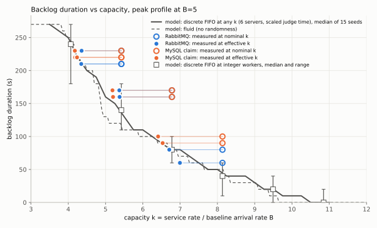

# 피크 부하 모양에서 RabbitMQ와 MySQL 채점 분배의 필요 채점 자원 (기본 실험)

## 질문

대회 제출은 평시 부하 위에 짧은 피크가 얹힌 모양이다. 이 실험의 질문은 두 가지다.

> 같은 피크 부하에서, 명목 채점 용량 k(= worker 수 기준 용량 ÷ 평시 부하)가 같을 때 RabbitMQ 방식과
> MySQL claim 방식의 사용자 지연(특히 백로그 지속 시간)은 어떻게 다른가? 그 차이는 "유효 용량의 차이"
> 하나로 설명되는가?

결과를 미리 정하지 않았다. 이 문서의 하네스(부하 모양, 채점 시작 시각, 분석기, 모델)는 이후 CPU 부하
변형과 규모 변형 실험에서 그대로 재사용한다.

**해석 규칙.** 부하 생성기와 서버가 같은 머신에서 돈다. 그래서 절대 RPS는 용량으로 인용하지 않고 비율과
효율만 쓴다. 작은 차이는 반복 간 변동과 비교한 뒤에만 말한다. `stale-token completion` 수는 중복 채점
수로 쓰지 않는다.

## 1. 조건과 파라미터

### 부하 모양 (평시 B, 총 360초, Poisson 도착)

| 구간 | 시각(앵커 기준) | 길이 | 유입률 | B=5에서 |
|---|---|---:|---:|---:|
| 평시 | 0–90s | 90s | 1B | 5/s |
| 피크 | 90–150s | 60s | 5B | 25/s |
| 최고 피크 | 150–180s | 30s | 10B | 50/s |
| 피크 | 180–240s | 60s | 5B | 25/s |
| 평시 | 240–360s | 120s | 1B | 5/s |

Gatling open-arrival(`constantUsersPerSec(r).during(t).randomized`)로 넣는다. 기대 도착 수는 5,550건이다.
실제 실행의 도착 수는 5,386–5,642건이고, 모든 구간이 기대값 ±4σ 안에 있었다(`supply.json`의 `segments`).

### 고정 조건

| 항목 | 값 |
|---|---|
| B | 5 RPS |
| 채점 | sleep 기반 합성 지연. 95% 50ms / 5% 2000ms(평균 147.5ms), `key-source=code`, seed 20260920 |
| judge 노드 | 2대 (`judge-1`, `judge-2`), 컨테이너 CPU 한도 0.75 |
| worker 합계 / 명목 k | 4 (2+2) / 5.42 · 5 (3+2) / 6.78 · 6 (3+3) / 8.14 |
| MySQL | MIF = 노드별 worker × 4 (8/8, 12/8, 12/12), claim timeout 4s, poll 100ms, claim batch 16 |
| RabbitMQ | prefetch 1, 노드별 concurrency = worker 수 |
| warm-up | 별도 contest에서 closed 10 RPS × 30s, quiescence까지 drain한 뒤 세션 준비와 본 부하 |
| 세션 | 도착 1건당 미리 로그인한 세션 1개(기대값 + 6σ = 6,017개, 100/s로 준비). 세션 재사용 0 |
| 상태 초기화 | 실행마다 MySQL·RabbitMQ·Redis 볼륨 삭제(`-ResetMySqlVolume -ResetBrokerAndCacheVolumes`). 부하 직전 outbox 0행, contest_submission 0행 |
| 순서 | 방식을 번갈아 실행했다(아래 실행 명령 참고) |

### 측정 정의 (분석기와 모델이 같은 정의를 쓴다)

- **시간축**: 스케줄 앵커(마커 사용자가 읽은 시각) 기준 초. 제출 시각은 부하 생성기의 dispatch 시각이다.
  그 이후 시각은 Docker VM 시계로 잰 구간을 더해 놓으므로 호스트와 VM의 시계 차이가 구간 길이에 들어가지 않는다.
- **큐 대기** = `judge_started_at − submitted_time`이다. 채점 시작은 이번에 추가한 컬럼으로, worker가 제출을
  집은 순간이다(`ContestSubmissionJudgeProcessor.judge` 진입). MySQL 방식에서는 claim했지만 로컬 큐에서
  기다린 시간도 대기에 들어간다.
- **백로그 지속(주 지표)**: 제출 시각을 10초 구간으로 묶는다. 구간 평균 큐 대기가 1초를 넘으면 백로그 구간이다.
  첫 평시 90초 이후에서 가장 긴 연속 백로그 구간의 길이를 쓴다.
- **L_result** = `result_saved_at − submitted_time`. 이것으로 10초·30초 초과 수를 센다.
- **피크 p50/p99**: 90–240s(5B 시작부터 5B 끝까지)에 도착한 제출의 L_result.
- **유효 k**: 대기 중인 제출이 worker 수 이상인 동안에는 모든 worker에 일이 있다. 그 최장 구간(양 끝 1초 제외)의
  worker 집기 수/초를 서비스율 μ로 보고 k_eff = μ / B로 둔다. 15초 미만이면 "불충분"으로 표시한다(이번에 해당 없음).
- **모델 예측**(`scripts/mysql-judge-tradeoff/peak_queue_model.py`)
  - *nominal*: 명목 worker 수의 다중 서버 FIFO(min-heap), Poisson 도착, 5% slow 난수. 15 seed의 중앙값.
  - *scaled@k_eff*: 같은 이산 모델에서 채점 시간을 k_nom/k_eff배로 늘려 유효 k를 만든다.
  - *fluid@k_eff*: 유체 근사(dQ/dt = λ − μ, 0.01초). 무작위성이 없다.
  - *replay@k_eff*: **그 실행의 실제 도착 시각과 실제 slow/fast 순서**를 같은 worker 수의 FIFO에 넣는다.
    채점 시간은 평균 점유가 측정 서비스율과 같아지도록 늘린다. "이 실행이 유효 k 하나로 설명되는가"의 판정 기준이다.
  - 참고: 유체 모델의 연속 지속 시간은 과제에 적힌 참고값과 일치한다(k=5 → 125.2s, 7 → 69.2s, 8 → 43.3s,
    9.75 → 0s, `test_peak_queue_model.py`). 참고값은 10초 구간이 아니라 순간 대기 > 1s의 연속 시간이다.
    이 문서의 주 지표는 10초 구간 정의를 쓴다.

### 무효 처리 규칙과 결과

무효 조건은 다음 중 하나다. 503·429·500이 1건이라도 있거나, 그 밖의 실패·미응답·세션 재사용이 있거나,
구간별 도착 수가 기대값에서 4σ 넘게 벗어나거나, integrity(accepted = unique = results = scoreboard)를
위반하거나, `judge_started_at`이 없는 결과가 있는 경우다.

- **본 실행 16회 모두 유효**하다. 전부 `ok`만 받았고 integrity를 통과했다.
- 쓰지 않은 실행: `smoke-peak-mysql-fault-1`, `smoke-peak-rabbit-fault-1`. 하네스 확인용으로 모양을
  축약(20:1,20:5,10:10,20:5,20:1)해 돌린 실행이라 비교에서 뺐다.
- 호스트 CPU가 30초 이상 연속 90%를 넘은 실행은 없다(최대 84%). `k542-mysql-r2`와 `k814-rabbit-r1`은 피크
  구간 호스트 평균이 45%로 다른 실행(18–20%)보다 높았다. 원인은 이 실험 밖의 호스트 활동으로 보이며, 두 실행의
  전체 CPU 값은 그만큼 걸러 읽어야 한다(아래 CPU 표).

## 2. 결과: 방식 × k

값은 반복 실행의 중앙값 [최소–최대]다. n은 k=5.42에서 3, 나머지는 2다. 실행별 원본은
`results/mysql-judge-tradeoff/peak-comparison-b5-20260925/comparison.md`에 있다.

### 사용자 지연

| k_nom | 방식 | 백로그 s | replay@k_eff | scaled@k_eff | nominal 모델 | L>10s | L>30s | 최대 대기 s | 피크 p50 s | 피크 p99 s |
|---:|---|---|---:|---:|---:|---|---|---|---|---|
| 5.42 | MySQL | 220 [220–230] | 220 [220–230] | 230 | 140 [110–180] | 3708 [3681–4164] | 2608 [2583–2840] | 65.2 [62.8–70.4] | 33.9 [33.4–36.3] | 64.2 [61.6–69.7] |
| 5.42 | RabbitMQ | 210 [210–230] | 220 [210–230] | 220 | 140 | 3942 [3647–4187] | 2627 [2412–2662] | 62.9 [58.8–63.3] | 33.6 [30.6–34.2] | 62.7 [58.6–63.0] |
| 6.78 | MySQL | 165 [160–170] | 170 | 150 | 80 [60–100] | 2758 [2695–2821] | 176 [56–297] | 31.2 [30.7–31.6] | 15.1 [14.1–16.0] | 30.6 [30.1–31.2] |
| 6.78 | RabbitMQ | 165 [160–170] | 170 | 140 | 80 | 2536 [2379–2692] | 0 | 25.8 [24.5–27.1] | 12.1 [10.6–13.6] | 25.7 [24.4–26.9] |
| 8.14 | MySQL | 95 [90–100] | 90 | 95 [90–100] | 40 [10–60] | 1064 [895–1234] | 0 | 15.5 [14.3–16.7] | 4.3 [3.7–4.8] | 14.8 [13.9–15.7] |
| 8.14 | RabbitMQ | 70 [60–80] | 50 [40–60] | 80 | 40 | 490 [151–830] | 0 | 11.8 [10.3–13.3] | 2.1 [1.4–2.7] | 11.8 [10.3–13.3] |

### 유효 용량

| k_nom | 방식 | k_eff | 효율 k_eff/k_nom | 구간 내 slow 비율 | 채점 1건의 worker 점유(implied) |
|---:|---|---|---|---:|---:|
| 5.42 | MySQL | 4.18 [4.18–4.24] | 0.771 [0.770–0.781] | 5.3–5.4% | 189–192ms |
| 5.42 | RabbitMQ | 4.35 [4.34–4.36] | 0.802 [0.801–0.804] | 5.3–5.4% | 184ms |
| 6.78 | MySQL | 5.19 [5.19–5.20] | 0.766 [0.765–0.767] | 5.4–5.5% | 192–193ms |
| 6.78 | RabbitMQ | 5.37 [5.37–5.38] | 0.792 [0.792–0.793] | 5.5% | 186ms |
| 8.14 | MySQL | 6.47 [6.41–6.53] | 0.796 [0.788–0.803] | 5.0–5.2% | 184–187ms |
| 8.14 | RabbitMQ | 6.85 [6.71–7.00] | 0.843 [0.825–0.860] | 4.7–4.9% | 172–179ms |

### 비용 (360초 부하 창의 CPU core-seconds, 중앙값)

| k_nom | 방식 | 스택 전체 | MySQL | broker | batch-1 (relay) | judge 2대 | web 2대 | row-lock waits/s | Questions/s |
|---:|---|---:|---:|---:|---:|---:|---:|---:|---:|
| 5.42 | MySQL | 184 [181–212] | 48 | 34 | 14 | 40 | 40 | 2.30 | 450 |
| 5.42 | RabbitMQ | 185 [179–187] | 38 | 39 | 21 | 37 | 40 | 0.52 | 397 |
| 6.78 | MySQL | 182 [181–182] | 47 | 34 | 14 | 38 | 41 | 2.30 | 461 |
| 6.78 | RabbitMQ | 186 [182–190] | 39 | 40 | 21 | 37 | 41 | 0.43 | 391 |
| 8.14 | MySQL | 185 [185–185] | 46 | 35 | 14 | 41 | 41 | 2.29 | 463 |
| 8.14 | RabbitMQ | 202 [180–225] | 42 | 42 | 24 | 42 | 44 | 0.57 | 386 |

- 피크 경험 하나를 치르는 데 드는 스택 전체 CPU는 두 방식이 사실상 같다(180–190 core-s).
  k=8.14 RabbitMQ의 202는 두 실행(180, 225) 중 225인 쪽이 호스트가 바빴던 `k814-rabbit-r1`이어서 생긴 값이다.
- 비용이 드는 자리는 다르다. MySQL 방식은 MySQL 컨테이너에서 약 +8–10 core-s를 더 쓰고, row-lock wait가
  약 4–5배(0.5 → 2.3/s), Questions가 약 +15% 많다. RabbitMQ 방식은 broker에서 약 +5 core-s, relay가 도는
  batch-1에서 약 +7 core-s를 더 쓴다.
- **broker(0.75 CPU 한도)는 포화되지 않았다.** 최고 피크 평균은 0.10–0.16 core다. 다만 CFS throttling은
  부하 창에서 누적 24–35초 관측됐다. 이는 100ms 주기의 짧은 버스트 때문이고 **두 방식에서 비슷하다**(MySQL
  24–29s, RabbitMQ 26–34s). broker는 두 방식 모두에서 결과 stream(scoreboard)을 나르기 때문이다. batch-1
  (0.5 한도)도 throttling이 있었고, relay가 도는 RabbitMQ 쪽이 더 많다(4–8s, MySQL 쪽 1–3s). 둘 다 이번
  용량 비교의 병목은 아니었다(아래 점유 분해에서 dispatch 경로 밖의 차이가 작다). 다만 이후 규모 실험(B=70)에서는
  먼저 확인해야 할 한계다.

## 3. 반복 실행의 변동 폭

| 지표 | 같은 조건 반복 간 폭 |
|---|---|
| 백로그 지속 | 10–20s (구간 하나에서 둘) |
| L>10s | 5.42에서 약 ±250건(3,650–4,190), 8.14 RabbitMQ에서 151–830 |
| 최대 대기 / 피크 p99 | ±3–4s |
| k_eff | ±0.01–0.15. 효율로 ±0.2–1.8%p |
| 스택 CPU | 보통 ±5 core-s. 호스트가 바빴던 실행은 +30–40 |

유효 k는 반복 간에 매우 안정적이다(같은 조건에서 ±1%대). 사용자 지연 지표는 도착 순서의 무작위성 때문에
훨씬 흔들린다. 그래서 **방식 간 차이는 지연 지표가 아니라 k_eff에서 먼저 확인된다.**

- 효율 차이는 RabbitMQ가 +0.031(5.42), +0.026(6.78), +0.047(8.14)이고 모두 반복 범위가 겹치지 않는다.
- 지연 지표의 방식 간 차이는 k=5.42·6.78에서 반복 범위 안이다. k=8.14에서만 백로그(95 vs 70), L>10s,
  최대 대기가 범위를 넘는다. 다만 n=2다.

## 4. 이론 곡선 위의 실측



([`docs/img/judge-peak-profile-backlog-vs-k.svg`](img/judge-peak-profile-backlog-vs-k.svg), 생성:
`Compare-PeakProfileRuns.py --svg`)

- 속 빈 점은 실측을 명목 k 위치에, 속 찬 점은 같은 실측을 유효 k 위치에 찍은 것이다. 명목 k 위치의 점은
  모두 모델보다 크게 위에 있다(5.42: 모델 140s vs 실측 210–230s). 유효 k로 옮기면 곡선 위로 온다.
- 실선은 이산 FIFO(6 서버, 채점 시간 스케일)로 그린 연속 곡선이고, 점선은 유체 근사다. k≈5 부근에서는 5B
  구간의 유입과 처리율이 거의 같다. 그래서 무작위 요동이 백로그를 만들고, 유체 근사(무작위성 없음)는 실제보다
  짧게 예측한다(k_eff≈5.3에서 유체 120s, 이산 140–150s, 실측 160–170s).
- 남은 10–20s 차이는 이번 워크로드의 slow 작업 배치에서 온다. slow 여부는 코드로 결정되므로, 같은 prefix의
  같은 도착 순번은 실행마다 같은 slow/fast를 받는다. 피크 구간에 slow 비율이 5.3–5.5%로 약간 높게 몰려 있다.
  이 순서를 그대로 쓴 replay는 k=5.42·6.78에서 백로그를 0–10s 차이로 맞춘다.

## 5. 판정: 방식 간 차이는 유효 k 하나로 설명되는가

**설명된다.** 근거는 네 가지다.

1. **각 실행은 자기 유효 k 하나로 재현된다.** 실제 도착·slow 순서를 측정 서비스율로 돌린 replay는 16개
   실행 중 14개 무장애 실행에서 백로그를 −20…+10s(대부분 0–10s) 차이로 맞춘다. 최대 대기와 피크 p99는 ±5s
   차이로 맞춘다. 가장 크게 벗어난 두 실행은 k=8.14 RabbitMQ(실측 80/60 vs replay 60/40)로, 백로그가 짧아
   구간 하나(10s)의 차이가 비율상 크게 보이는 지점이다.
2. **백로그가 쌓여도 용량이 떨어지지 않는다.** 포화 구간을 10초 창으로 자르면, "창에서 집은 작업의 명목 채점
   시간" 대비 "실제 점유"의 비율이 두 방식 모두 1.1–1.4 사이에서 오르내린다. 백로그가 커지는 180s 부근이나
   오래 지속된 280–310s에서도 추세가 없다. 창별 흔들림은 그 창에 slow 작업이 몇 개 걸렸는지로 설명된다.
   MySQL의 로컬 큐, claim, poll도 대기열 길이에 따라 비용이 커지지 않았다.
3. **방식 간 차이는 채점 1건당 고정 점유 차이 약 6–8ms다.** 아래 점유 분해를 보면, 두 방식은 worker 스레드
   안의 채점·결과 저장·결과 발행이 같고, "processor 밖"만 다르다. MySQL 16–20ms(outbox `completeAll` 약
   14–15ms 포함, poll/handoff), RabbitMQ 11–12ms(ack와 prefetch 1의 다음 배달)다. 이 고정 차이가 효율
   0.77 대 0.80(k=5.42·6.78)을 만든다.
4. **같은 유효 k면 같은 지연이다.** k_eff 5.19(MySQL, 6.78)와 5.37(RabbitMQ, 6.78)은 둘 다 백로그 160–170s다.
   k_eff 4.18 대 4.35(5.42)도 220 대 210–230으로 반복 범위 안이다.

따라서 "RabbitMQ가 피크를 더 잘 버티는" 몫은 **worker당 처리율 3–5%의 차이이고, 그 이상의 동역학 차이는
없다.** 같은 피크 경험을 사려면 MySQL 방식에 worker를 약 3–5% 더 주면 된다. 대가는 MySQL CPU·row-lock
증가이고, RabbitMQ 방식의 대가는 broker·relay CPU다. 두 방식 모두 명목 k 대비 약 20%의 용량을 잃는다.
이 손실의 대부분은 두 방식이 공통으로 가진 worker 스레드 안의 채점 후 작업이다(아래 7장).

> 주의: 명목 k로 모델을 읽으면 두 방식 모두 크게 틀린다(5.42에서 모델 140s vs 실측 210–230s). 용량 계획에는
> 반드시 측정한 유효 k(또는 1건당 실제 점유 약 180–190ms)를 써야 한다.

### MySQL 무장애 실행의 재claim

MySQL 무장애 실행에서도 `staleReclaims`가 2–12건 있었고(실행당, 제출의 ≤0.2%), `storedResultRepublishes`가
거의 같은 수였다. 4s lease가 로컬 큐에서 만료된 뒤 다른 worker가 다시 claim했고, 대부분은 이미 저장된 결과를
재발행으로 처리했다는 뜻이다. MIF = worker × 4에서 "로컬 대기 최대 약 0.6초"라는 사전 추정은 평균 채점
시간 기준이었다. 실제로는 worker 2–3개가 모두 2s 작업을 잡고 있고 로컬 큐에 slow 작업이 여럿 있으면 로컬 대기가
4초를 넘는다. 1건당 비용이 약 20ms이고 건수가 매우 적어서 용량 비교에는 영향이 없다(유효 k 오차 < 0.1%).
`stale-token completion` 수는 이 재claim의 늦은 완료가 거절된 수이며, 중복 채점 수로 쓰지 않는다.

## 6. 피크 중 장애 (방식당 1회)

조건: B=5, worker 3+3(명목 k 8.14). 첫 5B 구간 30초 지점(앵커 +120s, 실제 +121.4s)에 `judge-1`을 SIGKILL했고,
60초 뒤(+180s, 실제 +182.7s)에 같은 설정으로 `docker compose start`했다. 장애 동안 명목 k는 4.07이다.

| | MySQL | RabbitMQ |
|---|---:|---:|
| 재시작 요청 → 메트릭 응답 / 첫 채점 | +25.5s / +26.0s (앵커 +208.7s) | +25.6s / +26.0s (+208.7s) |
| 실제 용량 감소 구간 | 121.4–208.7s (87s) | 121.4–208.7s (87s) |
| 백로그 지속 | 170s (120–280s) | 170s (120–280s) |
| L>10s / L>30s | 3743 / 3019 | 3758 / 3079 |
| 최대 대기 / 피크 p50 / 피크 p99 | 56.6s / 46.0s / 56.5s | 57.4s / 44.7s / 57.3s |
| 무장애 같은 조건(중앙값) | 95s, 최대 대기 15.5s | 70s, 최대 대기 11.8s |
| 재claim/재전달 제출 | 10건 (outbox attempts > 1) | 3건 (살아남은 노드가 redelivered 플래그와 함께 받음) |
| 그 제출들의 최대 L_result / 최대 대기 | 8.0s / 6.2s | 4.5s / 2.5s |

**replay 모델**(`Replay-PeakFault.py`)은 그 실행의 도착·slow 순서를 쓰고, 채점 1건 점유를 같은 방식 무장애
k=8.14 실행의 중앙값(MySQL 185.5ms, RabbitMQ 175.2ms)으로 둔다.

| 변형 | MySQL 백로그 / 최대 대기 / p99 | RabbitMQ 백로그 / 최대 대기 / p99 |
|---|---|---|
| 실측 | 170 / 56.6 / 56.5 | 170 / 57.4 / 57.3 |
| as-run (재전달 지연 MySQL 4s, RabbitMQ 0s, 복귀 +208.7s) | 180 / 57.8 / 57.9 | 170 / 56.8 / 56.8 |
| 재전달 지연 0 | 180 / 57.8 / 57.9 | 170 / 56.8 / 56.8 |
| 재전달 지연 30s | 180 / 57.8 / 57.9 | 170 / 56.8 / 56.8 |
| 재시작 요청 즉시 복귀(+182.7s) | 170 / 44.8 / 44.9 | 150 / 43.8 / 43.7 |
| 장애 없음 | 100 / 15.1 / 15.1 | 100 / 14.5 / 14.5 |

(무작위 5% 모델, 15 seed: MySQL as-run 170 [160–180] / 54.5, RabbitMQ 160 [140–170] / 50.3.
`results/.../peak-comparison-b5-20260925/fault-model.json`)

**판정: 백로그 지속을 결정한 것은 줄어든 용량(과 그 길이)이지, 재전달/lease 방식이 아니다.**

- replay가 두 방식의 실측을 백로그 0–10s, 최대 대기 ±1.2s 차이로 맞춘다.
- 재전달 지연을 0초, 4초, 30초로 바꿔도 결과가 거의 변하지 않는다.
- 재claim·재전달된 제출은 3–10건뿐이고, 그들의 지연(최대 4.5–8.0s)은 같은 시각에 큐에 줄 선 일반
  제출(최대 57s)보다 훨씬 짧다. 죽은 노드가 들고 있던 작업은 lease 만료(4s)나 즉시 재전달로 금방 큐 앞쪽에
  돌아온다. 뒤에 줄 선 수천 건의 대기는 남은 3 worker의 처리율로 정해진다.
- 두 방식의 장애 결과는 같다(170s 대 170s). 무장애 때 보였던 3–5% 효율 차이는 장애가 만든 큰 백로그에
  비하면 작다.
- 결과를 가장 크게 움직인 변수는 **재시작 후 준비 시간**이었다. 계획한 60초 정지는 JVM 기동 약 26초 때문에
  실제 87초가 됐다. 준비가 즉시였다면 최대 대기는 약 13초 짧았을 것이다(57 → 44s).
- MySQL 쪽 재claim 10건은 모델의 "실행 중이던 작업" 3건보다 많다. 죽은 노드가 claim만 하고 로컬 큐에 쥐고
  있던 작업(MIF 12)도 lease 만료 뒤 돌아왔기 때문이다. 표본이 작아 최대값으로만 읽는다.

## 7. 채점 후 작업 시간 실측 (직전 단계의 약 60ms 추정 검증)

포화 구간에 채점된 작업의 worker 점유를 분해했다(`Decompose-PeakOccupancy.py`, ms/건, 무장애 14회).

| 조건 | 방식 | 명목 채점 | 채점 전 조회 + sleep 초과 | 결과 insert 대기 | 저장 후(stream 발행·완료 전달) | processor 밖 | 점유 합계 | 명목/점유 |
|---|---|---:|---:|---:|---:|---:|---:|---:|
| 2+2 | MySQL (3회) | 154.3–154.9 | 1.2–1.4 | 6.2–6.3 | 10.4–11.2 | 16.4–18.4 | 188.9–191.5 | 0.81 |
| 2+2 | RabbitMQ (3회) | 153.8–155.4 | 1.3–1.4 | 6.3 | 10.1–11.3 | 10.8–11.1 | 183.6–184.2 | 0.84 |
| 3+2 | MySQL (2회) | 156.0–156.4 | 1.2 | 6.2–6.3 | 8.6–8.7 | 20.1–20.2 | 192.3–192.8 | 0.81 |
| 3+2 | RabbitMQ (2회) | 156.6 | 1.4 | 6.5–6.6 | 9.0–9.5 | 12.2–12.5 | 186.0–186.3 | 0.84 |
| 3+3 | MySQL (2회) | 146.8–151.4 | 1.2 | 6.5–6.7 | 13.9–18.4 | 10.6–14.1 | 183.7–187.2 | 0.80–0.81 |
| 3+3 | RabbitMQ (2회) | 141.6–145.5 | 1.3–1.6 | 6.7–7.2 | 21.8–24.3 | −2.4–2.9 | 171.5–178.9 | 0.81–0.83 |

- "저장 후"와 "processor 밖"의 경계는 `contest_judge_processing` 타이머의 **실행 전체 평균**으로 나눈 것이다.
  3+3처럼 포화 구간이 짧은 조건에서는 포화 밖 작업이 섞여 경계가 흔들린다(음수가 나온 이유). 두 칸의 **합**이
  안정적인 값이다. 그 합은 MySQL 27–29ms, RabbitMQ 21–24ms다.
- 명목 채점 시간을 뺀 **채점 외 점유 전체**는 MySQL 약 34–37ms, RabbitMQ 약 29–31ms다. 이 중 두 방식에
  공통인 부분(조회 1.3ms + 결과 insert 6.3ms + 저장 후 stream 발행 약 9–11ms)이 약 17–19ms다.
  MySQL만의 outbox `completeAll`은 결과 저장 → PUBLISHED 사이에서 직접 잰 값이 14–15ms다.
- **약 60ms 추정은 이번 조건에서는 확인되지 않았다.** 이번 실측은 채점 외 점유가 약 30–37ms다. 직전 추정은
  MIF 64, worker 16개, 150–230 RPS에서 Little's law로 구한 값이다. 거기에는 claim 후 로컬 큐 대기가 `reserved`
  점유에 섞여 있을 수 있고, DB·result writer(단일 스레드, batch 32) 경합도 훨씬 컸다. 이번 측정은 worker가
  제출을 집은 순간부터 재므로 로컬 큐 대기를 포함하지 않는다. 같은 규모(B=70) 실험에서 이 분해를 다시 해야
  두 값을 직접 비교할 수 있다.
- 한편 명목 대비 약 20% 손실의 구성은 이렇다. 약 4–5%p는 이번 워크로드 피크 구간의 slow 비율(5.3–5.5%)
  때문에 명목 평균 자체가 147.5ms보다 큰 몫이다. 나머지 약 15–19%p가 위의 채점 외 점유다. k_eff/k_nom은
  0.77–0.84이고, 구간의 실제 작업 구성 기준 효율(명목/점유)은 0.80–0.84다.

## 정확한 실행 명령

모든 실행은 같은 커밋(`fd47d51`)의 같은 하네스(`Run-TradeoffExperiment.ps1` SHA-256 `4822A38F…`, `parameters.json`의 `harnessScriptSha256`)에서 돌았다. 일부 실행의 `harnessTreeDirty=true`는 실행 중에 분석 스크립트(`Analyze-`/`Compare-PeakProfileRuns.py`)를 고치고 있었기 때문이다. 수치는 모두 최종 분석기(`003eb37`)로 다시 분석했다. 방식 순서는 번갈아 두었다.

```powershell
# 기본 10회: 5.42 R→M, 6.78 M→R, 8.14 R→M, 5.42 M→R, 5.42 R→M
.\scripts\mysql-judge-tradeoff\Invoke-PeakProfileMatrix.ps1 -Plan base -Suffix 20260925
# 장애 2회 (8.14, judge-1 SIGKILL +120s, start +180s)
.\scripts\mysql-judge-tradeoff\Invoke-PeakProfileMatrix.ps1 -Plan fault -Suffix 20260925
# 나머지 조건 2회째: 6.78 R→M, 8.14 M→R
.\scripts\mysql-judge-tradeoff\Invoke-PeakProfileMatrix.ps1 -Plan base-extra -Suffix 20260925
```

matrix가 한 실행에 넘기는 인자(예: k=6.78 MySQL):

```powershell
.\scripts\mysql-judge-tradeoff\Run-TradeoffExperiment.ps1 -DispatchMode mysql -PeakProfile -PeakBaseRps 5 `
  -WorkerCount 3 -Judge2WorkerCount 2 -MySqlMaxInFlight 12 -Judge2MaxInFlight 8 -MySqlClaimBatchSize 16 `
  -MySqlClaimTimeout 4s -MySqlPollInterval 100ms -RabbitPrefetch 1 -LatencySeed 20260920 `
  -WarmupTargetRps 10 -WarmupSeconds 30 -UserCount 6400 -BurstAuthRps 100 -BurstAuthSeconds 63 `
  -SteadyGuardSeconds 0 -DrainTimeoutSeconds 900 -ResetMySqlVolume -ResetBrokerAndCacheVolumes `
  -RunId peak-b5-k678-mysql-r1-20260925
# 장애 실행은 여기에 -PeakFaultKillAtSeconds 120 -PeakFaultRestartAtSeconds 180 -KilledNode judge-1
```

분석:

```powershell
python scripts\mysql-judge-tradeoff\Analyze-PeakProfileRun.py <runDir>        # 실행 끝에 자동 실행
python scripts\mysql-judge-tradeoff\Compare-PeakProfileRuns.py --out results\mysql-judge-tradeoff\peak-comparison-b5-20260925 `
  --svg docs\img\judge-peak-profile-backlog-vs-k.svg results\mysql-judge-tradeoff\peak-b5-*-20260925
python scripts\mysql-judge-tradeoff\Decompose-PeakOccupancy.py results\mysql-judge-tradeoff\peak-b5-k*-20260925
python scripts\mysql-judge-tradeoff\Replay-PeakFault.py results\mysql-judge-tradeoff\peak-b5-fault-k814-mysql-r1-20260925 --implied-ms 185.45
python scripts\mysql-judge-tradeoff\Replay-PeakFault.py results\mysql-judge-tradeoff\peak-b5-fault-k814-rabbit-r1-20260925 --implied-ms 175.2
python scripts\mysql-judge-tradeoff\peak_queue_model.py curve --out <file>.json
```

## 산출물

`results/mysql-judge-tradeoff/` 아래에 있고 Git에서는 무시된다.

- 실행 16개: `peak-b5-k{542,678,814}-{mysql,rabbit}-r{1,2,3}-20260925`, `peak-b5-fault-k814-{mysql,rabbit}-r1-20260925`
- 실행마다 다음 파일이 남는다.
  - 원본: `peak-summary.json`, `peak-report.md`, `peak-bins.csv`(10초 구간 대기·지연 시계열), `peak-queue-1s.csv`
    (1초 도착·집기·대기열·컨테이너 CPU), `latency.csv`(제출별 접수·채점 시작·채점 끝·저장·outbox 시각),
    `submission-attempts.csv`, `peak-recorder.json`, `supply.json`
  - 비용: `container-cpu-1s.csv`, `host-cpu-1s.csv`, `timeseries.csv`, `metrics/*.prom`
  - 장애 실행: `fault-replay.json`, `judge-logs.txt`, `redelivered-submissions.csv`
- 비교: `peak-comparison-b5-20260925/{comparison.md,comparison.json,occupancy.json,fault-model.json}`
- 로그: `peak-matrix-logs/`

## 하네스 변경 (실험 전에 커밋)

| 커밋 | 내용 |
|---|---|
| `a25b8e1` | `judge_started_at` 컬럼(V18)과 채점 시작 시각 기록, `contest.judge.processing` 타이머 |
| `3b5d61f` | `peak_queue_model.py`: 이산 FIFO, 스케일 이산, 유체, 노드 장애 이벤트 모델과 테스트 |
| `ee878bc` | RabbitMQ listener가 재전달된 메시지의 submission id를 로그로 남김(재전달 cohort용) |
| `436b70e` | Gatling `ContestSubmissionPeakProfileSimulation`(Poisson 구간 부하, 구간 trace, 제출별 기록) |
| `04dbbf3` | `-PeakProfile`, judge-2 개별 크기(`CONTEST_JUDGE_2_*`), broker/Redis 볼륨 초기화, 무효 규칙, 시각 고정 장애, `HostCpuSampler.ps1`, `Invoke-PeakProfileMatrix.ps1` |
| `fd47d51` | `Analyze-PeakProfileRun.py`, `Compare-PeakProfileRuns.py` |
| `003eb37` | replay@k_eff, 점유 분해, 장애 replay, 비교 그래프의 연속 이산 곡선 |

실행 중 Docker 호출은 장애 실행의 `kill`·`start` 2회와 부하 후 judge 로그 수집 1회뿐이다. SQL은 실행당 mysql
세션 하나(`Invoke-SqlRows`), 컨테이너 CPU는 기존 cgroup helper, 호스트 CPU는 Windows 원시 카운터(Docker 호출
없음)로 읽었다. 실험 중 Docker Desktop은 정상이었다.

## 이후 실험(CPU 부하 변형, 규모 변형)에서 재사용할 때 주의할 점

- **B=70**에서는 도착이 약 77,700건이고 세션이 약 80,000개 필요하다.
  - `Invoke-PeakProfileMatrix.ps1 -BaseRps 70`은 로그인 속도를 `max(100, 세션/300)`(약 267/s)로 늘려 약 5분
    동안 준비한다. `-UserCount`는 약 80,100이 된다.
  - 그런데 seeding은 warm-up contest에도 같은 `userCount`를 쓰고, 그 요청의 timeout이 60초다
    (`Run-TradeoffExperiment.ps1`의 open-burst seeding). 먼저 짧은 실행으로 확인하고, 필요하면 warm-up
    seeding을 따로 줄여라.
  - 로그인 267/s가 web·Redis에 거절을 만들면 준비 단계에서 run이 멈춘다(세션 수 검사).
- 레코더는 최대 400,000건까지 기록한다. B=70의 한 실행은 충분히 들어간다.
- judge 컨테이너는 0.75 CPU, broker 0.75, batch-1 0.5 한도다. 이번 B=5에서도 broker와 batch-1에 짧은 CFS
  throttling이 있었다. B=70에서는 이것이 먼저 한계가 될 수 있으니 `peak-summary.json`의 `cpu.containers.*`에서
  `throttledMsLoad`와 `meanCoresTopPeak`, 그리고 `flags`를 먼저 봐라.
- **CPU 부하 변형**: 현재 채점은 sleep이라 judge CPU를 쓰지 않는다. CPU 소모 채점을 넣으면 judge 컨테이너 한도
  (0.75)가 worker 수보다 먼저 서비스율을 정할 수 있다. 그 경우에도 k_eff는 포화 구간 집기율로 재므로 분석기는
  그대로 쓸 수 있다.
- 유효 k는 "대기 ≥ worker 수"인 구간이 15초 이상이어야 측정된다. k가 커서 백로그가 거의 없는 조건은 "불충분"으로
  나온다. 그때 방식 비교는 replay/점유 분해 대신 지연 지표와 CPU로만 해야 한다.
- MySQL MIF = worker × 4, lease 4s에서는 무장애 실행에서도 slow 작업이 로컬 큐에 몰리면 재claim이 생긴다(실행당
  2–12건). 규모 실험에서 이 수가 커지면 용량 비교를 오염시킬 수 있으니 `db-verification.json`의 `staleReclaims`와
  `storedResultRepublishes`를 함께 보고하라.
- 장애 실행은 JVM 재기동에 약 26초가 걸린다. 계획한 정지 시간 + 약 26초가 실제 용량 감소 구간이다.
  `peak-summary.json`의 `fault.firstJudgementAfterRestartAt`을 써라.
- 반복 간 변동: 지연 지표는 ±10–20s(백로그), ±3–4s(최대 대기) 흔들린다. k_eff는 ±1%대로 안정적이다.
  방식 비교는 k_eff와 점유 분해로 먼저 하라.
