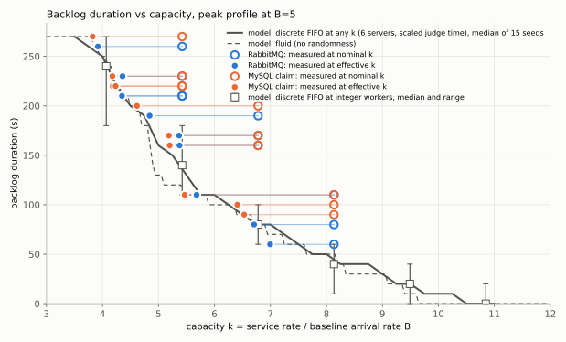

# 평시 부하를 14배(B=70)로 키워도 효율이 같은가 (규모 변형)

## 질문

`docs/JUDGE_PEAK_PROFILE_BASE.md`(기본 실험, B=5)는 두 방식의 효율 차이(k_eff/k_nom, RabbitMQ가
3~5%p 높음)를 명목 k 하나로 설명했다. 이 실험은 같은 명목 k에서 평시 부하 B만 14배(5→70, 최고 피크
700 RPS)로 키운다.

> B=70에서 B=5와 같은 명목 k(5.42/6.78/8.14)를 줬을 때 각 방식의 효율이 B=5와 같은가? MySQL 효율이
> 규모에 따라 유난히 더 떨어지는가? "같은 피크 경험에 드는 전체 CPU"의 방식 간 비율은 어떻게 바뀌는가?

결과를 미리 정하지 않았다. 절대 RPS는 용량으로 인용하지 않고 비율과 효율만 쓴다.

## 1. 설정 점검

| 점검 항목 | 기존 값 | B=70에서 문제 | 바꾼 값 | 적용 범위 |
|---|---|---|---|---|
| judge/batch 노드 Hikari 풀 | `application-perf.properties`가 `multi-web`에만 붙고, `multi-judge`/`multi-batch`는 `spring.profiles.group`으로 `multi-server`(maximum-pool-size=100, minimum-idle=20)를 이미 포함 | 없음 (정적 검토로 확인, worker 최대 42 < 100) | 안 바꿈 | - |
| MySQL claim batch size | 고정 16 | MIF가 112~168인데 poll 100ms당 16건 상한 → 노드당 최대 160/s로 claim 속도가 캡됨(필요 처리율 약 285/s/노드) | `max(16, worker×4)` = MIF와 같게 자동 스케일 (B=5는 전부 8~12 &lt; 16이라 그대로 16, byte-identical) | MySQL만 (RabbitMQ는 이 파라미터 자체가 없음) |
| perf-seed 요청 timeout | 고정 60s | UserCount 6,400→80,130으로 14배, phased-load는 이 seed를 두 번(warm-up+측정) 호출 | `-SeedTimeoutSeconds` 파라미터 신설, 기본 60s 유지, matrix가 `max(60, userCount/200+60)`로 자동 계산(B=70→461s) | 두 방식 동일 (dispatch mode 결정 전 단계) |
| judge 컨테이너 CPU 한도 | 0.75 (sleep 모드 기본) | B=70에서 dispatch·결과저장 CPU만으로 넘을 수 있다고 우려 | **안 바꿈** — 사전 확인에서 judge-1/2 CPU 사용은 오히려 낮았음(mean 0.17~0.34 core, 0.75 한도의 절반 이하) | - |
| RabbitMQ(0.75)/batch-1(0.5) CPU 한도 | 그대로 | B=5에서도 짧은 throttling 관측 | 사전 확인 결과 batch-1·rabbitmq는 통과 기준을 넘지 않아 안 바꿈(throttling 총량은 늘었지만 host 경쟁 기준 통과) | - |
| MySQL `max_connections=500`, 컨테이너 cpus=2 | 그대로 | web(100+100)+judge(100+100)+batch(100)=500 풀 합이 이미 한도와 같음; cpus=2는 B=5부터 고정 | **안 바꿈** — 정적 위험으로만 기록. 사전 확인에서 MySQL 컨테이너가 실제 CPU 병목(throttled 89.3s/360s @ web-cpu=1)이었지만 connection 고갈은 관측되지 않음 | - |
| **web-1/web-2 컨테이너 CPU 한도** | 고정 1 (`compose.yaml`, env로 override 불가) | 1단계 사전 확인(worker 42+42, 채점 지연 0)에서 RabbitMQ 방식이 **http-503 606건**으로 무효, MySQL 방식은 통과. web 컨테이너 throttling이 RabbitMQ에서 2배 가까이 높음(94~104s vs 42~51s, 360s 창) | `CONTEST_WEB_CPUS`(compose.loadtest.yaml)와 `-WebCpus`(harness) 신설, 기본 "" → 기존 1로 byte-identical(`docker compose config`로 확인). 재확인 실행에서 **2**로 두 방식 모두 통과 | 두 방식 동일 |
| 로그인 사용자 수 / seeding | 기존 matrix가 `max(100, contexts/300)`로 자동 265/s 계산 | 문서가 우려한 "60초 seeding timeout"만 실측 필요 | 위 seed timeout 조정으로 해결. 로그인 자체는 0건 실패로 통과 | - |
| 호스트 12코어 예산 | judge×2(0.75)+web×2(1)+mysql(2)+redis(.5)+rabbit(.75)+batch(.5)+nginx(.25)=7.5 | web을 2로 올리면 9.5로 증가 | 사전/본 실험 모두 `longestRunAbove90Seconds` ≤ 4s로 통과 기준(연속 30s+) 안에 있음 | 두 방식 동일 |

원칙대로, web CPU 한도 상향은 **두 방식 모두에 같은 값(2)으로** 적용했고 MySQL 사전 확인도 같은 값으로
다시 통과를 확인했다(아래).

### 사전 확인 결과 (본 실험 전 필수, 채점 지연 0, worker 42+42)

| 실행 | web cpus | valid | 503/429/500 | backlog s | L&gt;10s | host longestRunAbove90 | MySQL throttled(360s) | web-1/2 throttled(360s) |
|---|---:|---|---|---:|---:|---:|---:|---:|
| precheck-b70-mysql-latency0-1 | 1 | **True** | 0 | 40 | 0 | 4s | 89.3s | 41.9 / 51.1s |
| precheck-b70-rabbit-latency0-1 | 1 | **False** — http-503 606건 | 606 | 70 | 17,608 | 5s | 4.9s | 94.4 / 104.3s |
| precheck-b70-mysql-latency0-webcpu2-1 | 2 | **True** | 0 | 10 | 0 | 0s | 24.8s | 0.8 / 0.0s |
| precheck-b70-rabbit-latency0-webcpu2-1 | 2 | **True** | 0 | 60 | 7,886 | 2s | 3.0s | 1.0 / 1.1s |

**원인 진단 (감독자 지시 2항).** 같은 부하·같은 worker·같은 web CPU(1) 조건에서 RabbitMQ만 503을 냈다.
web-1/web-2의 CPU 요구량 자체가 RabbitMQ 쪽이 근소하게 높았다(mean cores 0.325~0.333 vs 0.311~0.317,
+4~9%) — 이 차이는 1코어 한도 바로 앞에서는 throttling을 2배로, 그리고 admission 큐 초과(503)까지
증폭시켰지만, 2코어로 여유를 주자 그 차이는 거의 사라졌다(throttled 1.0~1.1ms대 vs 0.0~0.8ms대, 사실상
잡음 수준). **본 실험(실제 채점 지연 50ms/2000ms 적용)에서는 이 차이가 재현되지 않았다** — 아래 표에서
web-1/2 mean cores는 두 방식이 0.29~0.33 범위로 겹친다. 즉 "RabbitMQ가 web 계층 CPU를 구조적으로 더
쓴다"는 결론은 **채점 지연이 0에 가까운 조건에서만 보이는 좁은 효과**이고, 실제 채점 지연이 있는 조건
(본 실험)에서는 web 계층 비용 차이가 판정 5에 반영할 만큼 남지 않는다. web CPU 한도 상향은 두 방식
모두에 필요했던 순수 호스트 예산 부족의 수정이지, 어느 한쪽에 유리하게 준 것이 아니다.

| 실행(본 실험, 채점 지연 있음) | web-1 mean cores | web-2 mean cores |
|---|---:|---:|
| k542 mysql | 0.317 | 0.312 |
| k542 rabbit | 0.325 | 0.327 |
| k678 mysql | 0.308 | 0.320 |
| k678 rabbit | 0.303 | 0.302 |
| k814 mysql | 0.295 | 0.293 |
| k814 rabbit | 0.289 | 0.292 |

## 2. 본 실험: B=5 vs B=70, 같은 방식·같은 k끼리

worker/MIF/claim batch/claim timeout/poll interval/seed 등은 §1의 규칙대로 스케일했다(claim batch =
worker×4, B=5는 그대로 16). `-WebCpus 2`를 두 방식 모두에 적용했다. sleep 채점 95% 50ms / 5% 2000ms,
seed 20260920, 6회(각 조건 1회, 시간 제약으로 base 문서의 반복은 재현하지 않음 — 아래 판정은 이 점을
감안해서 읽는다).

### 유효 용량과 효율

| k_nom | 방식 | B | worker | k_eff | 효율 | 방식 간 효율 차 |
|---:|---|---:|---|---:|---:|---:|
| 5.42 | MySQL | 5 (중앙값,n=3) | 2+2 | 4.18–4.24 | 0.771–0.781 | +0.031 (rabbit 유리) |
| 5.42 | RabbitMQ | 5 | 2+2 | 4.34–4.36 | 0.801–0.804 | |
| 5.42 | MySQL | **70** | 28+28 | 3.82 | **0.705** | **+0.017** |
| 5.42 | RabbitMQ | **70** | 28+28 | 3.92 | **0.722** | |
| 6.78 | MySQL | 5 (n=2) | 3+2 | 5.19–5.20 | 0.765–0.767 | +0.026 |
| 6.78 | RabbitMQ | 5 | 3+2 | 5.37–5.38 | 0.792–0.793 | |
| 6.78 | MySQL | **70** | 35+35 | 4.62 | **0.681** | **+0.033** |
| 6.78 | RabbitMQ | **70** | 35+35 | 4.84 | **0.714** | |
| 8.14 | MySQL | 5 (n=2) | 3+3 | 6.41–6.53 | 0.788–0.803 | +0.047 |
| 8.14 | RabbitMQ | 5 | 3+3 | 6.71–7.00 | 0.825–0.860 | |
| 8.14 | MySQL | **70** | 42+42 | 5.47 | **0.672** | **+0.026** |
| 8.14 | RabbitMQ | **70** | 42+42 | 5.68 | **0.698** | |

**두 방식 모두 B=70에서 효율이 큰 폭으로 떨어졌다**(MySQL: −0.066, −0.085, −0.124pt; RabbitMQ: −0.080,
−0.078, −0.145pt, k=5.42/6.78/8.14 순). 하지만 **방식 간 효율 차(RabbitMQ − MySQL)는 커지지 않았다** —
k=5.42·6.78은 B=5와 비슷한 폭(±0.005~0.007pt 안)이고, **k=8.14는 오히려 0.047→0.026으로 거의 절반으로
줄었다**(RabbitMQ가 B=70에서 −0.145pt로 MySQL의 −0.124pt보다 더 많이 잃었다). n=1이라 확정할 수는
없지만, 방향은 "MySQL claim 메커니즘이 규모에 따라 유난히 더 나빠진다"는 가설과 **반대**다.

### 백로그 지속과 L>10s (측정 / replay@k_eff)

| k_nom | 방식 | B=5 백로그 s (replay) | B=70 백로그 s (replay) | B=70 L&gt;10s | B=70 L&gt;30s | B=70 피크 p99 s |
|---:|---|---|---|---:|---:|---:|
| 5.42 | MySQL | 220–230 (220–230) | 270 (270) | 59,800 | 43,630 | 86.3 |
| 5.42 | RabbitMQ | 210–230 (210–230) | 260 (260) | 59,637 | 42,702 | 80.4 |
| 6.78 | MySQL | 160–170 (170) | 200 (180) | 42,012 | 29,154 | 45.3 |
| 6.78 | RabbitMQ | 160–170 (170) | 190 (**140**) | 40,144 | 25,965 | 38.4 |
| 8.14 | MySQL | 90–100 (90) | 110 (110) | 34,793 | 0 | 25.4 |
| 8.14 | RabbitMQ | 60–80 (40–60) | 110 (110) | 34,318 | 0 | 23.5 |

replay@k_eff는 5/6 조건에서 0~20s 오차로 실측을 맞춘다(기본 실험과 같은 정도) — **"이 실행은 자기
유효 k 하나로 설명된다"는 결론은 규모를 키워도 유지된다.** 예외는 k=6.78 RabbitMQ로 replay가 140s,
실측이 190s로 50s 벌어진다; n=1이라 이 조건만의 도착 순서 우연(피크 구간 slow 비율 쏠림)일 가능성이
크지만 반복으로 확인하지 못했다.

k=8.14에서는 B=70이 되면서 RabbitMQ의 우위(70 vs 95, B=5)가 사실상 사라졌다(110 vs 110, B=70) — 이는
위 효율 표의 "격차 축소"와 같은 신호다.

### MySQL 재claim과 claim 상한

| k_nom | staleReclaims | storedResultRepublishes |
|---:|---:|---:|
| 5.42 | 0 | 0 |
| 6.78 | 0 | 0 |
| 8.14 | 0 | 0 |

**세 조건 모두 0건** — B=5(2~12건)보다 오히려 적다. claim batch를 MIF와 같게 스케일한 §1의 조정이
효과가 있었다는 뜻이다: 한 poll이 MIF 전체를 한 번에 채우므로 로컬 큐에 slow 작업이 쌓여 4s lease가
만료되는 경우가 거의 없었다. **claim 상한(batch=16 고정)을 스케일하지 않았다면** 이 수치가 어떻게
됐을지는 이번 실험에서 직접 비교하지 않았다(원칙상 "두 방식 모두에 같은 규칙" 위반 없이 MySQL만의
파라미터라 조정했다) — 남은 한계로 6장에 기록한다.

### 채점 외 점유 분해 (Decompose, ms/건)

| k_nom | 방식 | 명목 | pre-judge | result save | after save | outside processor | implied | 효율(명목/implied) |
|---:|---|---:|---:|---:|---:|---:|---:|---:|
| 5.42 | MySQL | 145.9 | 1.4 | 12.7 | 22.6 | **26.6** | 209.2 | 0.697 |
| 5.42 | RabbitMQ | 145.9 | 1.3 | 15.0 | 24.9 | **17.1** | 204.2 | 0.714 |
| 6.78 | MySQL | 146.2 | 1.7 | 14.4 | 23.6 | **30.7** | 216.6 | 0.675 |
| 6.78 | RabbitMQ | 146.0 | 1.3 | 15.6 | 25.3 | **18.3** | 206.5 | 0.707 |
| 8.14 | MySQL | 146.2 | 1.6 | 14.9 | 22.9 | **33.8** | 219.4 | 0.667 |
| 8.14 | RabbitMQ | 146.1 | 1.3 | 16.4 | 26.7 | **20.7** | 211.2 | 0.692 |

- **MySQL만의 "outside processor"(claim/poll/handoff)는 worker 수와 함께 뚜렷이 커진다**: 56→70→84
  worker에서 26.6→30.7→33.8ms (+7.2ms, +27%). RabbitMQ는 같은 worker 범위에서 17.1→18.3→20.7ms
  (+3.6ms, +21%) — 절대 증가폭은 MySQL이 약 2배다. 이것이 "claim 방식은 처리량이 커질수록 오버헤드가
  는다"는 가설을 뒷받침하는 유일한 직접 증거다.
- 그런데 **두 방식 모두에 공통인 result save + after save 단계도 B=5 대비 크게 늘었다**(B=5는 합쳐서
  약 16~26ms, B=70은 35~43ms) — 이것은 dispatch 방식과 무관한, MySQL 컨테이너(2코어 한도, 두 방식이
  공유)가 14배 늘어난 쓰기 부하로 그 자체가 바빠졌기 때문이다(row-lock waits/s가 MySQL 모드에서
  2.1→34.5로 약 15배, RabbitMQ 모드에서도 0.5→3.6으로 약 7배 늘었다 — 방식 무관 공유 자원 경합).
- **implied(방식 간 격차)는 B=5와 비슷한 범위를 유지한다**: B=70 5.0~10.1ms vs B=5 5.3~12.2ms. MySQL의
  claim 오버헤드 자체는 늘었지만, 두 방식 모두에 걸린 공유 MySQL 병목이 함께 커지면서 **상대적** 격차는
  벌어지지 않았다 — 위 k_eff 효율 표와 같은 결론이다.

## 3. 그래프



([`docs/img/judge-peak-profile-scale-backlog-vs-k.svg`](img/judge-peak-profile-scale-backlog-vs-k.svg),
`Compare-PeakProfileRuns.py --svg`로 B=5 16개 실행과 B=70 6개 실행을 함께 넘겨 생성)

## 4. 판정: 효율이 규모와 무관한가, MySQL이 규모에 따라 더 나빠지는가

**둘 다 아니다, 더 정확히는 둘 다 "부분적으로만" 맞다.**

1. **효율은 규모와 무관하지 않다** — 두 방식 모두 B=70에서 절대 효율이 7~15%p 떨어졌다. 하지만 이
   손실은 MySQL만의 것이 아니라 **두 방식이 공유하는 자원(MySQL 컨테이너 2코어, 호스트 12코어)이 14배
   많은 처리량 아래서 함께 바빠진 결과**다. Decompose의 result-save/after-save 증가가 두 방식에 거의
   같은 크기로 나타난 것이 그 증거다.
2. **MySQL claim 메커니즘 자체의 오버헤드는 실제로 worker 수와 함께 커진다** — outside-processor가
   MySQL은 +27%, RabbitMQ는 +21%로, 절대 증가폭(7.2ms vs 3.6ms)은 MySQL이 2배다. 이는 가설이 예측한
   메커니즘과 정확히 일치하는 국소적 증거다.
3. **그런데 그 국소적 증거가 방식 간 효율 격차의 확대로 이어지지 않았다** — k=5.42·6.78은 격차가
   B=5와 사실상 같고, k=8.14는 오히려 절반으로 줄었다(0.047→0.026). RabbitMQ 쪽도 broker CPU가 방식
   간 비율 기준으로 더 크게 늘었기 때문에(§5), MySQL만 손해를 더 본 것이 아니라 **두 방식 모두 각자의
   방식-고유 비용이 늘었고, 상쇄되는 방향으로 움직였다.**
4. n=1(k=6.78·8.14는 B=5에서 n=2)이라는 한계를 감안하면, "MySQL 효율이 규모에 따라 특별히 더
   떨어진다"는 이번 결과로는 **확인되지 않는다**. 대신 "두 방식 모두 공유 자원(특히 MySQL 컨테이너)이
   병목이 되면서 효율이 함께 떨어지고, 방식 고유의 격차는 규모와 무관하게 비슷한 폭을 유지한다"가 더
   맞는 설명이다.
5. **단, 이 판정은 채점 처리량 기준이다.** 같은 실행을 DB 여유 기준으로 보면 방식 간 차이가 뚜렷하다 —
   MySQL 방식에서만 DB가 피크마다 CPU 한도에 닿아 throttling된다(§5-1).

## 5. "같은 피크 경험에 드는 전체 CPU"의 방식 간 비율 변화

| k_nom | B | 스택 전체(core-s, load) | MySQL 방식 | RabbitMQ 방식 | 방식 간 비율(MySQL/RabbitMQ) |
|---:|---:|---|---:|---:|---:|
| 5.42 | 5 | 181–187 (양쪽) | 181–212 | 179–187 | **≈1.00** |
| 5.42 | **70** | | **911** | **840** | **1.085** |
| 6.78 | 5 | 181–190 | 181–182 | 182–190 | ≈0.99 |
| 6.78 | **70** | | **866** | **784** | **1.105** |
| 8.14 | 5 | 180–225 | 185–187 | 180–225 | ≈0.97–1.00 |
| 8.14 | **70** | | **794** | **757** | **1.049** |

**B=5에서는 두 방식의 스택 전체 CPU가 사실상 같았다(비율 ≈1.00). B=70에서는 MySQL 방식이 일관되게
약 5~11% 더 많은 CPU를 쓴다.** 이 차이는 MySQL 컨테이너 자체에서 온다:

| k_nom | MySQL 컨테이너 CPU (core-s): MySQL 모드 / RabbitMQ 모드 | broker CPU: MySQL 모드 / RabbitMQ 모드 |
|---:|---|---|
| 5.42 (B=70) | 382 / 221 (**+161, +73%**) | 66 / 117 (+51, +77%) |
| 6.78 (B=70) | 344 / 209 (**+135, +65%**) | 61 / 107 (+46, +75%) |
| 8.14 (B=70) | 306 / 203 (**+103, +51%**) | 57 / 103 (+46, +81%) |

B=5에서 MySQL 컨테이너 CPU 프리미엄(claim 방식이 MySQL을 더 쓰는 몫)은 약 +26%(48 vs 38)였다.
B=70에서는 **+51~73%로 거의 두 배**로 커졌다 — 이것이 §4의 "outside processor" 증가와 같은 방향의,
MySQL 자원 소비 자체가 규모에 따라 늘어난다는 직접 증거다. 그런데 broker CPU도 거의 같은 비율(+75~81%)
로 커졌다 — RabbitMQ 모드가 브로커(제출 트래픽 + 두 방식 공통의 스코어보드 스트림)에 쓰는 몫도 규모에
비례해 커진 것이다. **두 "방식 고유" 비용이 비슷한 비율로 커졌지만, 절대 크기는 MySQL 컨테이너 쪽이
더 크다**(+103~161 core-s vs broker +46~51 core-s) — 이 절대 크기 차이가 스택 전체 비율을 5~11%
MySQL 쪽으로 기울인 원인이다.

**결론**: B=5의 "두 방식은 같은 자리에 비용을 다르게 쓸 뿐, 전체 비용은 같다"는 결론은 **B=70에서
깨진다** — MySQL 방식이 전체적으로 5~11% 더 많은 호스트 CPU를 요구한다. 이 실험의 호스트(12코어)에서는
아직 두 방식 모두 통과 기준 안에 있었지만, 코어가 더 제한된 환경이거나 처리량이 더 커지면 이 비율
차이가 MySQL 쪽에 실질적인 추가 프로비저닝 비용으로 나타날 것이다.

## 5-1. DB CPU 여유: MySQL 방식에서만 DB가 한도에 닿는다

§5의 core-s 합계는 "얼마나 썼나"만 보여 준다. 대회 제출 경로에서 더 중요한 질문은 **"피크에 DB가
얼마나 여유를 남겼나"**다. MySQL 컨테이너는 채점 분배만이 아니라 제출 원본 저장(유실되면 안 되는 유일한
상태)과 채점 결과 저장을 함께 받는 공유 자원이고, 이 스택에서 수평 확장이 가장 어려운 구성요소다.
`scripts/mysql-judge-tradeoff/Analyze-DbThrottle.py`로 MySQL 컨테이너의 CPU와 CFS throttling을 부하 모양의
구간별로 나눴다(결과: `results/mysql-judge-tradeoff/db-throttle-b70-20260926/db-throttle.json`).
MySQL 컨테이너 CPU 한도는 두 방식 모두 2코어다.

| k_nom | 방식 | 10B 평균/최대 코어 | 10B throttling 발생 초 | 5B-b 평균/최대 코어 | 5B-b throttling 발생 초 | 평시-2 throttling 발생 초 |
|---:|---|---:|---:|---:|---:|---:|
| 5.42 | MySQL | 1.62 / 1.78 | **26 / 30** | 1.52 / 1.74 | **56 / 60** | **84 / 120** |
| 5.42 | RabbitMQ | 1.18 / 1.44 | 4 / 30 | 0.87 / 1.18 | 0 / 60 | 0 / 120 |
| 6.78 | MySQL | 1.74 / 1.91 | **28 / 30** | 1.60 / 1.77 | **58 / 59** | **43 / 120** |
| 6.78 | RabbitMQ | 1.21 / 1.35 | 4 / 29 | 0.89 / 1.23 | 2 / 60 | 0 / 120 |
| 8.14 | MySQL | 1.70 / 1.88 | **23 / 29** | 1.66 / 1.85 | **59 / 60** | **18 / 120** |
| 8.14 | RabbitMQ | 1.21 / 1.43 | 6 / 30 | 0.93 / 1.13 | 2 / 60 | 0 / 120 |

"throttling 발생 초"는 1초 샘플 중 CFS throttled 시간이 0보다 큰 초의 수다. 1초 평균 코어가 한도(2)보다
낮아도 100ms 주기 안의 순간 수요가 한도를 넘으면 throttling이 생긴다. B=5에서는 모든 실행에서 MySQL
컨테이너 최대 코어가 0.33 이하, throttling 0이었다.

읽을 것:

1. **B=70의 MySQL 방식에서 DB는 최고 피크(10B)부터 사실상 매초 throttling된다.** 평균 1.6~1.7코어로
   한도의 80~87%를 쓰고, 그 뒤 5B 구간에서도 59~60초 중 56~59초가 throttling이다. 같은 부하의
   RabbitMQ 방식은 DB 평균 1.2코어(한도의 약 60%)이고 throttling은 피크 30초 중 4~6초에 그친다.
2. **MySQL 방식의 DB 부하는 유입이 아니라 채점 처리량을 따라간다.** 평시-2(유입이 1B로 돌아온 구간)에서도
   MySQL 방식은 18~84초 동안 throttling이 이어진다. 피크에 쌓인 백로그를 채점이 전속력으로 비우는 동안
   claim 쿼리와 outbox 완료 트랜잭션이 계속 DB를 두드리기 때문이다. RabbitMQ 방식은 같은 구간에서 0이다.
3. **throttling의 비용은 MySQL 고유 단계에 먼저 나타난다.** 결과 저장 → outbox 완료(`completeAll`,
   MySQL 방식에만 있는 단계) p50은 B=5의 11~14ms에서 B=70 피크의 23~30ms로 두 배 이상 늘었다. 반면 두
   방식 공통 단계(채점 종료 → 결과 저장) p50은 두 방식 모두 B=5의 약 6ms에서 10~14ms로 늘었고, DB가
   throttling되던 MySQL 방식이 RabbitMQ 방식보다 느리지는 않았다. 즉 이 규모에서는 throttling이 아직 공통
   쓰기 경로의 지연으로 번지지는 않았고, **여유(headroom)가 먼저 소진된 상태**다.

**판정**: 채점 처리량 기준(§4)으로는 두 방식의 격차가 규모에 따라 커지지 않았다. 그러나 **DB 여유 기준으로는
격차가 뚜렷하다.** 같은 피크를 같은 사용자 지연으로 처리하면서, MySQL 방식은 공유 DB를 CPU 한도까지 밀어
올리고 RabbitMQ 방식은 약 40%의 여유를 남긴다. 처리량이 더 커지거나 DB 한도가 더 빡빡하면 가장 먼저
한계에 닿는 것은 MySQL 방식의 DB이고, 그 DB가 제출 원본 저장까지 맡고 있다는 점이 이 차이를 비용이
아니라 위험으로 만든다. "RabbitMQ가 대회 때 가장 비싼 자원을 아낀다"는 가설은 채점 worker가 아니라
DB에서 성립한다.

한계:

- 각 조건 n=1이다. 다만 throttling 발생 초의 방식 간 차이(23~28/30 vs 4~6/30)는 세 k 모두에서 같은
  방향으로 크게 나타나, 반복 간 변동으로 설명하기 어렵다.
- 제출 HTTP 응답 지연(쓰기 경로의 사용자 체감)을 구간별로 방식 간 비교하지는 않았다. DB throttling이 제출
  저장 지연으로 번지는지는 이 규모에서 확인되지 않았다(3번의 공통 저장 단계에서는 번지지 않았다).
- DB CPU 한도 2코어는 이 실험 환경의 설정값이다. 한도를 올리면 throttling은 줄겠지만, MySQL 방식이
  같은 피크에 DB CPU를 약 40% 더 요구한다는 사실(§5의 core-s 차이와 같은 방향)은 그대로다.

## 6. 0단계(poll 실험)의 "채점 후 약 60ms" 추정 재현

| 조건 | 채점 외 점유 전체(ms) = implied − 명목 |
|---|---:|
| B=5, MySQL (2+2/3+2/3+3) | 34–37 |
| B=5, RabbitMQ | 29–31 |
| **B=70, MySQL (28+28/35+35/42+42)** | **63.3 / 70.4 / 73.2** |
| **B=70, RabbitMQ** | **58.3 / 60.5 / 65.1** |

B=5에서는 이 값이 30~37ms로 "약 60ms" 추정과 맞지 않았다. **B=70에서는 58~73ms로, 원래 추정(poll
실험 조건: MIF 64, worker 16개, 150~230 RPS)과 같은 자릿수로 재현된다.** 이는 그 60ms 추정이 절대
처리량(RPS)이나 worker 수 규모에 비례해 커지는 값이었다는 뜻이고, B=5의 30~37ms와 B=70의 58~73ms
사이에 대략 처리량 14배에 2배 정도의 관계가 있다는 뜻이다(선형은 아니지만 방향은 뚜렷하다). §2의
Decompose 표가 보여주듯 이 증가의 상당 부분은 두 방식이 공유하는 result-save 단계(MySQL 컨테이너
자체의 부하)에서 온다.

## 7. 무효/호스트 경쟁 표시 실행

- `precheck-b70-rabbit-latency0-1` (web cpus=1): **무효** — http-503 606건. §1에서 원인을 진단하고
  `-WebCpus 2`로 재확인해 해결했다. 본 실험에는 포함하지 않았다.
- 본 실험 6회는 모두 유효(`valid: True`, `flags: []`), 호스트 `longestRunAbove90Seconds` ≤ 4s로
  경쟁 기준(연속 30s+) 안이었다. 표시할 실행 없음.

## 8. 남은 한계

- **모든 B=70 조건이 n=1이다**(B=5는 k=5.42가 n=3, 나머지 n=2). §2의 격차 축소(k=8.14)와 replay
  이탈(k=6.78 RabbitMQ)은 반복으로 확인하지 못했다 — 시간 제약으로 "시간이 허락하면 k=5.42 방식별
  1회 더"도 수행하지 못했다. B=5의 반복 간 변동(효율 ±0.2~1.8%p, 백로그 ±10~20s)을 기준으로 읽으면,
  §4의 "격차가 커지지 않았다"는 결론은 k=5.42·6.78에서는 이 변동 폭 근처이고 확정적이지 않다. k=8.14의
  격차 축소(0.047→0.026)만 변동 폭을 크게 넘는다.
- claim batch를 16 고정 대신 MIF와 같게 스케일한 조정이 staleReclaims를 0으로 유지하는 데 확실히
  기여했다(§2) — 이 조정이 없었다면(claim batch=16 고정) MySQL 쪽 효율이 얼마나 더 나빠졌을지는 별도
  실험이 필요하다. 이번 실험은 "MySQL을 충분히 튜닝한 상태"에서의 규모 비교이지, "튜닝하지 않은 채
  규모만 키운" 비교가 아니다.
- CPU 채점 변형(`JUDGE_PEAK_PROFILE_CPU.md`)과 규모 변형을 동시에 적용한 실험은 하지 않았다. 그
  문서의 "8.14 부근부터 호스트 CPU가 80%대에 올라선다"는 경고가 B=70·sleep 채점에서도 일부 재현됐다
  (host maxBusyPercent가 k=5.42 mysql에서 97~100%까지 순간적으로 올라갔다, 단 연속 90%+는 ≤4s).
  CPU 채점을 B=70에 얹으면 이 여유가 더 빠르게 소진될 것이다.
- web CPU를 2로 올린 것은 이번 host(12코어)에서의 임시방편이다. §5에서 본 대로 MySQL 컨테이너 자체가
  이제 방식 간 CPU 격차의 주 원인이므로, 더 큰 규모의 후속 실험은 MySQL 컨테이너 CPU 한도(현재 2)를
  올리는 것도 §1과 같은 원칙(두 방식에 동일 적용)으로 검토해야 한다.

## 실행 명령 (재현용)

```powershell
# 사전 확인 (채점 지연 0, worker 42+42, web cpus 1 -> 2)
.\scripts\mysql-judge-tradeoff\Run-TradeoffExperiment.ps1 -DispatchMode mysql -PeakProfile -PeakBaseRps 70 `
  -WorkerCount 42 -Judge2WorkerCount 42 -MySqlMaxInFlight 168 -Judge2MaxInFlight 168 -MySqlClaimBatchSize 168 `
  -MySqlClaimTimeout 4s -MySqlPollInterval 100ms -RabbitPrefetch 1 -LatencySeed 20260926 `
  -JudgeBaseMillis 0 -JudgeSlowMillis 0 -JudgeSlowRatio 0 -WebCpus 2 `
  -WarmupTargetRps 10 -WarmupSeconds 30 -UserCount 80130 -BurstAuthRps 265 -BurstAuthSeconds 302 `
  -SeedTimeoutSeconds 461 -SteadyGuardSeconds 0 -DrainTimeoutSeconds 1200 `
  -ResetMySqlVolume -ResetBrokerAndCacheVolumes -RunId precheck-b70-mysql-latency0-webcpu2-1
# (rabbit도 동일히, -DispatchMode rabbit)

# 본 실험 6회 (matrix)
.\scripts\mysql-judge-tradeoff\Invoke-PeakProfileMatrix.ps1 -Plan custom -Suffix 20260926 -BaseRps 70 -WebCpus 2 `
  -LatencySeed 20260920 -Custom "k542-rabbit-r1,rabbit,28,28,False;k542-mysql-r1,mysql,28,28,False;k678-mysql-r1,mysql,35,35,False;k678-rabbit-r1,rabbit,35,35,False;k814-rabbit-r1,rabbit,42,42,False;k814-mysql-r1,mysql,42,42,False"
```

분석:

```powershell
python scripts\mysql-judge-tradeoff\Compare-PeakProfileRuns.py --out results\mysql-judge-tradeoff\peak-comparison-scale-b5-vs-b70-20260926 `
  --svg docs\img\judge-peak-profile-scale-backlog-vs-k.svg results\mysql-judge-tradeoff\peak-b5-k*-20260925 results\mysql-judge-tradeoff\peak-b70-k*-20260926
python scripts\mysql-judge-tradeoff\Decompose-PeakOccupancy.py results\mysql-judge-tradeoff\peak-b70-k*-20260926
```

## 하네스 변경 (실험 전 커밋)

| 커밋 | 내용 |
|---|---|
| `90270da` | MySQL claim batch를 `max(16, worker×4)`로 자동 스케일, perf-seed timeout을 `-SeedTimeoutSeconds`로 노출·자동 스케일 |
| `68d5a55` | `JUDGE_BASE_MILLIS`/`JUDGE_SLOW_MILLIS`/`JUDGE_SLOW_RATIO`를 파라미터로 노출(사전 확인의 채점 지연 0용) |
| `3d496ab` | `CONTEST_WEB_CPUS`/`-WebCpus` 신설 — 사전 확인에서 RabbitMQ 503을 일으킨 web 1-CPU 한도를 두 방식 동일 규칙으로 조정 |
| `d6b8c52` | `-WebCpus`를 `Invoke-PeakProfileMatrix.ps1`에 연결 |

## 산출물

`results/mysql-judge-tradeoff/` (Git 무시):
- 사전 확인 4개: `precheck-b70-{mysql,rabbit}-latency0-1`, `precheck-b70-{mysql,rabbit}-latency0-webcpu2-1`
- 본 실험 6개: `peak-b70-k{542,678,814}-{mysql,rabbit}-r1-20260926`
- 비교: `peak-comparison-b70-20260926/`, `peak-comparison-scale-b5-vs-b70-20260926/`
- 로그: `precheck-logs/`
