# 트러블슈팅: 대회 제출 요청부터 실시간 스코어보드 반영까지

> 정리 기준: 2026-08-09, `dd1c274`
>
> 이 문서는 서로 떨어진 개선 사례를 나열하지 않고, 대회 제출 요청 하나가 들어와 DB에 저장되고
> 채점된 뒤 실시간 스코어보드에 반영되는 순서에 맞춰 문제, 원인, 해결, 검증 결과를 정리한다.

## 1. 현재 요청 처리 흐름

```mermaid
flowchart LR
    A["1. 제출 API<br/>인증·문제 조회·rate limit"]
    B["2. code hash·ID 생성<br/>bounded bulk queue"]
    C["3. chunk 내부 중복 병합<br/>최대 100건"]
    D["4. JDBC batch<br/>INSERT IGNORE"]
    E["5. 예약 ID·dedup key<br/>사후 정합성 판별"]
    F["6-a. 신규 제출<br/>judge outbox 함께 기록"]
    X["6-b. 정상 중복<br/>기존 submission ID 선택"]
    G["7. MySQL transaction<br/>commit"]
    H["8. HTTP 202<br/>submission ID 응답"]
    I["9. outbox relay·RabbitMQ<br/>채점 분배"]
    J["10. 채점 결과 DB commit<br/>result stream confirm"]
    K["11. Redis Lua<br/>상태·stream offset 반영"]
    L["12. MySQL<br/>applied_at 반영"]
    M["13. result stream<br/>delivery ACK"]

    A --> B --> C --> D --> E
    E -->|신규| F --> G
    E -->|정상 중복| X --> G
    G --> H
    G -->|신규 outbox| I --> J --> K --> L --> M
```



현재 흐름의 핵심은 다음과 같다.

- MySQL의 unique key가 제출 중복 여부의 최종 권위다.
- Redis 중복 캐시는 더 이상 제출 수락의 정확성을 결정하지 않는다.
- 신규 제출의 HTTP 성공은 제출과 judge outbox가 같은 DB 트랜잭션에서 commit됐다는 뜻이다.
- 정상 중복은 새 outbox를 만들지 않고 기존 submission ID를 응답한다.
- 채점과 스코어보드 반영은 DB commit 뒤 비동기로 진행되며, HTTP 응답 전달과 outbox relay의 선후는
  고정되지 않는다.
- 실시간 스코어보드는 채점 결과가 도착한 순서와 중복 전달 횟수에 관계없이 같은 결과로 수렴해야 한다.

아래부터는 이 처리 순서를 따라 트러블슈팅 과정을 설명한다.

---

## 2. 요청 진입: batch 전체 실패를 줄이기 위해 Redis를 먼저 조회했던 이유

### 2.1 문제: 중복 제출 한 건이 chunk 전체를 rollback시켰다

초기 batch insert는 최대 100건을 하나의 트랜잭션으로 묶었다. 이 구조는 여러 INSERT를 하나의
multi-values INSERT로 rewrite하기 좋지만, 한 건이 unique key를 위반하면 같은 트랜잭션의 정상
제출까지 모두 rollback되는 문제가 있었다.

대회 제출에는 다음 unique key가 있다.

```text
(contest_id, problem_id, user_id, code_hash)
```

따라서 이미 저장된 코드를 다시 제출한 요청 하나가 DB까지 도달하면, 당시의 일반 `INSERT` batch는
최대 100건을 함께 실패시킬 수 있었다. 각 INSERT를 미리 개별 실행해 실패를 확인하면 격리는 쉽지만,
batch rewrite의 성능 이점을 잃는다.

### 2.2 첫 대응: Redis를 DB 앞의 중복 필터로 사용

배치에 들어가기 전에 Redis에서 다음 순서로 중복을 확인했다.

```text
1. HGET contest:submission:dedup:{contestId}:user:{userId}:problem:{problemId} {codeHash}
2. 값이 있으면 해당 submission ID가 MySQL에도 존재하고 코드가 같은지 확인
3. 정상 중복이면 HSET + EXPIRE로 TTL을 갱신한 뒤 기존 submission ID를 반환
4. cache miss이면 bulk queue에 넣어 DB batch insert
5. DB commit이 성공한 뒤 HSET + EXPIRE로 Redis 등록
```

같은 JVM의 같은 chunk 안에서 동시에 들어온 중복은 별도의 map으로 한 번 더 합쳤다. Redis 선조회는
cold cache, 여러 Web 노드의 동시 요청, DB commit과 cache 등록 사이의 시간차를 완전히 막지 못했지만,
이미 처리한 중복이 batch에 들어가 전체 트랜잭션을 실패시키는 빈도를 줄이는 방어선이었다.

### 2.3 Redis 갱신 시점: false positive와 false negative 중 무엇을 감수할 것인가

Redis와 MySQL을 하나의 원자적 트랜잭션으로 commit하지 않는 한 갱신 순서마다 실패 구간이 남는다.

| 순서 | 장애 구간 | 결과 | 성격 |
|---|---|---|---|
| Redis를 처리 완료·임시 예약의 권위로 먼저 기록 → DB 저장 (`SETNX` 검토안) | Redis 등록 후 DB rollback | TTL 동안 재시도가 차단돼 실제 DB row가 0건일 수 있음 | false positive, at-most-once 성향 |
| DB 저장 → Redis 등록 (실제 구현) | DB commit 후 Redis 실패 또는 프로세스 종료 | 클라이언트가 재시도하면 cache miss로 같은 요청이 DB에 여러 번 도달할 수 있음 | false negative, at-least-once와 비슷한 재시도 구간 |

여기서 `at-most-once`, `at-least-once`는 메시지 브로커의 정식 전달 보장을 뜻하지 않는다. Redis와
DB 사이의 dual write에서 어떤 실패를 더 허용하는지 설명하기 위한 표현이다.

- `SETNX` 검토안처럼 Redis를 먼저 권위 있게 기록하면 중복 DB 시도는 줄지만, 저장되지 않은 요청을
  이미 처리한 것으로 오인해 정상 재시도를 막을 수 있다.
- DB를 먼저 갱신하면 저장되지 않은 요청을 중복으로 오인하는 치명적인 false positive는 피할 수 있다.
  대신 cache가 늦거나 실패하면 같은 논리 요청이 DB에 여러 번 도달할 수 있다.
- DB unique key는 후자의 경우에도 실제 저장 row를 최대 한 건으로 제한한다. 하지만 당시의 일반
  `INSERT` batch에서는 unique 충돌 한 건이 chunk 전체를 rollback시키는 비용이 남았다.

실제 구현은 두 번째인 `HGET → DB commit → HSET + EXPIRE` 순서를 선택했다. 제출을 저장하지 못했는데
성공한 것으로 오인하는 것보다, 중복 요청이 DB에 다시 도달해 추가 비용을 내는 편을 선택한 것이다.
다만 commit 뒤 `HSET + EXPIRE`가 실패하면 제출은 이미 저장됐는데 HTTP 응답은 실패로 바뀔 수 있었다.

`SETNX + TTL`로 DB 작업 전 임시 예약을 잡고 commit 뒤 해제하는 방법도 검토했다. 하지만 DB rollback
뒤 `DEL`만 실패하면 TTL이 끝날 때까지 정상 요청을 잘못 차단한다. 이는 검토한 대안이지 실제 적용한
Redis dedup 방식은 아니다.

### 2.4 Redis 서버가 느린 것이 아니라 동기 호출을 기다리는 애플리케이션이 느렸다

Redis command 자체는 빨랐다.

- Redis 서버의 `HGET` 평균 실행시간: 약 `0.72µs`
- Redis 서버의 `HSET` 평균 실행시간: 약 `6.62µs`

하지만 같은 호스트의 CPU가 포화된 부하 테스트에서 JFR로 본 Java thread 대기는 달랐다.

| 위치 | 표본 수 | 평균 park | 최대 park |
|---|---:|---:|---:|
| 요청 전 dedup `HGET` | 4,641 | 141.3ms | 1,240ms |
| commit 후 dedup `HSET` | 2,235 | 61.2ms | 1,130ms |
| TTL 등 추가 Redis 명령 | 2,207 | 67.3ms | 1,140ms |

병목은 Redis의 자료구조 연산이 아니라 Lettuce event loop와 응답 처리가 CPU scheduling을 기다리는
동안 동기 호출을 수행한 Tomcat·completion thread가 함께 대기한 것이었다.

### 2.5 최종 해결: Redis를 정확성 경로에서 제거

Redis 선조회는 batch 실패 가능성을 낮출 뿐 DB unique 제약을 대체하지 못했다. 결국 요청 전 `HGET`과
DB commit 후 `HSET + EXPIRE`를 모두 제출 임계 경로에서 제거했다.

현재는 다음 세 단계가 중복을 처리한다.

1. 같은 JVM chunk에서는 `(contest, problem, user, codeHash)` map으로 중복을 합친다.
2. 여러 Web 노드 사이의 중복은 MySQL unique key가 막는다.
3. `INSERT IGNORE` 뒤 예약 ID와 dedup key를 조회해 새 삽입인지 정상 중복인지 판별하고, 중복이면
   기존 submission ID를 응답한다.

Redis rate limit은 남아 있지만 중복 여부의 권위가 아니라 한 사용자의 제출 빈도를 제한하는 별도
기능이다.

관련 변경: `7695cea`(Redis 선조회가 포함된 batch 경로), `97eb34b`(Redis dedup 임계 경로 제거)

---

## 3. bulk queue: JPA batch 설정은 켰지만 행마다 SELECT가 발생했다

### 3.1 문제: 설정상 batch와 실제 SQL 실행은 달랐다

애플리케이션이 ID를 먼저 발급한 엔티티를 `saveAll()`에 넘겼다. Spring Data JPA는 ID가 이미 있는
엔티티를 신규 row가 아니라 기존 row일 가능성이 있는 객체로 판단해 `persist`가 아닌 `merge` 경로를
선택할 수 있다.

그 결과 신규 제출인데도 row마다 다음과 같은 존재 확인 쿼리가 붙었다.

```sql
select ... from contest_submission where id = ?;
```

Hibernate batch size와 `rewriteBatchedStatements=true`를 설정해도, INSERT 전에 SELECT가 반복되면
요청당 DB round-trip이 줄지 않는다. OSIV가 켜진 환경에서는 요청과 lazy loading이 DB connection을
더 오래 점유해 커넥션 고갈도 악화시켰다.

### 3.2 해결 과정

1. DB `AUTO_INCREMENT`를 기다리지 않고 애플리케이션에서 ID를 먼저 발급했다.
2. `saveAll()`의 `merge` 대신 `EntityManager.persist()`로 신규 insert 경로를 명확히 했다.
3. 이후 `INSERT IGNORE`와 행별 사후 판별이 필요해지면서 현재 경로는 JDBC batch로 단일화했다.
4. 최대 100건을 같은 트랜잭션에서 처리하고 MySQL Connector/J의
   `rewriteBatchedStatements=true`를 유지했다.
5. 설정값만 확인하지 않고 MySQL general log와 driver-level 호출을 통해 실제 multi-values INSERT로
   rewrite되는지 검증했다.

현재 기대하는 SQL 모양은 다음과 같다.

```sql
INSERT IGNORE INTO contest_submission (...)
VALUES (...), (...), (...);
```

### 3.3 저장 경로 격리 실험

| 시나리오 | Immediate 첫 실패 | Bulk 첫 실패 |
|---|---:|---:|
| insert 1건, pool 100 | 4,000 RPS | 6,000 RPS |
| insert 3건, pool 100 | 4,000 RPS | 5,000 RPS |
| insert 1건, pool 10 | 2,000 RPS | 4,000 RPS |
| insert 3건, pool 10 | 2,000 RPS | 4,000 RPS |

이 수치는 제출 저장 경로만 격리한 첫 실패 지점이다. HTTP, RabbitMQ, Judge, Redis scoreboard를 모두
포함한 end-to-end 처리량의 향상률로 해석하면 안 된다. 또한 HTTP 응답은 DB batch commit을
기다리므로 부분 chunk는 flush 주기와 worker 포화 정도에 따라 추가로 대기하는 트레이드오프가 있다.

관련 변경: `7695cea`

---

## 4. DB insert: `INSERT IGNORE`가 숨긴 누락과 불량 요청 격리

### 4.1 일반 INSERT의 한계와 `INSERT IGNORE` 도입

Redis 선조회가 있어도 race와 cache miss 때문에 중복이 DB에 도달할 수 있었다. 일반 INSERT는 중복
한 건 때문에 chunk 전체를 rollback시켰다. 정상 row는 저장하고 이미 존재하는 중복 row만 무시하기
위해 제출 저장을 `INSERT IGNORE`로 바꿨다.

하지만 `INSERT IGNORE`는 unique 중복만 무시하지 않는다. FK 위반처럼 row 전체가 경고와 함께
조용히 누락되는 경우도 있다. 특히 user 사전 SELECT를 제거하고 `getReferenceById()`로 바꾼 뒤에는
존재하지 않는 user가 DB의 FK 위반으로 드러나므로, 이 누락을 정상 중복과 구분해야 했다. 데이터
잘림이나 type conversion은 값을 보정한 row가 삽입될 수도 있어, 아래 사후 조회가 모든 값 변형까지
검출한다고 볼 수는 없다.

Connector/J가 batch를 rewrite하면 JDBC update count가 `SUCCESS_NO_INFO(-2)`일 수 있어 어떤 row가
삽입되고 어떤 row가 무시됐는지 update count만으로는 판별할 수 없다.

### 4.2 해결: INSERT 직후 DB를 다시 조회해 결과를 분류

batch insert 직후 같은 트랜잭션에서 예약 ID와 dedup key를 조회한다.

| 조회 결과 | 판정 | 응답/처리 |
|---|---|---|
| 예약 ID에 요청과 같은 key의 row가 존재 | 새 삽입 | 예약 ID 반환, judge outbox 생성 |
| 예약 ID는 없지만 같은 dedup key의 row가 존재 | 정상 중복 | 기존 submission ID 반환, outbox 미생성 |
| 예약 ID와 dedup key 모두 없음 | FK 위반 등 설명할 수 없는 행 누락 | 정합성 예외, transaction rollback |
| 예약 ID가 다른 key의 row를 가리킴 | Snowflake ID 충돌 가능성 | fail-fast, transaction rollback |

이 방식에서 MySQL이 중복의 최종 권위이고 Redis cache는 필요하지 않다.

### 4.3 두 번째 문제: 불량 row 한 건이 여전히 정상 99건을 실패시켰다

사후 조회가 침묵하는 누락을 발견해도 예외가 발생하면 같은 트랜잭션의 chunk 전체가 rollback된다.
초기에는 그 예외를 chunk 전체의 Future에 그대로 전달해, 존재하지 않는 user 한 명 때문에 정상
제출 최대 99건도 함께 실패했다.

### 4.4 최종 해결: 원인 row만 실패시키고 나머지를 한 번 재실행

`ContestSubmissionBatchConsistencyException`에 문제가 된 예약 ID, 즉 설명할 수 없이 누락됐거나
다른 제출이 점유한 ID 목록을 넣었다. bulk writer는 chunk를 다음 두 집합으로 나눈다.

```text
offenders  = 정합성 예외가 지목한 요청 + 같은 dedup key를 공유하는 요청
survivors  = 같은 transaction 때문에 함께 rollback됐을 뿐 정상인 요청
```

처리 순서는 다음과 같다.

1. 첫 transaction은 정합성 예외로 전부 rollback된다.
2. offenders의 Future만 실패시킨다.
3. survivors는 요청마다 이미 예약한 동일 ID를 사용해 한 번 다시 batch insert한다.
4. 재실행에서는 다시 격리하지 않아 chunk당 DB 시도 횟수를 최대 두 번으로 제한한다.
5. 예약 ID 중복처럼 원인 row를 특정할 수 없는 ID 생성기 결함은 chunk 전체를 실패시킨다.

rollback으로 첫 시도의 insert가 모두 취소됐고 요청별 예약 ID가 고정되어 있으므로 survivors 재실행은
안전하다. 새로 삽입된 submission ID만 같은 트랜잭션의 judge outbox에 기록된다.

관련 변경: `c897b74`(사후 정합성 판별), `9326b31`(불량 요청 격리)

---

## 5. DB commit 이후: HTTP 응답과 at-least-once 채점 전달

이 단계는 앞의 제출 저장 문제와 뒤의 스코어보드 순서 역전을 연결한다.

### 5.1 HTTP 성공과 DB commit의 관계

신규 제출과 `contest_judge_outbox`는 같은 MySQL 트랜잭션에 저장된다. bulk writer의 Future는 이
트랜잭션이 commit된 뒤 완료되고 API는 `202 Accepted`를 응답한다. 정상 중복이면 새 outbox를 만들지
않고 기존 submission ID를 선택한 transaction이 끝난 뒤 같은 형태로 응답한다.

```text
신규 제출의 HTTP 성공 → 제출과 judge outbox의 DB commit 완료
정상 중복의 HTTP 성공 → 기존 submission ID 반환, 새 outbox 없음
HTTP 실패/timeout     → DB 미저장을 의미하지 않음
```

DB commit 뒤 응답 전에 프로세스나 연결이 끊기면 사용자는 실패를 보지만 제출 row는 이미 존재할 수
있다. 이 경우 rate limit을 통과해 저장 경로까지 같은 요청이 다시 들어오면, DB unique key와 사후
조회가 기존 submission ID를 돌려주는 것이 중요하다.

### 5.2 Judge work queue의 정식 at-least-once 전달

Redis dedup 갱신 순서에서 사용한 `at-least-once 성향`과 달리, 여기서는 DB outbox와 RabbitMQ 사이의
실제 전달 의미로 at-least-once를 사용한다.

```text
contest_judge_outbox claim
→ persistent message 발행
→ Rabbit publisher confirm
→ outbox PUBLISHED 완료
```

publisher confirm은 RabbitMQ가 메시지를 받았다는 뜻이지만, confirm 뒤 outbox를 완료하기 전에
프로세스가 죽으면 같은 event를 다시 발행할 수 있다. 이를 억지로 exactly-once로 만들지 않고
submission ID 기반의 멱등 처리로 중복을 흡수한다.

### 5.3 채점 결과 저장과 ACK 순서

Judge consumer는 다음 순서를 지킨다.

```text
Rabbit work queue delivery
→ 이미 저장된 결과인지 조회
→ 새 결과면 contest_submission_result batch commit
→ Rabbit result stream 발행
→ 모든 publisher confirm 확인
→ listener 반환
→ work queue ACK
```

결과가 이미 저장돼 있으면 외부 채점 API를 다시 호출하지 않고 저장된 결과를 result stream에 다시
발행한다. 결과 DB commit이나 stream confirm 뒤 work queue ACK 전에 장애가 나도 같은 메시지가 다시
전달될 수 있으므로, 이 재발행 경로가 필요하다.

결과적으로 HTTP 요청은 DB commit까지만 기다리고, 채점 완료와 스코어보드 반영은 durable queue를
통해 비동기로 이어진다. 여러 Judge가 병렬로 처리하기 때문에 다음 단계에서는 **제출 순서와 채점
완료 순서가 다르다**는 사실을 전제로 해야 한다.

---

## 6. 채점 결과 반영: 실시간 스코어보드의 순서 의존성 제거

### 6.1 문제: 제출 순서와 채점 완료 순서는 다르다

HTTP 요청과 DB 저장이 정상이어도 채점 시간은 제출마다 다르다. 이전 스코어보드는
`(user, problem)`마다 다음 누적 상태만 저장했다.

```text
accepted = 정답 처리 여부
wrongAttempts = 정답 처리 전까지 도착한 오답 수
```

ACCEPTED가 들어오면 그 시점의 `wrongAttempts`로 penalty를 확정하고 `accepted=true`로 바꿨다. 이후
도착한 이벤트는 이미 정답 처리됐다는 이유로 버렸다. 이 방식은 이벤트가 제출 순서대로 도착한다는
숨은 가정을 갖고 있었다.

다음 순서가 실제 오류를 만들었다.

```text
t=10분  WRONG 제출     → 채점에 2초
t=12분  ACCEPTED 제출  → 채점에 10ms

도착 순서: ACCEPTED → WRONG
```

실시간 스코어보드는 ACCEPTED를 먼저 적용해 `12 + 0 × 5 = 12`로 penalty를 확정하고, 늦게 온 WRONG을
버렸다. 반면 DB rebuild는 제출 시각 순으로 재생해 `12 + 1 × 5 = 17`을 계산했다. 대회 중 사용자가
본 순위와 최종 순위가 달라질 수 있었다.

### 6.2 해결: 누적하지 않고 제출 집합으로부터 기여도를 재계산

사용자·문제별 Redis hash에 지금까지 본 제출 사실을 보존한다.

| 필드 | 의미 |
|---|---|
| `a:min` | 가장 이른 ACCEPTED의 contest minute |
| `a:sid` | 그 ACCEPTED의 submission ID |
| `w:<submissionId>` | 각 WRONG 제출의 contest minute |
| `c:solved` | 이 문제가 전체 solved에 기여한 기존 값 |
| `c:penalty` | 이 문제가 전체 penalty에 기여한 기존 값 |

이벤트가 올 때마다 다음을 계산한다.

```text
새 기여 solved  = ACCEPTED가 있으면 1, 없으면 0
새 기여 penalty = earliestAcceptedMinute
                  + accepted보다 이른 wrong 개수 × 5
summary 반영     = 새 기여도 - 기존 c:* 기여도
```

같은 WRONG이 중복 전달돼도 `w:<submissionId>`가 같은 필드를 덮어쓰므로 결과가 변하지 않는다. 더 이른
ACCEPTED가 나중에 도착해도 `(contestMinutes, submissionId)`를 비교해 정답 시각을 교체하고 다시
계산한다. 같은 분의 제출 순서는 Snowflake submission ID로 결정한다.

Lua number는 double이라 53비트를 넘는 Snowflake ID를 정확한 정수로 표현하지 못한다. 따라서 Lua
script에서는 submission ID를 숫자가 아니라 길이와 사전순을 이용한 십진 문자열로 비교한다.

Redis Lua 한 번 안에서 문제 상태, 사용자 summary, ranking zset, stream offset, DB completion repair
marker를 함께 갱신하므로 한 이벤트의 Redis 반영은 원자적이다. 이어서 MySQL의 `applied_at`을
갱신하고 result stream delivery를 ACK한다.

### 6.3 검증과 비용

다음 성질을 회귀 테스트로 고정했다.

- 위 시나리오의 최종 penalty가 17이다.
- 같은 이벤트 집합을 무작위 순서로 적용해도 결과가 같다.
- 중복 전달과 재적용 횟수가 결과를 바꾸지 않는다.
- 실시간 Redis 경로와 MySQL 결과 rebuild가 같은 순위를 만든다.

대신 problem hash는 오답 제출 수만큼 커진다.

| 문제별 상태 | 측정 메모리 |
|---|---:|
| 정답 + wrong 0건 | 112 bytes |
| 정답 + wrong 5건 | 240 bytes |
| 정답 + wrong 20건 | 696 bytes |
| 정답 + wrong 100건 | 2,616 bytes |
| 정답 + wrong 200건 | 5,176 bytes |

wrong 하나당 약 25 bytes가 추가된다. 필드 schema도 바뀌었으므로 이전 schema로 진행 중인 대회는
배포 시 스코어보드를 rebuild해야 한다.

관련 변경: `f2ced5a`, 현재 브랜치의 동일 변경 `21bf9ba`

---

## 7. 요청 처리 순서로 요약한 최종 판단

| 처리 단계 | 과거 문제 | 현재 판단 |
|---|---|---|
| 요청 진입 | Redis–MySQL dual write는 순서에 따라 false positive/negative 위험이 있고, 실제 DB-first 구현에는 cache miss·재시도 구간이 남음 | 중복 정확성에서 Redis를 제거하고 MySQL unique를 권위로 사용 |
| bulk queue | `saveAll()`이 신규 row에도 `merge`를 사용해 행마다 SELECT | 현재는 JDBC batch와 실제 rewrite 검증 사용 |
| DB insert | 일반 INSERT는 중복 한 건 때문에 chunk 전체 rollback | `INSERT IGNORE` 뒤 DB 사후 조회로 신규·중복·누락 분류 |
| 오류 격리 | 설명할 수 없는 누락 한 건이 정상 요청까지 실패 | 원인 요청만 실패, rollback된 survivors를 한 번 재실행 |
| 채점 결과 반영 | 채점 완료 순서가 다르면 live와 rebuild 불일치 | 제출 집합에서 기여도를 재계산해 순서·중복에 독립적으로 수렴 |

공통된 교훈은 캐시 상태나 이벤트 도착 순서를 정확성의 전제로 두지 않는 것이다.

- 제출 원본과 중복 여부의 최종 권위는 MySQL이다.
- Redis dedup은 성능 최적화였을 뿐 정합성 장치가 아니었고 결국 임계 경로에서 제거했다.
- Redis scoreboard는 파생 상태이므로 같은 DB 결과로 언제든 같은 값으로 재구성할 수 있어야 한다.
- exactly-once를 주장하기보다 unique key, outbox, 멱등성, commutative 연산으로 중복과 순서 뒤바뀜을
  안전하게 흡수한다.

---

## 8. 검증 환경: 고정 도착률에서 고정 동시 사용자와 pace로 변경

### 8.1 문제: 고정 RPS는 만들었지만 실제 제출 사용자를 재현하지 못했다

초기 Gatling 제출 시나리오는 open model의 `constantUsersPerSec`처럼 매초 정해진 수의 새 virtual
user를 주입하고, 각 user가 제출 한 번을 수행하는 형태였다. 인증을 생략하는 `/perf` 전용 endpoint를
측정할 때는 가능했지만, 실제 `/api/problems/{id}/submissions`는 session 인증을 요구한다. 같은 방식을
그대로 적용하면 **제출마다 새 사용자가 로그인**하므로 제출 파이프라인보다 로그인 경로를 함께 반복
측정하게 된다.

또한 open model은 서버가 느려져도 정해진 도착률로 새 요청을 계속 밀어 넣는다. 과부하 지점을 찾는
데는 유용하지만, 이전 응답을 기다린 뒤 다시 제출하는 실제 사용자의 행동과는 달랐다.

### 8.2 해결: 로그인 한 번, 고정 동시 사용자, 일정한 제출 간격

제출은 closed model로 바꿨다.

```text
concurrent users = ceil(target RPS × submit interval)

각 virtual user:
로그인 1회 → 첫 제출 시점 jitter → pace마다 새 코드 제출 반복
```

최초 전환 시에는 제출 간격 `3.1초`를 사용했다. 평균 `139 RPS` 구간은 `431명`, peak `200 RPS`
구간은 `620명`이었다. 이후 현실적인 사용자별 제출 주기와 scoreboard 참가자 수를 함께 맞추기 위해
load-test harness가 간격을 다음처럼 계산하도록 보정했다.

```text
submit interval = floor(0.5 × seeded user count / peak RPS)
```

기본값 `10,000명`, peak `200 RPS`에서는 간격 `25초`, 평균 구간 `3,475명`, peak 구간 `5,000명`이다.
Gatling에서는 `rampConcurrentUsers`와 `constantConcurrentUsers`로 population을 만들고, 각 session이
`pace(interval)`로 요청한다. 시작 직후 모든 session이 동시에 쏘는 spike를 막기 위해 첫 제출을 한
interval 안에서 무작위로 분산했다.

이때 “고정부하”는 엄밀히 말해 **고정 동시 사용자 수**다. 서버가 정상적으로 응답하면
`사용자 수 / 제출 간격`만큼 목표 RPS가 나오지만, 서버가 느려지면 사용자가 이전 응답을 기다리므로
실제 throughput이 목표보다 낮아지고 latency가 오른다. 반면 인증이 필요 없는 scoreboard read는 각
요청이 독립적이므로 open model의 `constantUsersPerSec`를 그대로 사용한다.

실제 경로로 처음 전환한 실행에서는 `620`개의 session login으로 `35,772`건을 제출했다. 즉 제출마다
로그인하는 잘못된 부하를 제거하고, 한 사용자가 로그인 상태를 유지한 채 반복 제출하는 흐름을
측정하게 됐다. 다만 API, 인증, 요청 형상까지 동시에 바뀌었고 당시 scoreboard read의 `99.4%`가
빈 페이지였으므로 이 실행을 closed model의 성능 개선 A/B 근거로 사용하지는 않는다.

step test도 같은 이유로 도착률 계단이 아니라 동시 사용자 population 계단으로 바뀌었다. 포화는
오류가 갑자기 늘어나는 지점뿐 아니라 목표 대비 처리량 부족과 latency 상승으로 판정한다.

관련 변경: `9b6226c`(최초 전환), `cbc4a40`(interval·jitter·조회 범위 보정),
`774033b`(모든 제출 시나리오로 확장)

---

## 9. 관련 코드와 검증

현재 요청 저장 경로:

- [`ContestSubmissionApiController`](../src/main/java/my/oj/web/contest/submission/api/ContestSubmissionApiController.java)
- [`SubmissionService`](../src/main/java/my/oj/web/submission/SubmissionService.java)
- [`ContestSubmissionService`](../src/main/java/my/oj/web/contest/submission/core/ContestSubmissionService.java)
- [`ContestSubmissionBulkWriter`](../src/main/java/my/oj/web/contest/submission/queue/ContestSubmissionBulkWriter.java)
- [`ContestSubmissionBulkProcessor`](../src/main/java/my/oj/web/contest/submission/queue/ContestSubmissionBulkProcessor.java)
- [`JdbcContestSubmissionBatchPersistence`](../src/main/java/my/oj/web/contest/submission/queue/JdbcContestSubmissionBatchPersistence.java)

채점 전달 경로:

- [`ContestJudgeOutboxRelay`](../src/main/java/my/oj/web/contest/submission/messaging/ContestJudgeOutboxRelay.java)
- [`ContestSubmissionJudgeProcessor`](../src/main/java/my/oj/web/contest/submission/judge/ContestSubmissionJudgeProcessor.java)
- [`ContestSubmissionJudgeResultBatchWriter`](../src/main/java/my/oj/web/contest/submission/judge/ContestSubmissionJudgeResultBatchWriter.java)
- [`RabbitContestSubmissionJudgeResultStreamPublisher`](../src/main/java/my/oj/web/contest/submission/messaging/RabbitContestSubmissionJudgeResultStreamPublisher.java)

스코어보드 경로:

- [`ContestScoreboardPolicy`](../src/main/java/my/oj/web/contest/scoreboard/ContestScoreboardPolicy.java)
- [`ContestScoreboardRedisScript`](../src/main/java/my/oj/web/contest/scoreboard/redis/ContestScoreboardRedisScript.java)
- [`ContestScoreboardStreamProcessor`](../src/main/java/my/oj/web/contest/scoreboard/stream/ContestScoreboardStreamProcessor.java)

주요 회귀 테스트:

- [`ContestSubmissionMySqlBatchRewriteIntegrationTests`](../src/test/java/my/oj/web/contest/submission/queue/ContestSubmissionMySqlBatchRewriteIntegrationTests.java)
- [`JdbcContestSubmissionBatchPersistenceTests`](../src/test/java/my/oj/web/contest/submission/queue/JdbcContestSubmissionBatchPersistenceTests.java)
- [`ContestSubmissionForeignKeySafetyIntegrationTests`](../src/test/java/my/oj/web/contest/submission/queue/ContestSubmissionForeignKeySafetyIntegrationTests.java)
- [`ContestSubmissionBulkWriterTests`](../src/test/java/my/oj/web/contest/submission/queue/ContestSubmissionBulkWriterTests.java)
- [`InMemoryContestScoreboardCommutativityTests`](../src/test/java/my/oj/web/contest/scoreboard/InMemoryContestScoreboardCommutativityTests.java)
- [`RedisContestScoreboardApplierRedisIntegrationTests`](../src/test/java/my/oj/web/contest/scoreboard/redis/RedisContestScoreboardApplierRedisIntegrationTests.java)
- [`ContestScoreboardLiveVersusRebuildRedisIntegrationTests`](../src/test/java/my/oj/web/contest/scoreboard/rebuild/ContestScoreboardLiveVersusRebuildRedisIntegrationTests.java)

기존 설계·측정 기록:

- [`OJ_DESIGN_NOTES.md`](OJ_DESIGN_NOTES.md)
- [`PORTFOLIO_BULK_INSERT.md`](PORTFOLIO_BULK_INSERT.md)
- [`CONTEST_SUBMISSION_PIPELINE_HISTORY.md`](CONTEST_SUBMISSION_PIPELINE_HISTORY.md)

부하 모델:

- [`OjGoalLoadSimulation`](../gatling/src/gatling/scala/my/oj/perf/OjGoalLoadSimulation.scala)
- [`ContestSubmissionStepLoadSimulation`](../gatling/src/gatling/scala/my/oj/perf/ContestSubmissionStepLoadSimulation.scala)
- [`ApiLoad`](../gatling/src/gatling/scala/my/oj/perf/ApiLoad.scala)
