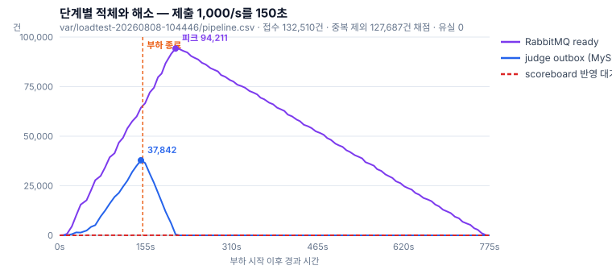
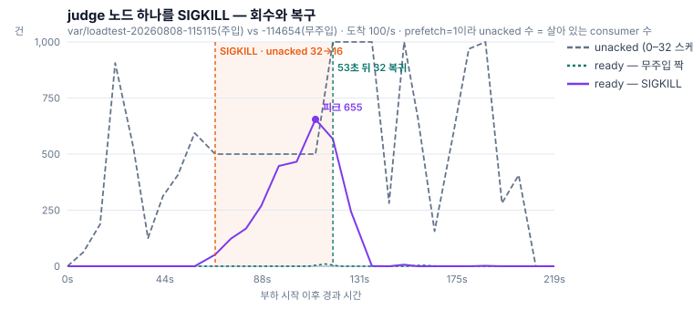
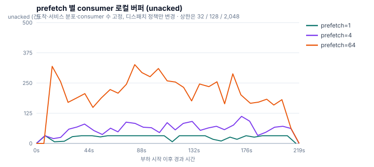

# 부하·회복 측정 기록

포트폴리오 본문([SUBMISSION.md](SUBMISSION.md))에 실린 수치가 어디서 나왔는지를 남긴 문서다.
그림은 전부 `var/loadtest-*/`의 원자료에서 [`make-charts.py`](make-charts.py)로 다시 만들 수 있으므로,
값이 의심되면 런 이름을 따라가 직접 다시 그리면 된다. 코드는
[github.com/tmdrud0/web](https://github.com/tmdrud0/web).

---

## 1. 이 수치들이 설명하지 않는 것

- 단일 호스트다. Ryzen 5 5600(6코어 / 12스레드)의 WSL 예산 12 vCPU 안에서 web·judge·
  MySQL·RabbitMQ·Redis가 상한을 나눠 쓴다. Gatling은 Windows 쪽에서 돌아 같은 물리 코어를 두고
  그 VM과 경쟁한다. 절대 처리량을 용량 수치로 쓰지 않는 이유가 이것이다.
- 채점이 `Thread.sleep`이다. judge 노드가 외부 채점 서버를 호출하고 기다리는 구조라 블로킹
  시간의 대용으로는 타당하지만, 커넥션 풀 고갈·타임아웃·부분 실패를 모델링하지 않는다.
- 닫힌 부하 모델이다. 가상 사용자가 직전 응답을 기다리므로 서버가 느려지면 부하가 저절로
  줄어든다. 실제 장애 때의 재시도 증폭을 재현하지 못한다.
- 네트워크 지연이 0이다. 전부 loopback이다.
- `submit-*` 시나리오에는 조회 부하가 없다. 유입 상한과 백로그 수치는 제출만 들어오는 조건에서
  나온 값이다. 실제 대회에서는 참가자가 순위를 계속 새로고침하므로 조회가 제출보다 많다.
  제출과 조회가 겹치는 조건은 `mixed-target`으로 따로 쟀고 §7.3에 있다.

따라서 모든 비교는 같은 환경에서 한 변수만 바꿔 짝지어 재는 짝실험으로 설계했고, 방향을
뒤집어 재현해 워밍업 교란을 배제했다.
읽을 때도 절대 성능으로 읽으면 안 된다. 구조가 어디서 막히는가의 증거다.

## 2. 측정 환경 기준선

| 항목 | 값 |
|---|---|
| CPU | AMD Ryzen 5 5600 — 6 cores / 12 logical |
| RAM | 15.91 GiB |
| WSL 2 예산 | 12 vCPU / 14 GB / swap 0 |
| Docker | Desktop 4.82.0, Engine 29.6.1 |

| 서비스 | 수 | CPU | 메모리 | JVM |
|---|--:|--:|--:|---|
| web | 2 | 1 | 1280M | `MaxRAMPercentage=60` |
| judge | 2 | 0.75 | 768M | `MaxRAMPercentage=60` |
| batch | 1 | 0.5 | 1024M | `MaxRAMPercentage=60` |
| mysql | 1 | 2 | 2560M | |
| redis | 1 | 0.5 | 512M | |
| rabbitmq | 1 | 0.75 | 1024M | |
| nginx | 1 | 0.25 | 128M | |
| **앱 합계** | **9** | **7.5** | **9344M** | WSL 예산 안 |
| 관측 스택 | 7 | 2.2 | 2112M | 함께 띄울 때 |

컨테이너 상한은 예약이 아니다. 그 이상 못 쓴다는 뜻일 뿐이다. WSL 예산이 총합을 덮는 한 관측 스택이 앱의 자원을 빼앗지
않으므로 앱 상한은 관측 스택 도입 전후로 같게 유지했다. 다만 스크레이프 직렬화 비용과 Prometheus
TSDB가 MySQL과 공유하는 디스크 I/O는 앱 예산 안에서 발생한다.

주요 설정: MySQL `innodb_buffer_pool_size=1536M` / `max_connections=500`, Redis `maxmemory=384mb`,
`maxmemory-policy=noeviction`(스코어보드 파생 상태를 조용히 지우지 않고 메모리 부족을 오류로 노출).
Snowflake worker ID는 `web-1=1`, `web-2=2`, `batch-1=100`, `judge-1=200`, `judge-2=201`로 인스턴스마다
고유하다.

버전: Java 17(`eclipse-temurin:17-jre`), Spring Boot 3.4.3, MySQL 8.0, Redis 7-alpine,
RabbitMQ 4.1-management, Nginx 1.27-alpine, Gatling 3.10.5, Gradle 8.12.1.

## 3. 채점 부하 모델

슬롯 32개. judge 노드당 리스너 16에 두 노드다. 성능을 맞추려고 고른 값이 아니다.

- 컨테이너. 스레드당 예약 스택 1MB면 64개는 JVM 자체 사용량과 768M 상한 사이에 남는 약 140M을
  거의 다 먹는다. 이 노드는 실제로 OOM으로 세 번 죽었다.
- 가정. 64로 두면 두 노드 합쳐 채점 서버에 동시 128 호출을 넣겠다는 뜻인데, 그런 채점 팜은
  재본 적이 없다. 16은 `prefetch=1`이 주는 격리를 유지하면서 아무도 측정하지 않은 용량을 주장하지
  않는 값이다.
- `Thread.sleep`은 CPU를 쓰지 않으므로 슬롯을 늘리면 처리량이 공짜로 올라간다. 실제 채점은 코어에
  묶이므로 그 이득은 재현되지 않는다. 슬롯 수는 이 모델이 유효한 범위이기도 하다.

근거는 `src/main/resources/application-judge-role.properties`의 주석에 그대로 있다.

서비스 시간은 기본 50ms이고 5%가 2초다. 평균 147.5ms. 설계 전제(평균 10ms, 1%가 2초)보다 의도적으로
무겁게 잡았다. 채점이 파이프라인의 상한이 되는 형태를 만들어야 유입과 채점의 격차를 outbox가
흡수하는 과정을 볼 수 있기 때문이다. 주입은 `JUDGE_LATENCY_ENABLED` / `JUDGE_BASE_MILLIS` /
`JUDGE_SLOW_RATIO` / `JUDGE_SLOW_MILLIS`로 런마다 지정한다.

## 4. 런 목록

본문에 쓰인 것만 추렸다. `req`는 HTTP 요청 수이고, `results`는 중복 제거 후 실제로 채점된 건수라
둘의 차이가 그 런에서 걸러진 중복이다. 나머지는 버렸다.

| 런 | 시나리오 | 조건 | req | results | ready 피크 | unacked 피크 | 쓰인 곳 |
|---|---|---|--:|--:|--:|--:|---|
| `20260808-104446` | submit-1000 | 150초 주입 | 133,935 | 127,687 | **94,211** | **32** | 백로그·적체 해소 |
| `20260808-092647` | submit-139 | `prefetch=1` | 31,848 | 27,010 | 87 | 32 | prefetch |
| `20260808-094634` | submit-139 | `prefetch=4` | 31,930 | 27,077 | 0 | **112** | prefetch |
| `20260808-093145` | submit-139 | `prefetch=64` | 31,952 | 27,100 | 109 | **326** | prefetch |
| `20260808-095107` | submit-139 | `prefetch=1` 재현 | 31,931 | 27,089 | 42 | 32 | 순서 뒤집기 |
| `20260808-094207` | submit-139 | `prefetch=64` 재현 | 31,981 | 27,128 | 0 | 410 | 순서 뒤집기 |
| `20260808-114654` | submit-100 | 무주입 | 24,443 | **19,452** | 10 | 32 | 노드 사망 짝 |
| `20260808-115115` | submit-100 | judge-1 SIGKILL | 24,485 | **19,493** | 655 | 32 | 노드 사망 |
| `20260807-202522` | mixed-target | 제출 139→200 + **조회 300** | 108,267 | 35,810 | 12 | 32 | 겹칠 때 기준선 |
| `20260807-204159` | mixed-target | 위 + 포화, `prefetch=1` | 108,325 | 35,848 | **2,446** | 32 | 포화 비교 |
| `20260807-211933` | mixed-target | 위 + 포화, `prefetch=64` | 108,256 | 35,827 | 108 | **2,048** | 포화 비교 |

`prefetch` 값은 `unacked` 피크로 확인된다. 상한이 32 / 128 / 2,048이고 실측이 32 / 112 / 326이다.
`prefetch=1` 런에서 `unacked`가 정확히 32를 넘지 않는 것이 설정이 실제로 적용됐다는 증거다.

`20260808-163430`·`20260808-164135`는 같은 SIGKILL 실험을 더 긴 다운 시간(77~88초)으로 반복한
것이다. `ready` 피크가 2,536 / 2,572로 커졌을 뿐 회수 거동은 같았다.

## 5. 단계별 적체와 해소



> `var/loadtest-20260808-104446/pipeline.csv`

HTTP 133,935건 중 132,510건을 접수했고(거절 1,425건, 1.06%), 중복을 걷어낸 127,687건이 전부
채점됐다. 제출 행과 결과 행이 일치한다. 유실 0.

- 부하는 150초에 끝나는데 `RabbitMQ ready`는 209초까지 계속 올라 94,211이 된다. relay가
  judge outbox에 남은 것을 계속 밀어넣기 때문이다. 부하가 멈춰도 백로그는 한동안 더 자란다.
- `judge outbox`는 유입(1,014/s)과 relay(640/s)의 차이만큼만 쌓여 37,842에서 꺾이고 87초 만에
  해소된다.
- `scoreboard 반영 대기`는 전 구간에서 50–70에 머문다. 하류라서 굶는 것이지 건강한 게 아니다.
- 부하 종료부터 큐가 빌 때까지 10.4분.

백로그는 상한이 꺾이는 지점 바로 앞에만 앉는다.

> 주의. 중복 4,823건은 부하 발생기가 사용자·문제 풀을 재사용해 생긴 것이다. 실제 중복률이
> 쓰지 않는다. dedup 경로가 부하 상태에서 동작한다는 증거로만 쓴다.

### 5.1 쓰기 경로는 부하에서 효율이 올라간다

`bulk-stats.csv`를 부하별로 늘어놓으면 자기조절이 그대로 보인다. 두 값은 web-1 / web-2다.

| 부하 | 평균 청크 | 활성 워커 | in-flight 피크 | 거절 | CallerRuns |
|---|--:|--:|--:|--:|--:|
| submit-100 | 3.94 / 4.07 | 1 | 18 / 21 | 0 | 0 |
| submit-139 | 3.78 / 3.97 | 1 | 30 / 41 | 0 | 0 |
| **submit-1000** | **22.71 / 19.88** | **4** | **410 / 338** | **0** | **0** |

한가할 때는 건당 처리에 가깝고(청크 4건, 워커 1), 밀리기 시작하면 배치가 뭉쳐 건당 비용이
떨어진다(청크 22.7건, 워커 4). 저부하 수치로 선형 외삽하면 이 자기조절을 놓친다.

세 가지가 같이 확인된다.

- admission이 상한으로 묶는다. 상한 800에 실측 피크 410 / 338. 1,000/s에서도 절반을
  넘지 않았고 `rejected`는 0이다. 이 구간에서 거절은 엣지에서 일어났다.
- 완료 통지 큐가 포화되지 않았다. `CallerRuns` 0.
- 두 노드 합산이 맞는다. 제출 63,508 + 64,179 = 127,687로 결과 행과 일치한다.

## 6. 노드 사망과 회수



> `var/loadtest-20260808-115115`(주입) vs `-114654`(무주입 짝)

백로그가 없는 조건(도착 100/s)에서 judge 노드 하나를 SIGKILL했다. 백로그를 걷어내야 재전달
자체의 속도가 보인다.

`prefetch=1`이라 `unacked` 수가 곧 일하고 있는 consumer 수다. 그래서 `32 → 16 → 32`가 노드의
생사를 그대로 보여준다. 회색 점선이 그것이고, 주황 음영이 노드가 죽어 있던 구간이다.

- SIGKILL 직후 broker가 TCP 끊김을 감지해 미확인 메시지를 큐로 되돌린다. `unacked`가 32에서 16으로
  한 계단 떨어질 뿐 유실이 없다.
- 죽어 있는 동안 슬롯이 16개로 줄어 처리율이 절반(약 75/s)이 되고 `ready`가 655까지 쌓인다.
  무주입 짝은 같은 구간에서 10을 넘지 않는다. 샘플 간격이 7~9초라 실제 봉우리는 이보다 높을 수 있다.
- 노드가 돌아오면 `unacked`가 32로 복귀하고 `ready`는 곧 0이 된다.

꼬리가 나빠진 것은 재전달이 느려서가 아니다. 대기는 `ready ÷ 그때의 처리율`이고, 처리율이
구간마다 다르므로 값은 범위로만 말할 수 있다.

| | 계산 | 대기 |
|---|---|--:|
| 회복된 용량으로 전부 소화 | `655 ÷ 150` | 4.4초 |
| 반토막 용량이 끝까지 | `655 ÷ 75` | 8.7초 |
| **실측 max에서 채점 꼬리 2초를 뺀 값** | `9.77 − 2.0` | **7.8초** |

7.8초가 두 경계 사이에 있고 상한 쪽에 가깝다. 구간의 대부분을 반토막 용량이 지배했다.
`ready`를 단일 처리율로 나누면 이 산수가 닫히지 않는다. 복구 영향을 줄이려면 JVM 기동 시간이나
노드 수를 손대야 한다.

## 7. `prefetch` 별 consumer 로컬 버퍼



> `var/loadtest-20260808-092647` / `-094634` / `-093145`

도착률·서비스 분포·consumer 수를 고정하고 디스패치 정책만 바꿨다. 부하는 HTTP 139/s이고,
중복 제출을 걷어내면 채점단에 도착하는 것은 123/s다. 세 런 모두 `ready`가 109를 넘지 않아
포화가 아닌 상태에서 잰 값이고, 이 조건이 본문 결론의 전제다.

### 7.1 지연 분포

| `prefetch` | p50 | p95 | p99 | max | consumer당 대기 |
|--:|--:|--:|--:|--:|--:|
| 1 | 0.322s | 2.119s | **2.376s** | 2.844s | 0 |
| 4 | 0.312s | 2.258s | **3.975s** | 6.101s | 1.18 |
| 64 | 1.297s | 6.433s | **10.308s** | 16.706s | 6.37 |

p50과 p95는 거의 움직이지 않는데 p99만 나빠진다. `prefetch=4`에서 p99가 67% 악화되는 동안
p50은 오히려 미세하게 낮다. 대시보드가 흔히 띄우는 두 지표로는 이 손해가 보이지 않는다.

대기 0에서의 2.376초는 서비스 시간 꼬리 그 자체다. `prefetch`가 키우는 것은
그 위에 얹히는 대기다.

### 7.2 로컬 버퍼가 큐를 쪼갠다

broker는 스레드가 한가한지를 보지 않는다. 이 consumer에게 밀어넣을 자리가 남았는지를 본다.
`prefetch=1`일 때만 이 둘이 같은 말이 된다. 그보다 크면 배정에 가용성 정보가 실리지 않고,
한번 로컬 버퍼에 들어간 메시지는 옆 consumer가 놀고 있어도 회수되지 않는다. 일감을 놀리지 않던
큐 하나가 head-of-line blocking을 가진 32개의 독립 FIFO로 쪼개진다.

| `prefetch` | 버퍼 상한 | `unacked` 피크 | 상한 대비 | p99 |
|--:|--:|--:|--:|--:|
| 1 | 32 | 32 | 100% | **2.376s** |
| 4 | 128 | 112 | 88% | **3.975s** |
| 64 | 2,048 | 326 | **16%** | **10.308s** |

상한이 16배 차이인데 p99는 2.6배다. `prefetch=64`에서도 버퍼는 상한의 일부만 찬다.
손해는 실제로 찬 양이 정한다.

순서를 뒤집어 재현했을 때 p99가 `2.372 → 2.376s`, `10.458 → 10.308s`로 일치해 워밍업 교란도
배제했다. 위 표의 값은 전부 `end-to-end-staleness.csv`의 `result-queryable`이다.

### 7.3 같은 변경을 포화 상태에서 재면

제출과 조회가 겹치고(`mixed-target`: 제출 139→200 + 조회 300) 도착이 용량을 넘는 조건에서
같은 비교를 했다. 여기서는 같은 변경이 훨씬 작아 보인다.

| 조건 | `ready` 피크 | `unacked` 피크 | p99 | 악화 |
|---|--:|--:|--:|--:|
| 포화 · `prefetch=1` | **2,446** | 32 | 14.297s | |
| 포화 · `prefetch=64` | 108 | **2,048** | 17.882s | **+25%** |
| 비포화 · `prefetch=1` | 87 | 32 | 2.376s | |
| 비포화 · `prefetch=64` | 0 | 326 | 10.308s | **+334%** |

같은 변경이 +25%로도 +334%로도 보인다. 포화 상태에서는 백로그라는 지배항이 분자와 분모를 함께
키워 `prefetch`의 효과를 희석하기 때문이다. 무엇을 재는지보다 어떤 조건에서 재는지가 결론을 바꾼다.

그리고 이 표에는 운영에 관한 것이 하나 더 들어 있다. 포화 상태에서 `prefetch=64`의 `ready`는
108이고 `prefetch=1`의 `ready`는 2,446이다. 큐 깊이만 보는 대시보드에서는 느린 쪽이 20배 건강해
보인다. 백로그는 broker의 큐에서 consumer 로컬 버퍼(`unacked` 2,048)로 옮겨갔을 뿐이다.

## 8. 스코어보드 복구 실험

본문 3장은 스코어보드 전달을 DB outbox에서 RabbitMQ stream으로 옮긴 판단을 다룬다.
그 판단의 근거가 이 실험이고, 두 후보를 별도 worktree에 각각 구현해 같은 절차로 돌렸다.

절차는 `gatling/run-scoreboard-rdb-recovery.ps1`이다.

1. consumer를 멈추고 시점 K의 Redis RDB를 저장한다. checkpoint 값과 스코어보드 SHA-256 digest를 함께 기록
2. 제출 tail을 더 흘려 상태 N을 만든다
3. Redis를 SIGKILL하고 K의 RDB로 되돌린다
4. digest와 checkpoint가 N으로 돌아올 때까지 500ms마다 확인한다

일부 key만 지우는 시험이 아니다. 스코어보드와 checkpoint가 같은 스냅샷 안에서 함께 되감긴다.

### 8.1 outbox

`var/c-stage-recovery/outbox-run-1/recovery-summary.csv`

| 항목 | 값 |
|---|---|
| checkpoint key | `contest:scoreboard:outbox:seq` |
| K → N | 73 → 164 (**재적용 대상 91건**) |
| 되감긴 checkpoint | 73 — 정확히 K로 복원 |
| 참가자 | 30 → 60 |
| **탐지** | **955ms** (폴링 간격보다 짧았다) |
| 첫 진행 | 754ms |
| checkpoint 수렴 | 30,923ms |
| **digest 수렴** | **30,954ms** |
| 운영 정지 상태 도달 | 33,043ms |
| 수동 개입 | **없음** |
| 최종 잔여 | neutral pending 0 · outbox 비종료 0 · Rabbit ready 0 |

31초의 지배항은 탐지도 재적용도 아니다. 어긋남은 1초 안에 발견됐고, 적용 루프는
`poll-interval-ms=200` / `batch-size=500`이라 쓰기 시간은 500ms 샘플 해상도 아래다.
시간을 쓴 것은 복구 스캔이다. `recovery-interval-ms=5000` / `recovery-batch-size=10`이라
한 사이클에 최대 10건만 되살린다. 91건에 6사이클이 필요했다.

`recovery-samples.csv`의 `contest_scoreboard_applied_total`이 그대로 보여준다.

| elapsed(ms) | 4,872 | 9,441 | 14,547 | 19,660 | 24,770 | 29,875 |
|---|--:|--:|--:|--:|--:|--:|
| `applied_total` | 174 | 204 | 234 | 264 | 284 | 304 |
| 계단 간격(ms) | — | 5,106 | 5,113 | 5,110 | 5,105 | 5,105 |

간격이 스캔 주기와 일치한다. 하네스가 `pollIntervalMs=500`으로 새 값을 받고 있었으므로 스크레이프
아티팩트가 아니다. 계단 사이 5초는 다음 스캔을 기다린 시간이다.

`requeueLostTail`은 `findHighestRedisSequences`에 SQL `LIMIT batchSize`를 걸고 그 뒤 자바에서
`redisSequence > currentSequence`를 거른다. 뒤처진 양을 묻지 않으므로 복구 처리율이 상수다. 실측 약 3행/초. 손실 구간이 커지면 복구 시간이 같은 비율로 늘어난다.

> 확인하지 않은 것. `applied_total`은 +140인데 재적용 대상은 91건이다. 같은 사이클에서 도는
> `requeueDuplicateSequences`가 재적용된 행을 다시 집어 올린 churn으로 보이지만, 로그로 확인하지
> 않았다.

### 8.2 stream

| 런 | 수렴 |
|---|--:|
| `stream-run-4` | **2,038ms** |
| `stream-run-3` | **2,533ms** |

되감긴 offset + 1로 재구독하면 broker가 그대로 다시 흘려준다. 탐지 단계도 배치 재적용 루프도 없다.
다만 네 런 모두 의미 상태는 수렴했으나 harness·환경 문제로 최종 게이트를 통과하지 못했다.
그래서 위 두 값은 수렴 상한 관찰값이고 확정값으로 쓰지 않는다.

### 8.3 두 후보의 기준점이 다르다

| | outbox | stream |
|---|--:|--:|
| 스코어보드 참가자 | **30** | **5,030** |
| 결과 행 | 164 | 19,597 |
| RDB 크기 | 31 KB | 5.8 MB |

outbox 쪽은 시간을 아끼려고 축소한 상태에서 쟀다. 스코어보드가 작으면 digest 계산도 재적용도
싸므로 outbox에 유리한 조건이다. 그런데도 31초가 걸렸다.

그래서 31초 대 2초를 성능 배수로 인용하지 않는다. 이 실험이 보여주는 것은 제어 흐름의
복잡도다. 한쪽은 탐지와 배치 재적용 루프가 필요하고, 다른 쪽은 재구독 한 번이다.

## 9. 랭킹 조회 벤치마크

본문 4장의 수치다. 이것만 성격이 다르다. 부하 런이 아닌, 별도 DB(`oj_rank_bench`)에 대한
쿼리 비교라 `var/loadtest-*` 같은 원자료가 없다. 그래서 위의 런 목록에 넣지 않았다.

| 항목 | 값 |
|---|---|
| 대상 | `around me` 랭킹 한 페이지 조회 — naive `OFFSET` vs 개선 후 |
| 페이지 크기 | 100건 |
| current streak | `user_streak_rank_snapshot` 10만 행 · 지점 `101` / `49,601` / `99,301` |
| solved | `user` 800만+ 행 · 지점 `101` / `4,000,501` / `8,000,901` |
| 측정 | **지점마다 1회** |
| 출처 | `docs/PORTFOLIO_RANK_QUERY_OPTIMIZATION.md` · `docs/velog/rank-around-me-optimization.md` |
| 그림 | `make-rank-chart.py` → `diagrams/rank-latency.svg` (수치를 스크립트에 적어 둔다) |

| 랭킹 · 지점 | naive | 개선 후 | 배수 |
|---|---:|---:|---:|
| streak 101 | 161 ms | 0.586 ms | 275× |
| streak 49,601 | 8,890 ms | 0.443 ms | 20,068× |
| streak 99,301 | 14,382 ms | 0.113 ms | 127,274× |
| solved 101 | 19.1 ms | 24.2 ms | **0.8× — 느려졌다** |
| solved 4,000,501 | 217,842 ms | 369 ms | 590× |
| solved 8,000,901 | 233,231 ms | 47,747 ms | **4.9×** |

> 이 표의 신뢰 구간. 지점마다 1회이고 버퍼 풀 상태를 통제하지 않았다. 배수의 자릿수는
> 근거로 쓰지만 개별 값은 그렇게 쓰지 않는다. 특히 앞 페이지 두 값(19.1 / 24.2ms)은 차이가
> 측정 잡음과 같은 크기일 수 있어, "앞 페이지에서 손해를 본다"는 방향만 읽고 폭은 읽지 않는다.

다시 재려면 하네스가 저장소에 있다. `src/test/java/my/oj/web/perf/RankAroundBenchmarkLoadTest.java`
는 같은 비교를 무작위 rank 1,000개(고정 seed 42)로 돌려 min·p50·p95·avg·max를 낸다.
고정 3지점보다 이쪽이 낫고, 위 표를 대체하려면 이것으로 다시 재야 한다.

```bash
./gradlew test --tests RankAroundBenchmarkLoadTest \
  -DincludeLoadTests=true -Drank.bench.jdbcUrl=jdbc:mysql://localhost:3306/oj_rank_bench
```

> 하지 않은 것. 위 표를 1,000샘플 하네스로 다시 재지 않았다. `oj_rank_bench` 데이터셋을
> 다시 만들어야 해서 미뤄 뒀고, 그래서 본문에서도 "수백 배"를 자릿수로만 인용한다.

## 10. 재현

```bash
docker compose -p oj-loadtest -f compose.yaml -f compose.loadtest.yaml up -d --build
```

```bash
python docs/portfolio/make-charts.py
python docs/portfolio/make-rank-chart.py
```

부하 실행은 `gatling/README.md`를 따른다. Gatling은 Windows 호스트에서 돌린다. 서버 컨테이너의
WSL 예산과 분리하기 위해서다. 원시 결과(`results-standalone/`, `var/*.gatling.log`, `var/*.jfr`)는 로컬
산출물이며 Git에서 추적하지 않는다.

이 문서의 그림 3장은 `var/loadtest-*/pipeline.csv`만 있으면 `make-charts.py`로 언제든 다시 만들 수
있다. 스크린샷이 아닌 원자료에서 그린 것이라 언제든 검증된다.
