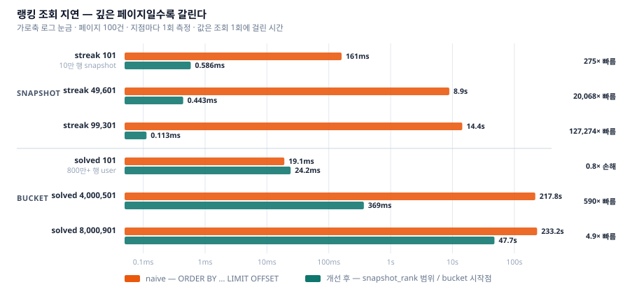

# 신승경 · 백엔드

장애가 났을 때 어디까지 복구되는지 말할 수 있는 시스템을 만드는 데 관심이 있다.
대회 중 제출이 몰릴 때 데이터가 유실되거나 실시간 순위가 최종 순위와 어긋나는 문제를 주제로
삼았다. 메시지 중복 전달과 이벤트 순서 역전은 분산 구성에서 피할 수 없다. 그것을 전제로 설계했다.

Java 17 · Spring Boot 3.4 · MySQL · Redis · RabbitMQ로 온라인 저지 API 서버를 혼자 만들었다
(2025.09 ~, 11개월). 요구사항은 [Codeforces](https://codeforces.com/profile/tmdrud)
Candidate Master로 대회를 뛰며 겪은 것들에서 나왔다.

| 시나리오 | 결과 |
|---|---|
| 제출 1,000/s를 150초 주입 | 접수 132,510건 · 중복 제외 **127,687건 채점**, 유실 0, 적체 해소 10.4분 |
| judge 노드 1대 SIGKILL | 4초 만에 미확인 메시지 회수, end-to-end **max 9.8초** |
| Redis 스코어보드 롤백 | 되감긴 offset + 1부터 replay, **2초대 수렴**(상한 관찰값) |
| 순위 정합성 | 이벤트 순서·중복과 무관하게 수렴, 회귀 테스트로 고정 |

> 전부 단일 호스트(Ryzen 5 5600 · WSL 12 vCPU)에서 부하 발생기와 서버가 자원을 나눠 쓰며 잰
> 값이다. 절대 성능으로 읽으면 안 된다. 구조가 어디서 막히는가의 증거로 읽어야 한다. 무엇을 재지 않았는지는
> [측정 기록](MEASUREMENTS.md) §1에 적었다.

## 핵심 역량

장애를 전제로 설계하고, 회복 경로를 직접 죽여서 확인한다. 채점 작업 분배를 DB claim에서
RabbitMQ work queue로 옮기면서 timeout·lease·sweeper를 broker에 넘겼다. 노드를 SIGKILL해도
미확인 메시지는 4초 만에 회수됐고 end-to-end max는 9.8초였다. 제출 1,000/s를 150초 넣었을 때
127,687건이 전부 채점됐고 유실은 0이다. → 2장

복구를 쉽게 만드는 것은 처리 성능이 아니라 상태의 위치라고 판단한다. 스코어보드 전달을
DB outbox에서 RabbitMQ stream으로 옮긴 이유가 그것이다. 스코어보드와 재시작 지점이 같은 스냅샷
안에 있으면 되감긴 offset + 1이 곧 재시작점이라 정할 설정값이 없다. Redis를 RDB로 되돌린 뒤
2초대에 수렴했다. → 3장

실행계획까지 내려가서 원인을 가른다. 깊은 페이지 랭킹 조회가 233초까지 갔다. 집계 테이블과
스냅숏으로 뒤쪽 페이지를 0.113ms까지 줄였지만 solved 랭킹은 아직 47.7초다. 병목이 tie group
안으로 옮겨간 것이고, 실행계획이 그걸 보여준다. 앞 페이지에서는 오히려 느려진 것도 같이 적었다.
→ 4장

| | |
|---|---|
| 연락처 | tmdrud049@gmail.com |
| GitHub | [github.com/tmdrud0](https://github.com/tmdrud0) |
| 저장소 | [github.com/tmdrud0/web](https://github.com/tmdrud0/web) |
| Codeforces | [tmdrud](https://codeforces.com/profile/tmdrud) — Candidate Master |

---

# 1. 온라인 저지 (개인 프로젝트, 2025.09 ~ 2026.08 · 11개월)

문제를 풀고 코드를 제출하면 채점 결과와 순위를 돌려주는 API 서버다.
일반 제출도 있지만 이 문서가 다루는 범위는 대회 제출 경로다. 정해진 시간에 제출이 몰리고,
유실되면 참가자가 대회 중에 알 수 없으며, 실시간 순위가 최종 순위와 달라지면 안 된다.

| 분류 | 기술 | 무엇에 썼나 |
|---|---|---|
| 언어·프레임워크 | Java 17, Spring Boot 3.4 | 역할별(web/batch/judge) 프로필 분리 기동 |
| 저장소 | MySQL 8.0, Redis 7 | 원본과 파생 상태의 분리 |
| 메시징 | RabbitMQ 4.1 | quorum queue(작업 분배), stream queue(offset 복구), publisher confirm, DLQ |
| 데이터 접근 | Spring Data JPA, JDBC Template, Flyway | 임계 경로는 JDBC batch |
| 인프라 | Docker Compose, Nginx | 9개 컨테이너, CPU·메모리 상한 고정 |
| 측정 | Gatling | 부하 주입 13회, 런별 CSV 원자료 비교 |


> **그림 1.** 제출은 MySQL(제출 원본 + judge outbox, 같은 트랜잭션) → relay → quorum queue →
> Judge → 결과 commit → result stream → Redis Lua(스코어보드 + offset) 순으로 흐른다.
> MySQL 파랑 · Redis 빨강 · RabbitMQ 보라 · 애플리케이션 회색. 이후 모든 그림이 같은 색을 쓴다.

저장소마다 역할을 하나씩만 준다.

- **MySQL** — 제출 원본과 중복 여부의 최종 권위. 유일하게 유실되면 안 되는 상태다.
- **Redis** — 스코어보드 파생 상태. MySQL 결과에서 언제든 같은 값으로 재구성할 수 있어야 한다.
- **RabbitMQ** — 작업 전달 수단. 원본을 보관하지 않는다.

아래 두 장의 판단은 전부 이 세 줄에서 나온다.

---

# 2. 대회 제출 파이프라인

채점 작업 분배를 DB claim에서 RabbitMQ work queue로 옮겼다. DB claim 구조도 동작은 했다.
문제는 timeout·heartbeat·lease·sweeper를 직접 만들고 그 값을 정할 근거까지 스스로 마련해야
했다는 것이다. timeout이 짧으면 정상적으로 오래 걸린 작업을 중복 채점하고 길면 장애 복구가
늦어지는데, 그 사이를 고를 기준이 없었다. 재전달과 in-flight 제한은 broker가 이미 검증한 기능이다.

지켜야 할 조건은 네 개였다.

| | 조건 | 어떻게 지켰나 | 무엇으로 확인했나 |
|---|---|---|---|
| ① | HTTP 성공을 반환했다면 제출 원본은 commit되어 있다 | commit 이후에만 `202` | 접수 건수 = 결과 건수 |
| ② | `(contest, problem, user, codeHash)`가 같은 제출은 한 건만 저장 | MySQL unique + 삽입 후 재조회 판별 | 중복 주입 시 ID 재사용 |
| ③ | 채점이 늦어져도 다른 제출이 같이 막히지 않는다 | `prefetch=1` × 다수 consumer | `prefetch` 짝실험 |
| ④ | 프로세스·broker 장애 후 미완료 작업을 다시 처리할 수 있다 | unacked requeue, 결과 선조회 후 재발행 | judge 노드 SIGKILL |


> **그림 2.** V0은 이벤트가 JVM 메모리에만 있어 commit 후 listener 전에 죽으면 영원히 채점되지
> 않는다. V2는 99건이 50ms에 끝나도 1건이 2초면 트랜잭션 전체가 2초다(head-of-line blocking).
> V3은 격리는 됐지만 timeout·lease 값을 정할 근거가 없다. 현재 구조는 재전달·in-flight 제한·
> retry·DLQ를 broker가 담당한다. 작업 상태를 쥐는 쪽이 DB에서 broker로 넘어간다.

## claim 코드가 사라진 자리에 at-least-once가 남았다

claim 상태 관리 코드가 통째로 사라졌다. `prefetch`로 consumer별 in-flight를 제한하고,
retry 3회를 소진한 메시지는 DLQ로 보낸다.

가장 크게 달라진 것은 회복이다. 노드가 죽으면 그 노드가 물고 있던 미확인 메시지를 broker가
큐로 되돌리므로, 정할 timeout도 돌릴 sweeper도 없다. 재전달됐을 때는 결과 행부터 조회하고
이미 있으면 채점 API를 호출하지 않고 넘어간다. 그래서 같은 메시지가 두 번 와도 결과는 한 번만
반영된다. 이 경로가 실제로 도는지는 노드를 SIGKILL해서 확인했고, 미확인 메시지 회수에 4초가
걸렸다.

Kafka를 고르지 않은 이유는 격리다. 작업 분배에 필요한 것은 격리였는데, Kafka는
파티션이 순서 보장 단위이면서 동시에 병렬 단위라 둘을 따로 조절하기 어렵다. `prefetch`는 1로
되돌릴 수 있다는 점이 컸다.

지불한 것은 at-least-once다. DB와 broker 사이에 2PC가 없다. relay는 confirm을 받으면
outbox를 `PUBLISHED`로 바꾸고 그 이후는 추적하지 않으므로, outbox가 있다고 broker durability를
낮출 수도 없다. quorum queue와 persistent message를 그대로 유지해야 한다.
대신 제출 원본과 `contest_judge_outbox`를 같은 트랜잭션에 commit해서 중복 여부의 권위는 DB에
남겼다.

## 백로그는 병목 바로 앞에만 앉는다

제출은 세 단계를 지나고 각 단계의 상한이 다르다. 유입 1,014/s, relay 640/s, 채점 150/s로
**유입이 채점의 6.8배**다. 이 격차를 durable outbox가 흡수하는 것이 설계 의도였다.

제출 1,000/s를 150초 넣었다. HTTP 133,935건 중 132,510건을 접수했고(거절 1,425건, 1.06%),
중복을 걷어낸 **127,687건**이 전부 채점됐다. 제출 행과 결과 행이 일치한다.

| 버퍼 | 위치 | 영속 | 피크 | 거동 |
|---|---|:-:|---:|---|
| 제출 in-flight | web JVM | ✕ | 410 / 800 | 여유 |
| judge outbox | MySQL | ✓ | 37,842 | 부하 종료 87초 만에 해소 |
| **RabbitMQ ready** | 브로커 | ✓ | **94,211** | 이후 9분에 걸쳐 해소 |
| scoreboard 반영 대기 | MySQL | ✓ | 67 | 병목 하류라 굶음 |

### 노드 하나가 죽으면

백로그가 없는 조건(도착 100/s, 용량의 67%)에서 judge 노드 하나를 SIGKILL했다.
백로그를 걷어내야 재전달 자체의 속도가 보인다. 무주입 런과 짝지었다.

| 제출 100/s | 무주입 | judge-1 SIGKILL |
|---|---:|---:|
| p95 | 0.556s | 6.864s |
| **max** | 2.553s | **9.770s** |
| submissions = results | 19,452 ✓ | 19,493 ✓ |

판정 근거는 max 하나다. 노드는 60.3초 동안 죽어 있었다. RabbitMQ가 하트비트 타임아웃(기본
60초)을 기다렸다면 그 노드가 물고 있던 메시지의 end-to-end가 60초를 넘었어야 한다. max가 9.77초다.

```
 96s  ready=  0  unacked=17  consumers=32   ← SIGKILL 직전
100s  ready= 52  unacked=16  consumers=16   ← 4초 만에 회수 완료
157s  ready=567  unacked=32  consumers=32   ← 다시 소비 시작
```

---

# 3. 스코어보드 전달·복구 경로

스코어보드 전달을 DB outbox에서 RabbitMQ stream으로 옮겼다. 이유는 처리 성능이 아니라
checkpoint의 위치다. Redis 상태와 재시작 지점이 같은 스냅샷 경계 안에 있어야 복구가 단순해진다.

Redis 스코어보드는 파생 상태다. 그래서 "Redis가 죽으면 어떡하나"는 "어디서부터 다시 흘려보낼
것인가" 한 줄로 좁혀진다. 그 재시작 지점을 어디 둘지가 문제였다.

가장 단순한 발상인 `max(outbox.id)`는 쓸 수 없다. auto increment ID에는 gap이 있고, DB insert
순서와 Redis 적용 순서가 같지 않으며, 실패한 작은 ID가 재시도되는 동안 큰 ID가 먼저 적용될 수
있다. 하나만 저장해서는 중간 누락을 판단할 수 없다. 문제를 다시 쓰면 단조 증가 키를 누가
소유하는가다.

```
기존   Redis INCR(redis_seq)  →  DB outbox에 checkpoint
현재   RabbitMQ가 offset 발급  →  Redis Lua 안에 checkpoint
```


> **그림 3.** 왼쪽은 checkpoint가 DB에 있어 Redis만 되감기면 어긋남을 탐지해야 한다. 오른쪽은
> checkpoint가 Redis Lua 안에 있어 되감긴 offset + 1이 곧 재시작점이다.
> 왼쪽에만 되돌아오는 점선이 있다.

어느 쪽을 고르든 얻는 것은 같다. RDB 스냅샷으로 복구했을 때 그 시점 이후 구간만 다시 흘려보내면
되고, 스코어보드 전체를 MySQL에서 재구성할 필요가 없다. 전체 rebuild는 retention 밖으로 밀려났을
때만 쓰는 마지막 수단이다. 차이는 그 증분의 시작점을 얼마나 쉽게 찾느냐다.

## 두 번 쓰는 비용과 중복 전달

judge는 결과를 commit한 뒤 stream publish confirm까지 기다린 다음에야 work queue를 ACK한다.
DB와 broker에 두 번 쓰는 비용이고, 그 사이 장애는 중복 전달로 나타난다.

```
contest_submission_result commit → result stream publisher confirm → judge work queue ACK
```

이 순서를 바꾸면 안 된다. publish를 commit 앞에 두거나 confirm을 기다리지 않고 listener를 반환하면
"DB commit 후 publish 전 장애"를 재전달로 복구할 수 없다. 재전달됐을 때는 결과 행부터 조회하고,
이미 있으면 채점 API를 호출하지 않고 저장된 결과만 다시 발행한다. unacked delivery를 가진
consumer connection을 강제로 끊어 확인했다. 결과 행은 그대로였고 stream entry만 하나 늘었으며
채점 호출은 0회였다. 스코어보드 적용이 순서·중복에 무관하므로 그 중복 entry가 결과를 바꾸지는 않는다.
Redis 적용과 MySQL 완료 표시 사이의 틈은 Lua가 offset과 함께 기록하는 `db-pending` set으로 메운다.

## 복구 제어 흐름


> **그림 4.** consumer를 멈추고 스냅샷 K를 만든 뒤, 제출 tail 약 90건을 더 적용한 상태 N의
> 스코어보드 digest를 기록한다. Redis를 SIGKILL하고 K의 RDB로 되돌린 다음 digest가 N으로 돌아올
> 때까지 잰다. 일부 key만 지우는 시험이 아니라 스코어보드와 checkpoint가 함께 되감기는 롤백이다.

수렴까지 outbox는 31.0초, stream은 2.0–2.5초였다.

```
outbox   어긋남 탐지  →  복구 스캔이 대상 행을 되살림(주기 × 배치 상한)  →  적용
stream   되감긴 offset + 1로 재구독  →  적용
```

남는 차이는 정해야 할 설정값이 있느냐다. outbox는 추격 속도를 설정값이 정하므로 복구 시간이
손실 구간 크기에 비례한다. stream은 다르다. 되감긴 offset이 곧 재시작점이라 정할 값이 없다.
두 구현의 처리 성능은 서로 밀어낼 정도의 차이가 아니었으므로, 남는 판단 기준이 이것이었다.
31초의 내역은 [측정 기록](MEASUREMENTS.md) §8.1에 있다.

---

# 4. 랭킹 조회

앞 두 장은 쓰기와 전달 경로다. 이 장은 같은 데이터를 읽는 경로에서 부딪힌 것이다.
처음 만든 구조가 동작은 했고, 데이터가 커졌을 때만 무너졌다. 코드를 보고는 알 수 없었다.
실행계획까지 내려가서야 원인이 갈렸다.

## `OFFSET`은 앞의 row를 버리는 비용이다

랭킹 페이지에는 "내 순위가 있는 페이지로 바로 가기"가 있다. 커서 페이지네이션을 쓸 수 없다.
사용자가 임의의 지점으로 건너뛰기 때문이다.

```sql
SELECT ...
FROM user
ORDER BY solved_count DESC, streak_last_solved_date ASC, id ASC
LIMIT 100 OFFSET :offset
```

정렬 인덱스를 타도 깊은 페이지에서는 앞의 row를 전부 읽고 버린다. 비용이 `OFFSET`에 거의
비례하므로 유저가 늘면 뒤쪽 페이지부터 무너진다. `around me`에는 하나가 더 붙는다. 내 rank를
먼저 알아야 어느 페이지를 읽을지 정할 수 있다.

필요한 값은 두 개뿐이다. 내 rank, 그리고 그 rank가 속한 페이지의 시작점. 이 둘만 싸게 구하면
전체 정렬 결과를 훑을 이유가 없다. 랭킹마다 값이 변하는 방식이 달라서 다르게 풀었다.

| 랭킹 | 값이 변하는 방식 | rank를 언제 계산하나 | 무엇을 유지하나 |
|---|---|---|---|
| current streak | 하루 한 번 배치로 | 미리 | `user_streak_rank_snapshot`에 `snapshot_rank` |
| solved | 제출마다, 1씩 증가만 | 조회 시점에 | `solved_count_bucket`에 값별 유저 수·누적 상위 수 |

streak은 조회 시점에 계산할 것이 없다. `snapshot_rank BETWEEN ? AND ?`로 필요한 구간만 읽는다.
solved는 제출마다 바뀌어 snapshot이 맞지 않으므로 1씩 증가만 한다는 성질을 쓴다. 값별 버킷만
유지하면 전체를 재정렬하지 않고 "나보다 위에 몇 명"을 상수 시간에 얻는다.



> **그림 5.** 가로축은 로그 눈금이다. 주황이 `OFFSET` 방식, 청록이 개선 후. streak은 뒤로
> 갈수록 빨라진다(읽을 구간이 같으니 앞 row가 없다). solved는 앞 페이지에서 오히려 느려지고
> 뒤 페이지에서 47.7초가 남는다.

측정 조건은 페이지 100건, current streak은 10만 행 snapshot, solved는 800만 행 이상의 `user`
테이블이다. 지점은 각각 `101 / 49,601 / 99,301`, `101 / 4,000,501 / 8,000,901`.

| 랭킹 · 지점 | naive `OFFSET` | 개선 후 | 배수 |
|---|---:|---:|---:|
| streak 101 | 161 ms | 0.586 ms | 275× |
| streak 49,601 | 8,890 ms | 0.443 ms | 20,068× |
| streak 99,301 | 14,382 ms | **0.113 ms** | 127,274× |
| solved 101 | 19.1 ms | **24.2 ms** | **0.8×** |
| solved 4,000,501 | 217,842 ms | 369 ms | 590× |
| solved 8,000,901 | 233,231 ms | **47,747 ms** | **4.9×** |

앞 페이지에서는 오히려 느려졌다. solved 101이 19.1ms에서 24.2ms가 됐다. 버릴 row가 없어 원래
싸던 자리에 bucket 조회가 한 번 더 붙기 때문인데, 깊은 페이지를 위해 앞 페이지에서 지불한 값이고
앞 페이지만 재면 이 구조는 도입할 이유가 없어 보인다.

뒤 페이지는 여전히 47.7초다. 이 작업에서 제일 중요한 수치가 이것이다. bucket이 페이지 시작점은
상수 시간에 찾아주지만, 같은 solved count를 가진 tie group 안에서는 다시 offset으로 읽는다.
실행계획이 그대로 보여준다.

```text
-> Limit/Offset: 100/23638 row(s)  (actual time=183..183 rows=100 loops=1)
    -> Index range scan on u using idx_user_ranking
       over (8 <= solved_count) with index condition: (u.solved_count <= 8)
       (actual time=0.346..183 rows=23738 loops=1)
```

`solved_count = 8` 하나에 23,738행이 몰려 있다. 병목은 전체 데이터셋에서 tie group 내부로
옮겨갔다. 그래서 이 개선폭은 값의 분포가 정한다. 분포가 평평하면 같은 구조로도 이 수치는
나오지 않는다. streak이 sub-ms인 것도 조회 시점에 rank를 계산하지 않기 때문이다.

> 이 표를 용량 수치로 쓰지 않는다. 지점마다 1회 측정이고 버퍼 풀 상태를 통제하지 않았다.
> 배수의 자릿수(두 자리냐 다섯 자리냐)는 근거로 쓰지만 개별 값은 그렇게 쓰지 않는다.
> 저장소에는 무작위 rank 1,000개로 같은 비교를 돌려 min·p50·p95·max를 내는
> `RankAroundBenchmarkLoadTest`가 있고, 위 표를 대신하려면 그것으로 다시 재야 한다.

---

# 5. 남은 한계

채점이 `Thread.sleep`이다. 블로킹 시간만 흉내 낼 뿐 커넥션 풀 고갈, 타임아웃, 부분 실패를
모델링하지 않는다. 실제 채점 서버를 붙이면 실패 모드가 하나 더 생긴다.

검증한 장애는 프로세스 즉사 하나다. SIGKILL은 TCP를 즉시 끊으므로 broker가 곧바로 감지한다.
하트비트 타임아웃이 실제로 문제가 되는 경우, 그러니까 프로세스는 살아 있는데 네트워크가 끊긴
경우는 재현하지 않았다. RabbitMQ도 단일 노드라 stream replication과 leader failover는 검증 밖이다.

대회 제출과 일반 제출이 같은 파이프라인을 쓴다. 일반 제출은 전체 테스트케이스를 돌리므로
한 건에 30초까지 걸릴 수 있다고 가정한다. `prefetch=1`은 consumer 하나가 한 건만 쥐게 한다.
그 하나가 30초를 쥐고 있는 것 자체는 막지 못한다. 슬롯 32개 중 몇이 일반 제출에 물려 있으면
대회 제출의 실효 용량이 그만큼 줄고, 위에서 본 `ready ÷ 처리율` 관계 그대로 꼬리가 늘어난다.
큐를 분리하거나 대회 제출에 별도 슬롯을 주는 것이 다음 과제다.

solved 랭킹의 tie group은 그대로 남아 있다. bucket이 페이지 시작점을 상수 시간에 찾아주지만
같은 solved count 안에서는 다시 offset이라 뒤쪽 페이지가 47.7초다. tie group 안에 보조 순서를
두거나 solved도 streak처럼 snapshot으로 돌리는 두 방향이 있는데, 갱신 비용과 조회 비용 중 어디에
부담을 둘지를 정하지 못했다. 제출마다 바뀌는 값이라 snapshot 주기가 곧 순위의 신선도다.

## 보조 자료

| 자료 | 내용 |
|---|---|
| [github.com/tmdrud0/web](https://github.com/tmdrud0/web) | 코드. 역할별 기동 계약과 실행 방법은 README |
| [부하·회복 측정 기록](MEASUREMENTS.md) | 측정 환경 기준선, 런별 조건과 원자료, 적체·복구 그래프, 재현 절차 |
