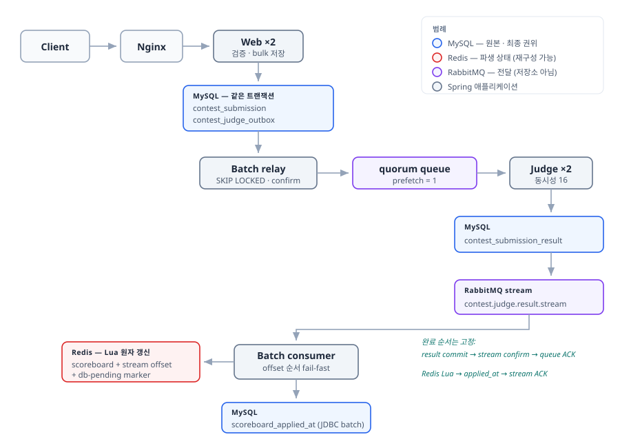
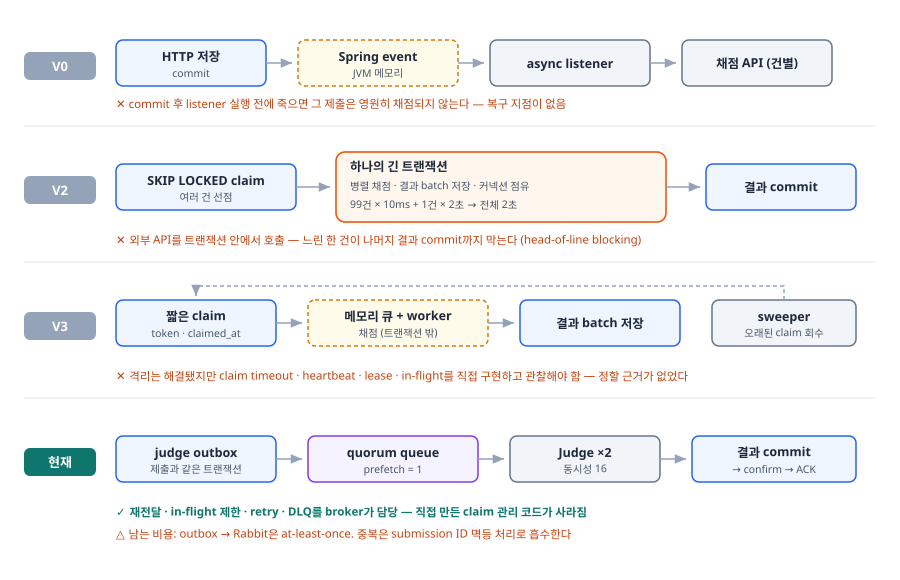
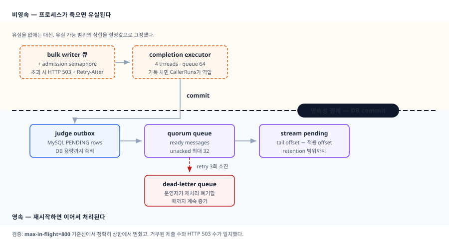
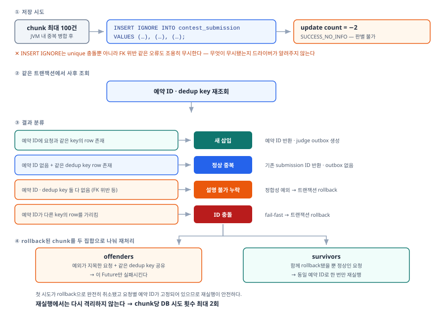
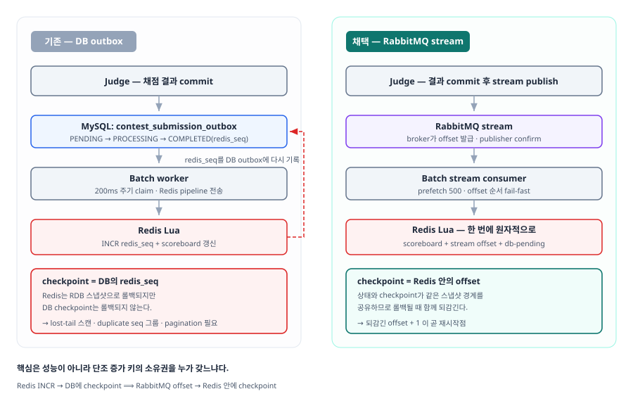
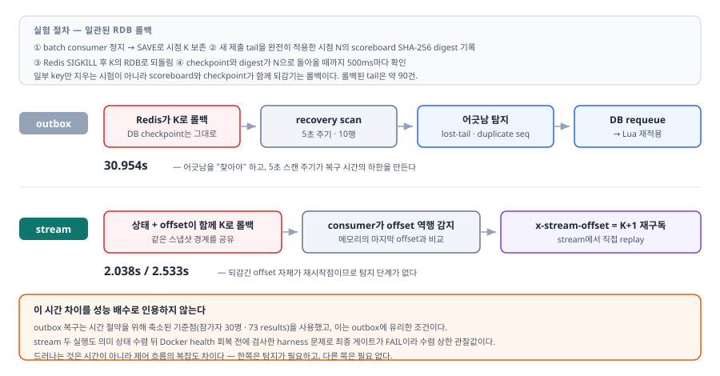

# 신승경 · 백엔드

장애가 났을 때 어디까지 복구되는지 말할 수 있는 시스템을 만드는 데 관심이 있다.
대회 중 제출이 몰릴 때 데이터가 유실되거나 실시간 순위가 최종 순위와 어긋나는 문제를 주제로
삼았고, 메시지 중복 전달과 이벤트 순서 역전은 분산 구성에서 피할 수 없으므로 그것을 전제로
설계했다.

Java 17 · Spring Boot 3.4 · MySQL · Redis · RabbitMQ로 온라인 저지 API 서버를 혼자 만들었다
(2025.09 ~, 11개월). 요구사항은 [Codeforces](https://codeforces.com/profile/tmdrud)
Candidate Master로 대회를 뛰며 겪은 것들에서 나왔다.

| 시나리오 | 결과 |
|---|---|
| 제출 1,000/s를 150초 주입 | 접수 132,510건 · 중복 제외 **127,687건 채점**, 유실 0, 적체 해소 10.4분 |
| judge 노드 1대 SIGKILL | 4초 만에 미확인 메시지 회수, end-to-end **max 9.8초** |
| Redis 스코어보드 롤백 | 되감긴 offset + 1부터 replay, **2초대 수렴**(상한 관찰값) |
| 순위 정합성 | 이벤트 순서·중복과 무관하게 수렴, 회귀 테스트로 고정 |

> 전부 단일 호스트(Ryzen 5 5600 · WSL 12 vCPU)에서 부하 발생기와 서버가 자원을 나눠 쓰며 잰
> 값이다. 절대 성능을 재는 값이 아니다. 구조가 어디서 막히는가의 증거로 읽어야 한다.
> → 「측정 전제」

## 핵심 역량

정합성을 순서와 중복에 의존하지 않게 설계한다.
채점 완료 순서는 제출 순서와 다르다. 누적 방식 스코어보드는 이것 때문에 대회 중 참가자가 본
순위와 최종 순위를 다르게 만들었다. 누적을 버리고 매번 재계산하도록 바꿨다. → 3장

측정 조건을 의심하고, 근거로 쓸 수 있는 수치와 없는 수치를 구분한다.
`prefetch`를 올렸을 때의 꼬리 악화는 포화 상태에서 재면 +25%로 보이고, 포화를 걷어내면 +334%다.
백로그라는 지배항이 분자와 분모를 함께 키워 효과를 희석하기 때문이다. 부하 발생기와 서버가
같은 호스트를 나눠 쓰므로 절대 처리량은 용량 수치로 쓰지 않고, 모든 비교는 한 변수만 바꿔
짝지어 재는 짝실험으로 설계했다. → 2장

내가 틀린 것을 측정으로 찾아낸다.
judge CPU가 72–78%로 관측돼 CPU 한도가 병목이라고 판단했다. 두 런의 CPU 시계열을 비교하니
JIT 컴파일이 감쇠하는 곡선이었고, 샘플러의 "피크 CPU"가 그 초반 스파이크를 집고 있었다.
정상 CPU는 7–9%였다. 병목은 다른 데 있었다. → 2장

| | |
|---|---|
| 연락처 | tmdrud049@gmail.com |
| GitHub | [github.com/tmdrud0](https://github.com/tmdrud0) |
| 저장소 | [github.com/tmdrud0/web](https://github.com/tmdrud0/web) |
| Codeforces | [tmdrud](https://codeforces.com/profile/tmdrud) — Candidate Master |

---

# 1. 온라인 저지 (개인 프로젝트, 2025.09 ~ 2026.08 · 11개월)

문제를 풀고 코드를 제출하면 채점 결과와 순위를 돌려주는 API 서버다.
일반 제출도 있지만 이 문서가 다루는 범위는 대회 제출 경로다. 정해진 시간에 제출이 몰리고,
유실되면 참가자가 대회 중에 알 수 없으며, 실시간 순위가 최종 순위와 달라지면 안 된다.

| 분류 | 기술 | 무엇에 썼나 |
|---|---|---|
| 언어·프레임워크 | Java 17, Spring Boot 3.4 | 역할별(web/batch/judge) 프로필 분리 기동 |
| 저장소 | MySQL 8.0, Redis 7 | 원본과 파생 상태의 분리 |
| 메시징 | RabbitMQ 4.1 | quorum queue(작업 분배), stream queue(offset 복구), publisher confirm, DLQ |
| 데이터 접근 | Spring Data JPA, JDBC Template, Flyway | 임계 경로는 JDBC batch |
| 인프라 | Docker Compose, Nginx | 9개 컨테이너, CPU·메모리 상한 고정 |
| 측정 | Gatling, Prometheus, Grafana | 부하 주입 13회, 큐 깊이·CPU 시계열 비교 |



> **그림 1.** 제출은 MySQL(제출 원본 + judge outbox, 같은 트랜잭션) → relay → quorum queue →
> Judge → 결과 commit → result stream → Redis Lua(스코어보드 + offset) 순으로 흐른다.
> MySQL 파랑 · Redis 빨강 · RabbitMQ 보라 · 애플리케이션 회색. 이후 모든 그림이 같은 색을 쓴다.

저장소마다 역할을 하나씩만 준다.

- MySQL은 제출 원본과 중복 여부의 최종 권위다. 유일하게 유실되면 안 되는 상태다.
- Redis는 스코어보드 파생 상태다. MySQL 결과에서 언제든 같은 값으로 재구성할 수 있어야 한다.
- RabbitMQ는 작업 전달 수단이다. 원본 저장소가 아니다.

## 측정 전제

수치를 싣기 전에 그 수치가 설명하지 않는 것을 먼저 적는다.

- 단일 호스트다. Ryzen 5 5600(6코어)의 WSL 예산 12 vCPU 안에서 web·judge·MySQL·RabbitMQ·Redis가
  상한을 나눠 쓰고, Gatling은 같은 호스트의 코어를 두고 그 VM과 경쟁한다.
- 채점이 `Thread.sleep`이다. judge 노드는 외부 채점 서버를 호출하고 기다리는 구조라 블로킹
  시간의 대용으로는 타당하지만, 커넥션 풀 한계·타임아웃·부분 실패를 모델링하지 않는다.
- 닫힌 부하 모델이다. 가상 사용자가 직전 응답을 기다리므로 서버가 느려지면 부하가 저절로 줄고,
  실제 장애 때의 재시도 증폭을 재현하지 못한다.
- 네트워크 지연이 0이다. 전부 loopback이다.

따라서 아래 수치는 절대 성능이 아니라 구조가 어디서 막히는가의 증거로 읽어야 한다.

---

# 2. 대회 제출 파이프라인

채점 작업 분배를 DB claim에서 RabbitMQ work queue로 옮겼다.
DB claim 구조도 동작했다. 문제는 timeout·heartbeat·lease·sweeper를 직접 만들고 그 값을 정할
근거까지 스스로 마련해야 했다는 것이다. timeout이 짧으면 정상적으로 오래 걸린 작업을 중복
채점하고 길면 장애 복구가 늦어지는데, 그 사이를 고를 기준이 없었다.
재전달과 in-flight 제한은 broker가 이미 검증한 기능이다.

지켜야 할 조건은 네 개였다.

| | 조건 | 어떻게 지켰나 | 무엇으로 확인했나 |
|---|---|---|---|
| ① | HTTP 성공을 반환했다면 제출 원본은 commit되어 있다 | commit 이후에만 `202` | 접수 건수 = 결과 건수 |
| ② | `(contest, problem, user, codeHash)`가 같은 제출은 한 건만 저장 | MySQL unique + 삽입 후 재조회 판별 | 중복 주입 시 ID 재사용 |
| ③ | 채점이 늦어져도 다른 제출이 같이 막히지 않는다 | `prefetch=1` × 다수 consumer | `prefetch` 짝실험 |
| ④ | 프로세스·broker 장애 후 미완료 작업을 다시 처리할 수 있다 | unacked requeue, 결과 선조회 후 재발행 | judge 노드 SIGKILL |

### 채점 부하 모델

이 장의 모든 수치가 딛고 있는 두 가정이다. 성능을 맞추려고 고른 값이 아니라 시나리오 정의다.

채점 슬롯은 32개다. judge 노드당 리스너가 16개이고 노드는 둘이다. 실제 채점은 사용자 코드를
격리 환경에서 실행하므로 동시 실행 수가 채점 서버의 코어에 묶인다. 32는 채점 서버가 동시에
32건을 받아준다는 가정이고, 컨테이너 메모리와 그 가정이 정한 값이다. `Thread.sleep`은 CPU를
쓰지 않으므로 슬롯을 늘리면 처리량이 공짜로 올라가지만 실제 채점에서는 일어나지 않는다.
슬롯 수는 이 모델이 유효한 범위이기도 하다.

서비스 시간은 기본 50ms, 5%가 2초다. 평균 147.5ms다. 설계 전제(평균 10ms, 1%가 2초)보다
의도적으로 무겁게 잡았다. 채점이 파이프라인의 상한이 되는 형태를 만들어야, 유입과 채점의 격차를
durable outbox가 흡수하는 과정을 관찰할 수 있기 때문이다. 가벼운 쪽으로 재면 격차가 줄어
관찰하려던 현상 자체가 흐려진다.

평균만 보면 어떤 구조든 통과한다. 5%의 꼬리와 조건 ③이 구조를 갈랐다.



> **그림 2.** V0은 이벤트가 JVM 메모리에만 있어 commit 후 listener 전에 죽으면 영원히 채점되지
> 않는다. V2는 99건이 50ms에 끝나도 1건이 2초면 트랜잭션 전체가 2초다(head-of-line blocking).
> V3은 격리는 됐지만 timeout·lease 값을 정할 근거가 없다. 현재 구조는 재전달·in-flight 제한·
> retry·DLQ를 broker가 담당한다.

## claim 코드는 사라지고 at-least-once가 남았다

claim 상태 관리 코드가 통째로 사라졌다. `prefetch`로 consumer별 in-flight를 제한하고, retry
3회를 소진한 메시지는 DLQ로 보낸다.

Kafka는 쓰지 않았다. 작업 분배에 필요한 건 격리였고, 순서 보장은 필요하지 않았다. Kafka는
파티션이 순서 보장 단위이면서 동시에 병렬 단위라 둘을 따로 조절하기 어렵다. `prefetch`는 1로
되돌릴 수 있다는 점이 컸다.

DB와 broker 사이에 2PC가 없으므로 at-least-once다. relay는 confirm을 받으면 outbox를
`PUBLISHED`로 바꾸고 그 이후는 추적하지 않으므로, outbox가 있다고 broker durability를 낮출
수도 없다. quorum queue와 persistent message를 그대로 유지해야 한다. 대신 제출 원본과
`contest_judge_outbox`를 같은 트랜잭션에 commit해서 중복 여부의 권위만은 DB에 남겼다.
중복 전달은 채점 결과 PK와 `INSERT IGNORE`, 그리고 결과가 이미 있으면 채점 API를 호출하지 않고
넘어가는 재전달 경로로 흡수한다.

## "최대 처리량"은 하나가 아니다

제출은 세 단계를 지나고, 각 단계가 앞 단계보다 느려서 경계마다 큐가 하나씩 생긴다.
단일 숫자로 최대 처리량을 말하면 어느 쪽이든 오해가 된다.

| 단계 | 하는 일 | 상한 |
|---|---|---:|
| 유입 | HTTP 접수 → 중복 해시 → bulk INSERT commit | **1,014 /s** |
| relay | judge outbox claim → RabbitMQ 발행 | **640 /s** |
| 채점 | 슬롯 32개 → 결과 commit → ACK | **150 /s** |

유입이 채점의 6.8배다. 이 격차를 durable outbox가 흡수하는 것이 설계 의도였고 실제로 그랬다.
접수는 commit 이후에만 `202`를 반환하므로 "접수했다고 답한 뒤 잃는" 경로는 없다.
쓰기 경로는 오히려 부하에서 효율이 올라간다. 밀리기 시작하면 배치가 뭉쳐 건당 비용이 떨어진다.
저부하 수치로 선형 외삽하면 이 자기조절을 놓친다.

병목이 채점인 것은 맞지만 CPU 때문은 아니다. 처음에는 judge CPU가 72–78%로 관측돼 CPU 한도가
처리량을 깎는다고 판단했다. 컨테이너를 recreate한 런과 웜 상태 런의 CPU 시계열을 비교하니 100초에
걸쳐 7%로 감쇠하는 JIT 컴파일 곡선이었고, 샘플러의 "피크 CPU"가 그 초반 스파이크를 집고 있었다.
웜 상태 정상 CPU는 7–9%다. 슬롯이 대기에 묶여 있어서 CPU가 남는 것이지, 더 받을 수 있다는 뜻이
아니다.

## `prefetch`: 여유가 있을 때 꼬리가 증폭된다

`prefetch`를 1 / 4 / 64로 바꿔 짝실험했다. 도착률·서비스 분포·consumer 수는 전부 고정하고
디스패치 정책만 바꿨다. 부하는 HTTP 139/s이고, 중복 제출을 걷어내면 채점단에 도착하는 것은 123/s다.
세 런 모두 `ready`가 최대 109건을 넘지 않았다. 포화가 아닌 상태에서 잰 값이고, 이 조건이 아래
결론의 전제다.

| prefetch | p50 | p95 | p99 | max | consumer당 대기 |
|---:|---:|---:|---:|---:|---:|
| 1 | 0.322s | 2.119s | **2.376s** | 2.844s | 0 |
| 4 | 0.312s | 2.258s | **3.975s** | 6.101s | 1.18 |
| 64 | 1.297s | 6.433s | **10.308s** | 16.706s | 6.37 |

대기 0에서의 2.376초는 서비스 시간 꼬리 그 자체다. `prefetch`가 키우는 것은 그 위에 얹히는 대기다.
`prefetch=4`에서 이미 p99가 67% 나빠지는데 p50과 p95는 그대로다. 대시보드에서 흔히 보는 두
지표가 멀쩡하니 공짜처럼 보이는 것이 가장 위험한 지점이다.

broker는 스레드가 한가한지를 보지 않는다. 이 consumer에게 밀어넣을 자리가 남았는지를 본다.
`prefetch=1`일 때만 이 둘이 같은 말이 된다. 그보다 크면 배정에 가용성 정보가 실리지 않고,
한번 로컬 버퍼에 들어간 메시지는 옆 consumer가 놀고 있어도 회수되지 않는다. 일감을 놀리지
않던 큐 하나가, head-of-line blocking을 가진 32개의 독립 FIFO로 쪼개진다. `prefetch`를 4에서
64로 16배 올려도 p99가 2.6배만 나빠지는 이유도 여기 있다. `unacked` 피크가 상한 2,048의
16%(326건)에 그쳤다.

> 측정 조건이 결론을 바꿨다. 같은 변경을 포화 상태(도착 > 용량)에서 재면 p99 악화가 +25%로
> 보인다. 포화를 걷어내면 +334%다. 백로그라는 지배항이 분자와 분모를 동시에 키워 효과를 희석하기
> 때문이다. 순서를 뒤집어 재현했을 때 p99가 `2.372 → 2.376s`, `10.458 → 10.308s`로 일치해
> 워밍업 교란도 배제했다.

## 백로그는 병목 바로 앞에만 앉는다

제출 1,000/s를 150초 넣었다. HTTP 133,935건 중 132,510건을 접수했고(거절 1,425건, 1.06%),
중복을 걷어낸 127,687건이 전부 채점됐다. 제출 행과 결과 행이 일치한다.

| 버퍼 | 위치 | 영속 | 피크 | 거동 |
|---|---|:-:|---:|---|
| 제출 in-flight | web JVM | ✕ | 410 / 800 | 여유 |
| judge outbox | MySQL | ✓ | 37,842 | 부하 종료 87초 만에 해소 |
| **RabbitMQ ready** | 브로커 | ✓ | **94,211** | 이후 9분에 걸쳐 해소 |
| scoreboard 반영 대기 | MySQL | ✓ | 67 | 병목 하류라 굶음 |

각 값은 그 버퍼의 개별 피크이고 같은 시점의 값이 아니다. judge outbox는 유입(1,014)과
relay(640)의 차이만큼만 쌓이므로 부하가 멈추면 곧 따라잡는다. RabbitMQ는 relay(640)와
채점(150)의 격차가 4배라 나머지 9분을 여기서 쓴다. 총 적체 해소(drain) 10.4분, 유실 0.

하류 큐가 얕은 것은 건강 신호가 아니다. scoreboard 반영 대기는 모든 런에서 50–70을 유지했는데,
채점이 끝나야 행이 생기므로 상류가 막히면 유입 자체가 제한되기 때문이다. 조건이 나쁜 런에서
오히려 더 얕아졌다.



> **그림 3.** 제출이 지나는 모든 버퍼와 그 영속성. 경계는 DB commit이고, 위(주황 점선)는
> 프로세스가 죽으면 유실되는 구간이다.

제출 완료 응답을 받은 사용자는 이미 경계 안에 있다. 유실 가능 구간은 응답을 아직 받지 못한
요청뿐이고, 그 범위는 admission semaphore가 상한으로 묶는다. web 노드당 동시 처리 800건을
넘으면 503과 `Retry-After`로 거절한다. 그래서 유실 가능 범위의 크기는 800이다.

### 노드 하나가 죽으면

백로그가 없는 조건(도착 100/s, 용량의 67%)에서 judge 노드 하나를 SIGKILL했다.
백로그를 걷어내야 재전달 자체의 속도가 보인다. 무주입 런과 짝지었다.

| 제출 100/s | 무주입 | judge-1 SIGKILL |
|---|---:|---:|
| p95 | 0.556s | 6.864s |
| **max** | 2.553s | **9.770s** |
| submissions = results | 19,452 ✓ | 19,493 ✓ |

판정 근거는 max 하나다. 노드는 60.3초 동안 죽어 있었다. RabbitMQ가 하트비트 타임아웃(기본
60초)을 기다렸다면 그 노드가 물고 있던 메시지의 end-to-end가 60초를 넘었어야 한다. max가 9.77초다.

```
 96s  ready=  0  unacked=17  consumers=32   ← SIGKILL 직전
100s  ready= 52  unacked=16  consumers=16   ← 4초 만에 회수 완료
157s  ready=567  unacked=32  consumers=32   ← 다시 소비 시작
```

꼬리가 나빠진 것은 재전달 지연 때문이 아니다. 죽어 있는 동안 슬롯이 16개로 줄어 처리율이
절반(약 75/s)이 되고 `ready`가 655까지 쌓인다. 그 대기는 `655 ÷ 150 = 4.4초`(회복된 용량)와
`655 ÷ 75 = 8.7초`(반토막 용량) 사이에 있고, 실측 max 9.77초에서 채점 꼬리 2초를 빼면 7.8초다.
구간의 대부분을 반토막 용량이 지배했다는 뜻이고, 그래서 산수가 닫힌다. 악화분은 전부 "능력이
없던 시간"이다. 복구 영향을 줄이려면 JVM 기동 시간이나 노드 수를 손대야 한다.

## `INSERT IGNORE` 뒤에 숨는 누락

여기까지가 구간별 거동이고, 마지막으로 유입 1,014/s를 지탱하는 저장 경로 안쪽을 본다.
그 처리량은 chunk 단위 bulk INSERT에서 나오는데, chunk 안에서 한 건이 실패하면 문제가 생긴다.

중복 한 건이 chunk 전체를 rollback시키는 것을 막으려고 제출 저장을 `INSERT IGNORE`로 바꿨다.
그런데 이것은 unique 충돌만 무시하지 않는다. FK 위반처럼 행 전체가 경고와 함께 조용히 사라지는
경우도 삼킨다. 게다가 Connector/J가 batch를 multi-values로 rewrite하면 update count가
`SUCCESS_NO_INFO(-2)`로 와서, 어떤 행이 삽입되고 어떤 행이 무시됐는지 드라이버가 알려주지 않는다.
그래서 INSERT 직후 같은 트랜잭션에서 예약 ID와 dedup key를 다시 조회해 분류한다.



| 조회 결과 | 판정 | 처리 |
|---|---|---|
| 예약 ID에 같은 key의 행 존재 | 새 삽입 | 예약 ID 반환, judge outbox 생성 |
| 예약 ID 없음 + 같은 dedup key 행 존재 | 정상 중복 | 기존 submission ID 반환 |
| 둘 다 없음 | 설명 불가 누락 | 정합성 예외 → rollback |
| 예약 ID가 다른 key의 행을 가리킴 | ID 충돌 | fail-fast → rollback |

여기서 끝내면 불량 한 건이 여전히 정상 99건을 죽인다. 정합성 예외에 문제가 된 예약 ID를 담고
chunk를 둘로 나눠, offenders의 Future만 실패시키고 survivors는 이미 예약해 둔 같은 ID로 다시
insert한다. 첫 시도가 rollback으로 완전히 취소됐고 ID가 고정되어 있으므로 재실행이 안전하다.
chunk당 DB 시도는 최대 2회다.

이 판별 덕분에 MySQL이 중복의 유일한 권위가 됐고, 앞단에 두던 Redis 중복 캐시를 임계 경로에서
지울 수 있었다.

---

# 3. 스코어보드 전달·복구 경로

스코어보드 전달을 DB outbox에서 RabbitMQ stream으로 옮겼다. 이유는 처리 성능이 아니라
checkpoint의 위치다. Redis 상태와 재시작 지점이 같은 스냅샷 경계 안에 있어야 복구가 단순해진다.

Redis 스코어보드는 파생 상태다. 그래서 "Redis가 죽으면 어떡하나"는
"어디서부터 다시 흘려보낼 것인가" 한 줄로 좁혀진다. 그 재시작 지점을 어디 둘지가 문제였다.

가장 단순한 발상인 `max(outbox.id)`는 쓸 수 없다. auto increment ID에는 gap이 있고, DB insert
순서와 Redis 적용 순서가 같지 않으며, 실패한 작은 ID가 재시도되는 동안 큰 ID가 먼저 적용될 수
있다. 하나만 저장해서는 중간 누락을 판단할 수 없다. 문제를 다시 쓰면 단조 증가 키를 누가
소유하는가다.

```
기존   Redis INCR(redis_seq)  →  DB outbox에 checkpoint
현재   RabbitMQ가 offset 발급  →  Redis Lua 안에 checkpoint
```



> **그림 4.** 왼쪽은 checkpoint가 DB에 있어 Redis만 되감기면 어긋남을 탐지해야 한다. 오른쪽은
> checkpoint가 Redis Lua 안에 있어 되감긴 offset + 1이 곧 재시작점이다. 왼쪽에만 되돌아오는
> 점선이 있다.

어느 쪽을 고르든 얻는 것은 같다. RDB 스냅샷으로 복구했을 때 그 시점 이후 구간만 다시 흘려보내면
되고, 스코어보드 전체를 MySQL에서 재구성할 필요가 없다. 전체 rebuild는 retention 밖으로 밀려났을
때만 쓰는 마지막 수단이다. 차이는 그 증분의 시작점을 얼마나 쉽게 찾느냐다.

## 무엇을 지불했나

judge는 결과를 commit한 뒤 stream publish confirm까지 기다린 다음에야 work queue를 ACK한다.
DB와 broker에 두 번 쓰는 비용이고, 그 사이 장애는 중복 전달로 나타난다.

```
contest_submission_result commit → result stream publisher confirm → judge work queue ACK
```

이 순서를 바꾸면 안 된다. publish를 commit 앞에 두거나 confirm을 기다리지 않고 listener를 반환하면
"DB commit 후 publish 전 장애"를 재전달로 복구할 수 없다. 재전달됐을 때는 결과 행부터 조회하고,
이미 있으면 채점 API를 호출하지 않고 저장된 결과만 다시 발행한다. unacked delivery를 가진
consumer connection을 강제로 끊어 확인했다. 결과 행은 그대로였고 stream entry만 하나 늘었으며
채점 호출은 0회였다. 스코어보드 적용이 순서·중복에 무관하므로 그 중복 entry가 결과를 바꾸지는 않는다.
Redis 적용과 MySQL 완료 표시 사이의 틈은 Lua가 offset과 함께 기록하는 `db-pending` set으로 메운다.

## 복구 제어 흐름



> **그림 5.** consumer를 멈추고 스냅샷 K를 만든 뒤, 제출 tail 약 90건을 더 적용한 상태 N의
> 스코어보드 digest를 기록한다. Redis를 SIGKILL하고 K의 RDB로 되돌린 다음 digest가 N으로 돌아올
> 때까지 잰다. 일부 key만 지우는 시험이 아니다. 스코어보드와 checkpoint가 함께 되감기는 롤백이다.

수렴까지 outbox는 31.0초, stream은 2.0–2.5초였다.

```
outbox   어긋남 탐지  →  복구 스캔이 대상 행을 되살림(주기 × 배치 상한)  →  적용
stream   되감긴 offset + 1로 재구독  →  적용
```

남는 차이는 시간이 아니다. 정해야 할 설정값이 있느냐다. outbox는 추격 속도를 설정값이 정하므로
복구 시간이 손실 구간 크기에 비례한다. stream은 되감긴 offset이 곧 재시작점이라 정할 값이 없다.
두 구현의 처리 성능은 서로 밀어낼 정도의 차이가 아니었다.
31초의 내역은 [측정 기록](MEASUREMENTS.md) §8.1에 있다.

## 다시 흘려보내도 안전한가

위 복구가 성립하려면 재적용이 안전해야 한다. 그런데 처음 구조는 그렇지 않았다.
penalty는 `정답 시각(분) + 그 이전 오답 수 × 5`로 계산한다.

```
채점 완료 순서 ≠ 제출 순서
  t=10분  WRONG    (채점 2초)
  t=12분  ACCEPTED (채점 10ms)      → 도착은 ACCEPTED 먼저

              실시간 Redis    DB 재구성
  penalty          12            17      ← 참가자가 본 순위 ≠ 최종 순위
```

`accepted` 플래그와 오답 수를 누적하고 정답이 오면 그 시점 값으로 penalty를 확정하는 방식은,
이벤트가 제출 순서대로 도착한다는 가정을 숨기고 있었다. 늦게 온 오답은 버려졌다.

누적을 버리고 지금까지 본 제출 사실 자체를 보존한 뒤, 이벤트마다 그 문제의 기여도를 처음부터
다시 계산하도록 바꿨다. 같은 오답이 중복 도착하면 같은 필드를 덮어쓰고, 더 이른 정답이 늦게
도착하면 정답 시각을 교체하고 다시 계산한다. summary에는 이전 기여도와의 차이만 더한다.
회귀 테스트로 세 가지를 고정했다. 위 시나리오의 최종 penalty가 17일 것, 같은 이벤트 집합을
무작위 순서로 적용해도 결과가 같을 것, 실시간 Redis 경로와 MySQL 재구성 경로가 같은 순위를 낼 것.

---

# 4. 남은 한계

채점이 `Thread.sleep`이다. 블로킹 시간만 흉내 낼 뿐 커넥션 풀 고갈, 타임아웃, 부분 실패를
모델링하지 않는다. 실제 채점 서버를 붙이면 실패 모드가 하나 더 생긴다.

검증한 장애는 프로세스 즉사 하나다. SIGKILL은 TCP를 즉시 끊으므로 broker가 곧바로 감지한다.
하트비트 타임아웃이 실제로 문제가 되는 경우(프로세스는 살아 있는데 네트워크가 끊긴 경우)는
재현하지 않았다. RabbitMQ도 단일 노드라 stream replication과 leader failover는 검증 밖이다.

부대 I/O를 줄이지 않았다. 슬롯 하나가 메시지에 묶이는 시간은 `32 ÷ 150 = 213ms`인데 채점은
147.5ms뿐이고, 나머지 65ms는 결과 배치 쓰기·outbox insert·ACK 왕복이다. 결과 writer가 worker
1개에 batch 32라 슬롯 시간의 31%가 여기 묶여 있다. 슬롯을 늘릴 수 없는 구조에서 처리량을
올리는 유일한 방향인데 아직 측정하지 않았다.

대회 제출과 일반 제출이 같은 파이프라인을 쓴다. 일반 제출은 전체 테스트케이스를 돌리므로
한 건에 30초까지 걸릴 수 있다고 가정한다. `prefetch=1`은 consumer 하나가 한 건만 쥐게 하지만
그 하나가 30초를 쥐고 있는 것 자체는 막지 못한다. 슬롯 32개 중 몇이 일반 제출에 물려 있으면
대회 제출의 실효 용량이 그만큼 줄고, 위에서 본 `ready ÷ 처리율` 관계 그대로 꼬리가 늘어난다.
큐를 분리하거나 대회 제출에 별도 슬롯을 주는 것이 다음 과제다.

## 보조 자료

| 자료 | 내용 |
|---|---|
| [github.com/tmdrud0/web](https://github.com/tmdrud0/web) | 코드. 역할별 기동 계약과 실행 방법은 README |
| [부하·회복 측정 기록](MEASUREMENTS.md) | 측정 환경 기준선, 런별 조건과 원자료, 적체·복구 그래프, 관측·테스트 범위, 폐기한 실행과 그 이유 |
